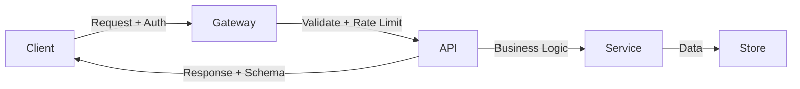

# API design

> **Learning Path:** Non-AI System Design Practice
> **Section:** 25.1.4 — System design practice

**API design is not about endpoints. It's about managing coupling across time.**

### 1. The problem

You have multiple producers and consumers that must evolve independently. A mobile app, a partner integration, an internal service, and a data pipeline all need the same business capability, but they change on different cadences, have different latency budgets, and different failure tolerances.

Without a stable boundary, every internal refactor becomes a coordinated deployment. Change a field name in the database and you break three clients. Add a required field and you force a mobile app update.

The problem is **temporal coupling**: how do you let the implementation move fast while keeping the contract stable?

### 2. Mental model

Think of an API as a contract with two sides: the promise and the price.

The promise is: *if you send this shape of request with these semantics, you will get this shape of response within these guarantees.*

The price is: you must keep that promise for a defined period, and you pay for changes with versioning, deprecation, and migration cost.

A good API design minimizes the price of change for consumers while preserving freedom for producers.

### 3. How it works

An API design is three things, not one:

* **Shape** - resource model, naming, and schema. For REST: nouns + verbs. For GraphQL: typed schema + queries. For gRPC: protobuf messages.
* **Contract** - semantics, errors, idempotency, pagination, rate limits, auth.
* **Evolution policy** - how you version, deprecate, and communicate breaking changes.

The essential mechanism is **explicit boundaries**. You choose what is exposed, what is hidden, and how consumers discover capabilities.

The API layer is where you translate external expectations into internal capabilities, and back.

### 4. Architectural reasoning

Design choice is driven by consumer constraints, not technology fashion.

* **Public, browser, heterogeneous clients** → REST/JSON with clear resources and generous caching. Human readability and HTTP semantics matter more than wire efficiency.
* **Internal microservices, high throughput, low latency** → gRPC/Protobuf. Strong typing, codegen, and binary efficiency win. You control both sides.
* **Many consumers need different subsets of a large data graph** → GraphQL. Reduces over-fetching and lets clients declare shape. You pay with complexity in caching and query cost control.

When it helps: multiple teams, multi-client products, and long-lived integrations.

Alternatives you are choosing against: shared libraries, direct DB access, event-only interfaces. Those couple consumers to implementation details.

Decision rule: optimize for the cost of change. If consumers are outside your control, prioritize stability and explicit versioning. If consumers are internal and you can deploy together, prioritize ergonomics and speed.

### 5. Trade-offs and failure modes

* **Flexibility vs stability.** Adding optional fields is cheap. Removing or renaming fields is expensive. The most common failure is breaking changes shipped without a deprecation window.
* **Granularity vs chatty calls.** Fine-grained resources are composable but increase latency. Coarse resources reduce calls but force clients to receive data they don't need.
* **REST discoverability vs GraphQL power.** REST is cacheable at the edge. GraphQL is flexible but requires persisted queries and cost analysis to avoid abuse.
* **Version in URL vs header vs evolution.** URL versioning is simple and explicit but leads to version explosion. Header versioning is cleaner but harder to test. The best practice is additive, backward compatible evolution with a clear sunset policy.

Failure modes architects see in production: undocumented error codes, non-idempotent POSTs for safe retries, pagination that changes total count mid-page, and rate limits that only appear at 429.

### 6. Example

Payment service for a SaaS platform.

Public API: `POST /v1/invoices` creates an invoice, returns `202 Accepted` with `Location` header. `GET /v1/invoices/{id}` returns immutable fields plus `status`. New field `tax_breakdown` is added as optional. Old clients ignore it.

Internal service: `CreateInvoice` gRPC call with protobuf. Strong typing guarantees the billing service and ledger service stay aligned. No versioning needed because both deploy together.

The boundary lets the public API evolve quarterly while internal services iterate weekly.

### 7. Reasoning challenge

You have an internal recommendation service used by three teams: web, mobile, and an offline batch job. Mobile needs 5 fields with <100ms p95. Web needs 50 fields and can tolerate 300ms. Batch needs the full graph nightly.

Do you expose one REST endpoint, a GraphQL schema, or two separate APIs? What do you version, and what is your deprecation policy for fields?

### 8. Key takeaway

* API design is contract design for change over time, not endpoint naming.
* Choose shape and protocol from consumer constraints: audience, latency, data shape, and control.
* Prefer backward compatible evolution: add, don't remove; deprecate with dates; version explicitly.
* The API layer is where you pay the cost of coupling so the rest of the system stays loosely coupled.
