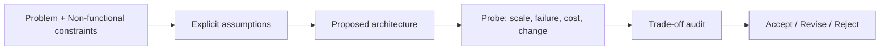

# Design review & critique

> **Learning Path:** Non-AI System Design Practice
> **Section:** 25.1.8 — System design practice

### The problem

A design can look clean on a whiteboard and fail in production. Not because the code is wrong, but because the architecture makes implicit bets about load, failure, cost, and change that were never tested.

Experienced engineers build working systems. Architects prevent expensive rework by catching those bets early. A design review is where you force those bets into the open before implementation locks them in.

### Mental model

A design review is not a code review and not a beauty contest. It is a structured adversarial check: **does this design satisfy the stated constraints, and what happens when the unstated constraints appear?**

Think of it as a pre-mortem. You assume the system is live and failing, then work backwards to find why the design allowed it.

### How it works

A good review is short, constraint-driven, and opinionated.

1. **Clarify context.** What is the problem, success metric, and hard constraints? Latency SLO, data durability, team size, budget, compliance. If these are vague, the review is meaningless.
2. **Surface assumptions.** Every design assumes something about traffic, data size, failure rate, operational skill, and growth. Make them explicit.
3. **Probe the seams.** Follow data and requests through the system. Where does state live? Where can it be lost? What is the blast radius of a single node failure?
4. **Audit trade-offs.** For each major decision, ask: what is gained, what is lost, and what is the escape hatch?
5. **Decide.** The output is not perfection, it is a set of risks accepted, deferred, or mitigated.

### Architectural reasoning

Design review helps when a decision is irreversible or expensive to undo: data model, partitioning strategy, synchronous vs async coupling, ownership boundaries.

It solves the problem of local optima. An engineer optimizes their service. A review optimizes the system.

Alternatives exist. You can rely on post-incident learning, prototype-and-pivot, or skip review for speed. Those work until the cost of change exceeds the cost of review. Review is cheapest at the sketch stage.

Choose it when:
* Multiple teams will depend on the interface
* Non-functional requirements dominate functional ones
* Failure modes have business cost
* The design will be hard to migrate later

### Trade-offs and failure modes

* **Thorough vs fast.** Deep review finds real issues, but can stall delivery. Time-box it. Focus on top 3 risks.
* **Critique vs ownership.** Reviewers can tear down without proposing. Good critique is: "This choice optimizes X at cost of Y. Given constraint Z, consider alternative A."
* **Rubber stamp.** If reviews always pass, the process is theater. Rotate reviewers and require explicit risk log.
* **Scope creep.** Reviews can turn into re-design sessions. Keep the problem fixed, only challenge the solution.
* **Missing context.** Reviewing a diagram without load numbers, error budgets, and operational model leads to abstract opinions.

The most common failure mode: reviewing technology instead of trade-offs. "Use Kafka" is not a review point. "You need durable ordered replay for 10 consumers with different lag tolerances, which is why an event log is needed" is.

### Example

Payment service redesign. Proposal: synchronous REST call from checkout to payment processor, with retries and a single Postgres for state.

Review probes:
* **Scale:** Checkout peak is 5k RPS, payment latency p99 is 800ms. Synchronous call ties checkout threads. Constraint violated.
* **Failure:** Payment processor times out. Retries cause duplicate charges. No idempotency key enforced.
* **Change:** New payment methods need new fields. Schema migration locks table for minutes.
* **Cost:** Single DB is a bottleneck and single point of failure.

Outcome: Accept async outbox pattern with idempotent payments, separate read model, and partitioning by tenant. Risk accepted: eventual consistency in checkout confirmation, mitigated by clear UX.

The review didn't reject the design, it forced explicit decisions about latency vs consistency and failure handling.

### Reasoning challenge

You are reviewing a real-time leaderboard for a game. Design: writes go to a single Redis sorted set, reads are served from the same instance. Team says it is simple and fast.

What constraint would you ask for first, and what failure would you probe? What alternative would you consider if that constraint is true?

### Key takeaway

* A design review validates constraints, not aesthetics.
* Make assumptions explicit before debating solutions.
* Probe scale, failure, cost, and change; those reveal architectural debt.
* Good critique states the trade-off and the condition under which the choice makes sense.

You should finish a review able to answer: what are we betting on, what happens if we lose that bet, and can we live with it.
