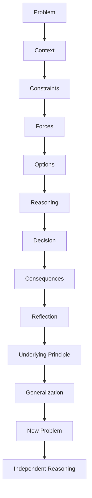
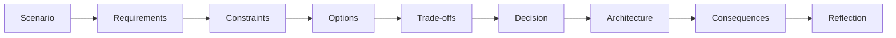
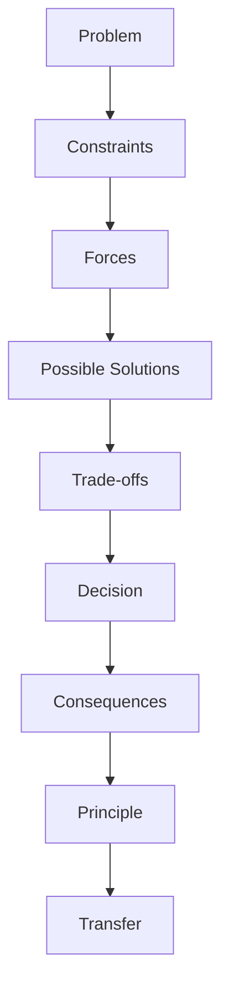
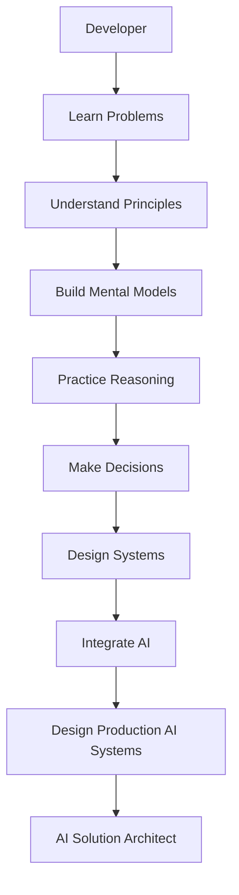

## Project: Learn by Reasoning

Learn by Reasoning is an educational platform designed to transform developers into **Solution Architects and AI Solution Architects** by teaching them how to reason about technology, architecture, trade-offs, and system design.

This is **not another tutorial website**.

The platform's central philosophy is:

> **Don't memorize technology. Understand why it exists.**

And:

> **Don't learn answers. Learn how to reason.**

---

# 1. Product Vision

The platform helps learners progress from:

**Developer → Senior Developer → Technical Lead → Solution Architect → AI Solution Architect**

The goal is not to make learners memorize:

* technologies
* definitions
* architecture patterns
* frameworks
* tools
* best practices
* interview answers

The goal is to develop the ability to:

* understand problems
* identify constraints
* explore alternatives
* reason about trade-offs
* make architectural decisions
* understand consequences
* derive solutions
* transfer knowledge to unfamiliar situations

A learner should eventually be able to say:

> "I don't remember the exact rule, but I understand the forces involved. Let me reason through the problem."

That is the ultimate success criterion.

---

# 2. Core Philosophy

## Technology exists to solve problems

Technology, frameworks, methodologies, architectural patterns, and tools should never be presented as arbitrary things to memorize.

They exist because somebody encountered a problem.

Examples:

* Kubernetes → container orchestration complexity
* Caching → repeated data access and latency
* Event-driven architecture → coupling and asynchronous processing
* Kafka → high-volume distributed event streaming
* RAG → grounding LLMs in external knowledge
* Vector databases → semantic similarity retrieval
* AI memory → limitations of transient context
* Agents → systems that need reasoning and action
* Multi-agent systems → specialization, delegation, and coordination
* Observability → understanding complex distributed systems
* Evaluation → measuring probabilistic AI behavior

Whenever possible, teach the **problem that created the technology before teaching the technology itself**.

---

# 3. Learn by Reasoning Methodology

The fundamental learning loop is:



The platform should repeatedly train this loop.

### Core sequence

**Problem → Constraints → Options → Reasoning → Decision → Consequence → Principle → Transfer**

Do not reduce learning to:

**Definition → Example → Quiz**

---

# 4. Educational Principles

## 4.1 Understanding over memorization

Prefer:

> "Why does this work?"

over:

> "What is the definition?"

Definitions are useful, but they should reinforce understanding rather than replace it.

---

## 4.2 Mental models over facts

Every major topic should result in a mental model.

The learner should understand:

* what exists
* why it exists
* how it works
* how the pieces relate
* when to use each approach
* when not to use it
* what changes the decision

---

## 4.3 Trade-offs over "best practices"

Never present a technology or architecture as universally best.

Avoid statements such as:

> "Always use microservices."

Instead explain:

> "Microservices become attractive when these constraints outweigh the additional operational and architectural complexity."

Every architectural recommendation must be contextual.

---

## 4.4 Reasoning over recall

Activities should test:

* why
* when
* how
* what if
* what changes
* what breaks
* what assumption is being made
* what trade-off is being accepted

Avoid excessive questions such as:

> "What is X?"

Prefer:

> "Given these constraints, would you choose X or Y? Why?"

---

## 4.5 Wrong decisions are learning opportunities

The learner should be allowed to make incorrect decisions.

A wrong answer should not simply produce:

> "Incorrect."

Instead:

1. Explain why the decision initially appeared reasonable.
2. Identify the assumption behind it.
3. Introduce the consequence or changed constraint.
4. Reveal where the reasoning breaks.
5. Extract the underlying principle.

The learner should understand **why their reasoning failed**.

---

# 5. Constructivist Learning

The learner should construct knowledge progressively.

A concept should often emerge through:

```text
Situation
    ↓
Observation
    ↓
Question
    ↓
Reasoning
    ↓
Discovery
    ↓
Concept
    ↓
General Principle
```

Do not immediately provide the final conceptual model when the learner can reasonably discover it.

---

# 6. Socratic Learning

Use Socratic questions to expose assumptions and deepen reasoning.

Examples:

* Why?
* What makes you choose that?
* What assumption are you making?
* What happens if traffic increases 10×?
* What happens if consistency becomes critical?
* What happens when the dependency fails?
* What happens if the data becomes stale?
* What would you sacrifice to achieve lower latency?
* When would this architecture stop working?
* What alternative would you consider?
* What would make you change your decision?

Questions should advance reasoning rather than exist merely as quizzes.

---

# 7. Case-Based and Problem-Based Learning

Use realistic scenarios.

A case should contain:

* business context
* functional requirements
* non-functional requirements
* constraints
* scale
* operational considerations
* security considerations
* cost considerations

Then require the learner to reason through the solution.

A good case follows:



---

# 8. Constraint Mutation

One of the most important learning mechanisms is changing the constraints after a decision.

Example:

> You selected Cache Aside.

Then change:

> What if stale data is no longer acceptable?

Then:

> What if writes increase 100×?

Then:

> What if the application becomes multi-region?

Then:

> What if infrastructure cost becomes the primary constraint?

The learner must reconsider the original decision.

This teaches:

> **Architectural decisions are contextual.**

---

# 9. Visual Learning

Mermaid diagrams are a core component of the learning experience.

Use diagrams to represent **thinking**, not decoration.

Use:

### Flowcharts

For:

* decision trees
* options
* relationships
* architecture
* reasoning paths

### Sequence diagrams

For:

* request flows
* distributed communication
* RAG
* agent execution
* authentication
* workflows

### State diagrams

For:

* lifecycle
* agent states
* workflow states
* failure/recovery

### Mindmaps

For:

* concept landscapes
* relationships
* classifications

### Architecture diagrams

For:

* components
* boundaries
* data flows
* infrastructure

---

# 10. Reasoning Graph

Where useful, visualize the reasoning itself.



The learner should be able to see:

> **Why did we arrive at this solution?**

not merely:

> **What is the solution?**

---

# 11. Learning Content Structure

A typical learning module should follow this progression:

1. Why does this problem exist?
2. Problem space
3. Landscape of possible approaches
4. Concept map
5. Underlying forces
6. Mechanisms
7. Visual explanation
8. Reasoning
9. Trade-offs
10. Decision framework
11. Real-world cases
12. Socratic questions
13. Wrong-path exploration
14. Constraint mutation
15. Activities
16. General principles
17. Transfer problem
18. Final reasoning challenge
19. Mental model
20. Compact takeaway

Not every topic requires every section.

Do not force content into a template when it doesn't improve learning.

---

# 12. Anti-Memorization Rules

Avoid excessive:

* glossary-style teaching
* definition dumps
* feature lists
* technology catalogs
* "top 10 things to remember"
* flashcard-oriented learning
* isolated terminology
* framework-specific trivia

Terminology should be introduced because it provides useful compression for an already-understood concept.

For example:

First:

> "The application checks the cache and, if absent, retrieves the data and populates the cache."

Then:

> "This pattern is called **Cache Aside**."

The name becomes a label for understanding rather than something the learner has to memorize.

---

# 13. Architecture Learning Philosophy

The learner should learn to reason across these dimensions:

* Functional requirements
* Performance
* Scalability
* Availability
* Reliability
* Consistency
* Security
* Privacy
* Cost
* Complexity
* Maintainability
* Operability
* Observability
* Developer experience
* Business value
* Time to market

Architecture is the process of balancing these forces.

---

# 14. AI Solution Architect Curriculum

The platform must eventually cover the complete journey from software engineering to AI solution architecture.

Major areas include:

## Software Engineering

* Programming
* Clean code
* SOLID
* Design patterns
* Testing
* Performance
* Concurrency
* Async programming
* APIs

## Application Architecture

* Layered architecture
* Clean Architecture
* Hexagonal architecture
* DDD
* Modular monolith
* Microservices
* CQRS
* Event sourcing
* ADRs

## Distributed Systems

* CAP
* PACELC
* Consistency
* Replication
* Partitioning
* Messaging
* Event-driven architecture
* Distributed transactions
* Saga
* Resilience
* Failure handling

## Data Architecture

* SQL
* NoSQL
* Data modeling
* Indexing
* Partitioning
* Sharding
* Data pipelines
* Data lakes
* Warehouses
* Vector databases
* Graph databases

## Cloud

* Compute
* Storage
* Networking
* IAM
* Containers
* Kubernetes
* Terraform
* GitOps
* Platform engineering

## Security

* Authentication
* Authorization
* OAuth2
* OIDC
* RBAC
* Zero Trust
* Encryption
* Secrets
* Network security
* AI security

## AI Foundations

* LLMs
* Tokens
* Context windows
* Embeddings
* Inference
* Model selection
* Fine-tuning
* Quantization
* Multimodal AI

## LLM Applications

* Prompt engineering
* Structured outputs
* Function calling
* Model routing
* Prompt management
* Guardrails

## RAG

* Ingestion
* Parsing
* Chunking
* Embeddings
* Vector search
* Hybrid search
* Reranking
* Query rewriting
* Context construction
* Graph RAG
* Agentic RAG
* Multimodal RAG
* RAG evaluation

## Memory

* Conversation memory
* Working memory
* Short-term memory
* Long-term memory
* Semantic memory
* Episodic memory
* Procedural memory
* Memory retrieval
* Memory writing
* Memory correction
* Memory lifecycle
* Memory security

## Tools and Protocols

* Function calling
* Tool use
* MCP
* Tool discovery
* Tool authorization
* Tool execution
* Agent interoperability

## Agents

* ReAct
* Planning
* Execution
* Reflection
* Routing
* Supervisors
* Human-in-the-loop
* Agent state
* Durable execution

## Multi-Agent Systems

* Specialization
* Delegation
* Hierarchical agents
* Peer agents
* Sequential agents
* Parallel agents
* Coordination
* Shared state
* Agent communication
* Agent identity
* Agent permissions

## AI Orchestration

* LangChain
* LangGraph
* Workflow engines
* Durable workflows
* State machines
* Event-driven AI

## AI Evaluation

* Golden datasets
* Offline evaluation
* Online evaluation
* Human evaluation
* LLM-as-judge
* RAG evaluation
* Agent evaluation
* Regression testing

## LLMOps

* Tracing
* Metrics
* Logging
* OpenTelemetry
* Prompt monitoring
* Model monitoring
* Retrieval monitoring
* Agent monitoring

## AI Reliability

* Fallbacks
* Retries
* Timeouts
* Validation
* Guardrails
* Human escalation
* Budget limits
* Agent loop detection
* Graceful degradation

## AI Cost

* Token economics
* Model selection
* Semantic caching
* Prompt caching
* Model routing
* Batch inference
* GPU economics
* Infrastructure cost

## AI Governance

* Privacy
* PII
* Data residency
* Auditability
* Model governance
* AI risk
* Human oversight
* Regulatory considerations

## Enterprise AI Architecture

* AI gateways
* Model gateways
* Agent registries
* Tool registries
* Prompt registries
* Knowledge platforms
* AI platforms
* Multi-tenancy
* Policy engines
* Audit platforms

---

# 15. Framework Independence

The platform should teach concepts independently from specific frameworks.

For example:

Do not teach:

> "LangGraph is how agents work."

Teach:

> "Agents require state, transitions, actions, observations, persistence, and recovery."

Then show how LangGraph implements those concepts.

Frameworks are implementations of architectural ideas.

This protects the learner from technology churn.

---

# 16. Technology Evolution

Technologies will change.

The underlying learning model should remain stable.

When a technology becomes outdated:

* preserve the underlying problem
* preserve the principle
* update the implementation
* explain what changed
* explain why the new technology emerged

The platform should teach **durable knowledge**.

---

# 17. Architecture Decision Records

Important learning modules should eventually produce an ADR-like decision.

Example:

```text
Decision:
Use Cache Aside.

Context:
Read-heavy workload with tolerable staleness.

Alternatives:
Read Through
Write Through
No Cache

Reasoning:
...

Trade-offs:
...

Risks:
...

Revisit when:
...
```

This teaches learners to communicate architecture decisions professionally.

---

# 18. Production Mindset

Never stop at:

> "The architecture works."

Teach:

> "Can we operate it?"

Every serious architecture should consider:

* Deployment
* Monitoring
* Logging
* Tracing
* Security
* Scaling
* Failure
* Recovery
* Cost
* Testing
* Governance
* Maintenance
* Migration

For AI:

* Evaluation
* Model changes
* Prompt changes
* Retrieval quality
* Hallucination
* Agent behavior
* Token usage
* Cost
* Safety

---

# 19. Content Quality Standard

Every lesson should answer:

### Why?

Why does the problem exist?

### What?

What approaches exist?

### How?

How does each approach work?

### When?

When should it be used?

### Why not?

When should it not be used?

### What if?

What happens when constraints change?

### So what?

What architectural principle can be generalized?

### Can you transfer it?

Can the learner solve a new problem?

If a lesson cannot answer these questions, it is incomplete.

---

# 20. Tone

The platform should feel:

* intellectually stimulating
* practical
* calm
* curious
* engineering-focused
* challenging
* respectful of the learner

Avoid:

* childish gamification
* excessive motivational language
* shallow simplification
* technology hype
* "10x engineer" claims
* fear-based learning
* certification-style memorization

The learner should feel:

> "I'm becoming better at thinking."

not:

> "I'm collecting another course certificate."

---

# 21. Website Experience

The experience should feel like an **architect's thinking environment**.

A typical topic should contain:

```text
WHY THIS EXISTS
        ↓
PROBLEM
        ↓
LANDSCAPE
        ↓
VISUAL MODEL
        ↓
MECHANISM
        ↓
REASONING
        ↓
TRADE-OFFS
        ↓
DECISION
        ↓
CASE
        ↓
CONSTRAINT CHANGE
        ↓
FAILURE
        ↓
GENERAL PRINCIPLE
        ↓
TRANSFER
        ↓
MENTAL MODEL
```

The learner should be actively thinking throughout the experience.

---

# 22. Brand Philosophy

The platform should communicate:

> **Technology should work for you. You should not work for technology.**

> **Tools should reduce cognitive burden, not create it.**

> **Frameworks are implementation choices, not knowledge trophies.**

> **Architectural patterns are compressed experience. Understand the experience behind the pattern.**

> **Learn the problems that created the technologies.**

> **Understand the forces that created the architecture.**

> **Then derive the solution yourself.**

---

# 23. Core Manifesto

Use this philosophy consistently throughout the product:

> **Don't memorize technology. Understand why it exists.**
>
> Problems created technologies.
>
> Constraints created architectures.
>
> Trade-offs created patterns.
>
> Failure created resilience.
>
> Scale created distributed systems.
>
> Knowledge limitations created RAG.
>
> Context limitations created memory.
>
> Complex decisions created agents.
>
> Coordination problems created multi-agent systems.
>
> Production complexity created observability and evaluation.
>
> **Understand the reasoning, and you can derive the solution.**

---

# 24. Definition of Success

A successful learner is not someone who can list 200 technologies.

A successful learner can receive an unfamiliar problem and independently:

1. Understand the problem.
2. Identify constraints.
3. Identify important forces.
4. Generate possible approaches.
5. Evaluate trade-offs.
6. Make a defensible decision.
7. Explain the decision.
8. Identify risks.
9. Predict failure modes.
10. Reconsider the decision when constraints change.
11. Derive a new solution from first principles.

That is an **architect**.

---

# 25. Golden Rule for All Agents

Whenever creating content, code, UX, architecture, or features for this project, ask:

> **Does this help the learner understand and reason, or does it merely give them something else to memorize?**

If it primarily increases memorization burden without increasing understanding, reconsider it.

The platform exists to **reduce cognitive burden through understanding**.

---

# 26. The North Star



## North Star Statement

> **Learn by Reasoning exists to teach engineers how to derive technology and architecture decisions from first principles, constraints, and trade-offs — so they can solve problems they have never seen before.**
