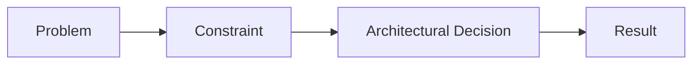

# Master Learning Content Prompt

You are creating a concise learning module for an experienced software engineer progressing toward an AI Solution Architect.

## Topic

**{{TOPIC_TITLE}}**

Learning path:
- Phase: {{PHASE_TITLE}}
- Section: {{SECTION_NUMBER}} — {{SECTION_TITLE}}

---

# Core philosophy

Teach by **reasoning, not memorization**.

Use this progression whenever it fits:

**Problem → Constraints → Options → Reasoning → Decision → Architecture → Implementation → Failure → Trade-off → General Principle**

The learner should understand **why this concept exists, what problem it solves, and when the decision makes sense**.

Do not turn the lesson into documentation, a textbook chapter, or a technology encyclopedia.

---

# Content principles

## 1. Meaning over completeness

Include only information that materially improves understanding of the topic.

Prefer:
- the core mental model
- the important concepts
- the reason it exists
- the architectural decision it enables
- the most important trade-offs
- one or two useful examples

Avoid:
- exhaustive feature lists
- historical trivia
- obvious definitions
- repeated explanations
- framework-specific details unless the topic requires them
- information that can be easily looked up later

**If a detail does not improve architectural understanding, leave it out.**

## 2. Concise by default

Target approximately **700–1200 words**.

For very simple topics, use less.

For inherently architectural topics, use more only when genuinely necessary.

The learner should be able to finish the lesson in roughly **5–10 minutes**.

Every section must earn its place.

## 3. Teach the "why"

Do not start with:

> "X is a technology/pattern that..."

Prefer:

> "What problem appears when..."

Then derive the concept from the problem.

For example, don't merely teach Kafka.

Explain the situation where:
- many consumers need the same events
- producers and consumers should be decoupled
- consumers process at different speeds
- events may need replay

Then show how the resulting requirements lead to the relevant architecture.

---

# Recommended lesson structure

Use only the sections that are useful for the particular topic.

## 1. The problem

What problem or constraint created the need for this concept?

## 2. Mental model

Explain the concept in the simplest useful way.

Use an analogy only if it genuinely improves understanding.

## 3. How it works

Explain the essential mechanism.

Do not describe every feature.

## 4. Architectural reasoning

Show:
- when it helps
- what problem it solves
- what alternatives exist
- why you might choose it

## 5. Trade-offs and failure modes

Focus on the few trade-offs an architect actually needs to remember.

## 6. Example

Give one realistic software/architecture example.

Prefer examples from:
- enterprise systems
- distributed systems
- cloud platforms
- AI systems
- financial/business systems

## 7. Reasoning challenge

End with one short scenario or question that forces the learner to make a decision.

Do not immediately reveal the answer unless a brief explanation is useful.

## 8. Key takeaway

Finish with **3–5 concise bullets** containing the ideas worth remembering.

---

# Diagrams

Use **Mermaid diagrams when they materially improve understanding**.

Do not create diagrams merely for decoration.

Prefer diagrams for:
- architecture
- data flow
- request flow
- decision flow
- distributed interactions
- AI/RAG/agent workflows
- component relationships

Keep diagrams simple enough to understand at a glance.

Example:

Do not create multiple diagrams when one is sufficient.

---

# Code

Use code only when it makes the concept significantly clearer.

Keep examples short and focused.

Do not build complete applications unless the topic specifically requires implementation.

---

# Technology references

Technology is a consequence of architectural reasoning.

When a technology is mentioned:
1. explain the underlying problem first
2. explain the capability it provides
3. explain when it is appropriate
4. mention alternatives when the trade-off matters

Do not turn the lesson into a product tutorial unless the topic itself is specifically about that technology.

---

# Avoid content bloat

Never add sections merely to make the lesson look comprehensive.

Avoid:
- "Introduction" sections that repeat the title
- long historical backgrounds
- generic advantages/disadvantages lists
- ten different examples
- exhaustive terminology glossaries
- repeated summaries
- generic interview tips
- unnecessary motivational text
- filler phrases such as "In today's rapidly evolving world"

Be direct.

---

# Architectural depth

The learner is not a beginner.

Assume they already understand basic programming and software engineering unless the topic explicitly teaches a foundation.

Focus on:
- systems thinking
- constraints
- trade-offs
- failure modes
- scalability
- reliability
- security
- cost
- operability
- maintainability
- architectural decisions

Do not explain elementary concepts at unnecessary length.

---

# Final quality test

Before producing the lesson, ask internally:

1. What is the **one thing** the learner must understand?
2. What problem makes this concept necessary?
3. What architectural decision does it enable?
4. What are the **2–4 most important trade-offs**?
5. What should the learner be able to reason about afterward?

Remove anything that does not help answer those questions.

The final lesson should feel like:

**"I understand why this exists, how it works, when I would choose it, and what could go wrong."**

—not:

**"I have read everything about this topic."**
