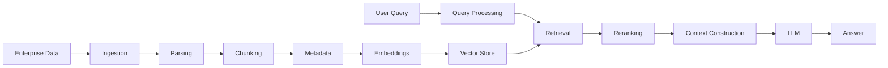
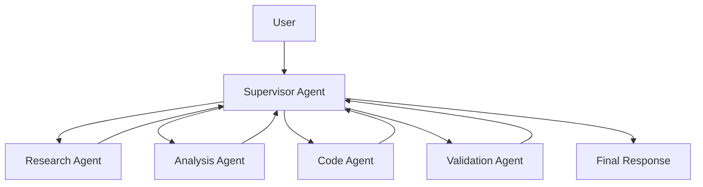
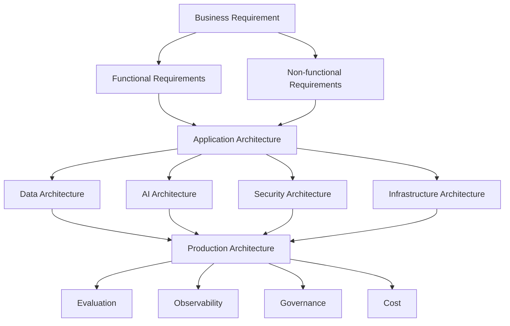
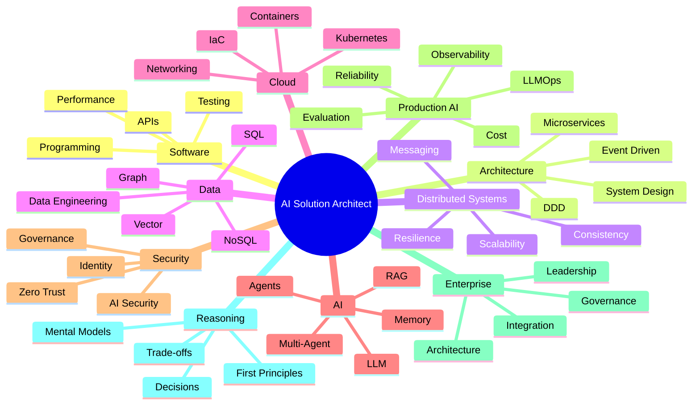

# AI Solution Architect Learning Path

## The complete journey

---

# PHASE 1 — Architect's Developer Foundation

Before becoming an architect, you need to understand the things you're actually architecting.

### 1. Programming mastery

* Clean code
* SOLID
* OOP
* Functional concepts
* Generics
* Async programming
* Concurrency
* Error handling
* Dependency injection
* Design patterns
* Refactoring
* Testing
* Profiling
* Performance engineering

### 2. API engineering

* REST
* HTTP
* gRPC
* WebSockets
* GraphQL
* API versioning
* Idempotency
* Pagination
* Rate limiting
* Authentication
* Authorization
* API gateways
* Contract testing

### 3. Application architecture

* Layered architecture
* Clean Architecture
* Hexagonal architecture
* Ports & adapters
* Modular monolith
* Microservices
* Domain-Driven Design
* Bounded contexts
* Aggregates
* CQRS
* Event sourcing
* Dependency inversion
* Architecture Decision Records

**Reasoning question:**

> Why did we need microservices when a modular monolith could work?

That is exactly the type of question your methodology should use.

---

# PHASE 2 — Distributed Systems

This is where a developer starts thinking like an architect.

### Core concepts

* Processes
* Threads
* Concurrency
* Parallelism
* Distributed communication
* Network failures
* Partial failures
* Timeouts
* Retries
* Backpressure
* Circuit breakers
* Bulkheads
* Idempotency
* Distributed transactions
* Two-phase commit
* Saga pattern
* Eventual consistency
* Strong consistency
* CAP theorem
* PACELC
* Consensus
* Leader election
* Distributed locking
* Ordering
* Deduplication
* Exactly-once vs at-least-once
* Message delivery semantics

### Messaging

* Queues
* Pub/sub
* Kafka
* RabbitMQ
* Event-driven architecture
* Event choreography
* Event orchestration
* Dead-letter queues
* Consumer groups
* Partitioning
* Ordering
* Replay

---

# PHASE 3 — Data Architecture

An AI architect absolutely needs strong data architecture.

### Databases

* Relational databases
* SQL
* PostgreSQL
* SQL Server
* Indexing
* Query optimization
* Transactions
* Isolation levels
* NoSQL
* MongoDB
* Key-value stores
* Document stores
* Wide-column databases
* Time-series databases

### Data architecture

* Data modeling
* Normalization
* Denormalization
* Partitioning
* Sharding
* Replication
* Read replicas
* CDC
* Data pipelines
* ETL / ELT
* Data lakes
* Data warehouses
* Lakehouses
* Data governance
* Data lineage
* Data quality

### AI-specific data

* Embeddings
* Vector databases
* Vector indexes
* Metadata
* Chunking
* Document processing
* Semantic search
* Hybrid search
* Knowledge graphs
* Graph databases

---

# PHASE 4 — Cloud & Infrastructure Architecture

An AI solution architect must understand where the system actually runs.

### Cloud fundamentals

* Compute
* Storage
* Networking
* DNS
* Load balancing
* CDN
* VPC/VNet
* Subnets
* Firewalls
* Private endpoints
* IAM
* Secrets management
* Managed services

### Containers

* Docker
* Container networking
* Images
* Registries
* Security scanning

### Kubernetes

* Pods
* Deployments
* Services
* Ingress
* ConfigMaps
* Secrets
* StatefulSets
* Jobs
* CronJobs
* HPA
* KEDA
* Resource limits
* Scheduling
* Persistent volumes
* Network policies

### Platform engineering

* Kubernetes architecture
* Helm
* GitOps
* ArgoCD
* Infrastructure as Code
* Terraform
* Environment management
* Service mesh
* Platform APIs

### Cloud architecture

Understand at least one cloud deeply:

**Azure / AWS / GCP**

For your path, Azure can be the primary reference architecture.

---

# PHASE 5 — Security Architecture

This cannot be an afterthought in AI systems.

### Application security

* Authentication
* Authorization
* RBAC
* ABAC
* OAuth2
* OIDC
* JWT
* mTLS
* TLS
* Secrets
* Encryption
* Key management

### Enterprise security

* Zero Trust
* Network segmentation
* Private networking
* Identity boundaries
* Data classification
* Data loss prevention
* Audit logging
* Compliance

### AI security

* Prompt injection
* Indirect prompt injection
* Jailbreaking
* Data exfiltration
* Tool abuse
* Excessive agency
* Insecure output handling
* RAG poisoning
* Training-data concerns
* Model supply-chain risks
* Agent identity
* Tool authorization
* Tenant isolation

---

# PHASE 6 — AI / LLM Foundations

Now enter AI.

But **do not turn this into an ML research curriculum**.

Focus on what an application architect needs.

### Understand

* AI vs ML vs Deep Learning vs GenAI
* Foundation models
* LLMs
* Tokens
* Context windows
* Transformer high-level architecture
* Attention — conceptual understanding
* Embeddings
* Inference
* Temperature
* Top-p
* Model parameters
* Model capabilities
* Model limitations

### Model selection

Reason about:

* Quality
* Latency
* Cost
* Context length
* Multimodal capability
* Privacy
* Hosting
* Availability
* Vendor lock-in

### Model patterns

* Foundation models
* Small language models
* Open-source models
* Hosted models
* Fine-tuning
* LoRA / PEFT
* Quantization
* Distillation

You don't need deep model-training mathematics for the Solution Architect path.

---

# PHASE 7 — LLM Application Engineering

Now learn how to actually build AI applications.

### Prompt engineering

* System prompts
* User prompts
* Few-shot prompting
* Structured prompting
* Prompt templates
* Prompt versioning
* Prompt injection resistance
* Output constraints

### Structured outputs

* JSON schema
* Function calling
* Typed outputs
* Validation
* Retries
* Output parsing

### LLM patterns

* Simple completion
* Chain
* Router
* Parallel execution
* Map/reduce
* Reflection
* Critic
* Generator/validator
* Planner/executor

---

# PHASE 8 — RAG Architecture

This should be a **major learning pillar**.

### Learn

* RAG fundamentals
* Document ingestion
* Parsing
* OCR
* Chunking
* Metadata
* Embeddings
* Vector databases
* Similarity search
* ANN indexes
* Hybrid search
* BM25
* Reranking
* Query rewriting
* Multi-query retrieval
* Context compression
* Contextual retrieval
* Parent-child retrieval
* Hierarchical retrieval
* Filtering
* Semantic search
* Knowledge graphs
* Graph RAG
* Multimodal RAG

### RAG architecture

* Naive RAG
* Advanced RAG
* Agentic RAG
* Graph RAG
* Hybrid RAG
* Multi-index RAG
* Multi-tenant RAG

### RAG failure modes

* Bad chunking
* Missing documents
* Poor retrieval
* Wrong ranking
* Context overload
* Stale data
* Conflicting sources
* Hallucination
* Citation failures

---

# PHASE 9 — AI Memory

This deserves its own phase because **memory is not simply "chat history."**

### Memory types

* Conversation memory
* Short-term memory
* Long-term memory
* Semantic memory
* Episodic memory
* Procedural memory
* Working memory
* User memory
* Organizational memory

### Architecture

* What should be remembered?
* What should never be remembered?
* Where should memory live?
* When should memory be retrieved?
* When should memory be updated?
* How do we forget?
* How do we correct memory?
* How do we prevent memory poisoning?

### Critical distinction

**Context ≠ memory**

**RAG ≠ memory**

**Conversation history ≠ memory**

Understanding these distinctions is essential.

---

# PHASE 10 — Tool Calling & AI Interfaces

AI becomes useful when it can interact with systems.

### Learn

* Function calling
* Tool schemas
* Tool discovery
* Tool selection
* Tool validation
* Tool permissions
* Tool execution
* Tool results
* Error handling
* Tool retries
* Idempotency
* Human approval

### MCP

* MCP architecture
* MCP clients
* MCP servers
* Resources
* Tools
* Prompts
* Authentication
* Authorization
* Security
* Enterprise MCP architecture

Also understand the broader ecosystem of AI-to-AI and AI-to-system communication, including emerging agent interoperability standards.

---

# PHASE 11 — Agentic AI

Now the learner moves from:

**LLM application**

to:

**AI system capable of reasoning and acting.**

### Agent fundamentals

* Agent definition
* Perception
* Reasoning
* Planning
* Action
* Observation
* Feedback
* State
* Goals
* Tools

### Agent patterns

* ReAct
* Planner
* Executor
* Router
* Supervisor
* Critic
* Reflection
* Human-in-the-loop
* Autonomous agent
* Workflow agent

### Agent state

* State modeling
* Persistence
* Checkpoints
* Recovery
* Interruptions
* Resumption

---

# PHASE 12 — Multi-Agent Architecture

This becomes an architectural discipline of its own.

### Learn

* Single agent vs workflow
* Single agent vs multi-agent
* Agent specialization
* Supervisor architecture
* Hierarchical agents
* Peer-to-peer agents
* Sequential agents
* Parallel agents
* Debate
* Consensus
* Agent delegation
* Agent communication
* Shared state
* Independent state
* Agent discovery
* Agent identity
* Agent permissions

### Critical architectural question

> **Do I actually need multiple agents?**

Sometimes a deterministic workflow is better.

That decision itself should be taught through reasoning.

---

# PHASE 13 — AI Orchestration

Learn one orchestration framework deeply.

For example:

**LangChain → LangGraph**

Then understand the architectural concepts independently of the framework.

### LangGraph concepts

* State
* Nodes
* Edges
* Conditional routing
* Checkpoints
* Persistence
* Interrupts
* Human-in-the-loop
* Retries
* Timeouts
* Parallel execution
* Subgraphs
* Streaming
* Durable execution

Also understand:

* Workflow engines
* Event-driven AI
* Temporal-style durable workflows
* n8n-style automation
* Deterministic vs agentic orchestration

---

# PHASE 14 — AI Evaluation

This is where many AI developers stop too early.

An architect needs to answer:

> **How do I know this AI system works?**

### Evaluation

* Offline evaluation
* Online evaluation
* Golden datasets
* Human evaluation
* LLM-as-judge
* Regression testing
* Prompt evaluation
* Retrieval evaluation
* Agent evaluation

### RAG metrics

* Precision
* Recall
* Context relevance
* Context precision
* Context recall
* Faithfulness
* Answer relevance

### Agent metrics

* Task success
* Tool selection accuracy
* Tool execution success
* Planning quality
* Number of steps
* Failure rate
* Human intervention rate

### Evaluation architecture

Build an **evaluation pipeline**, not just a test script.

---

# PHASE 15 — LLMOps / AI Observability

Production AI needs a different operational mindset.

### Observability

* Logs
* Metrics
* Traces
* OpenTelemetry
* Distributed tracing
* Token usage
* Latency
* Model calls
* Retrieval traces
* Tool traces
* Agent traces

### AI-specific monitoring

* Hallucination
* Drift
* Retrieval degradation
* Prompt changes
* Model changes
* Cost changes
* Quality degradation
* Agent loops
* Tool failures

---

# PHASE 16 — AI Cost Architecture

Architects must understand the economics.

### Learn to reason about

* Token economics
* Input vs output tokens
* Model selection
* Caching
* Semantic caching
* Prompt caching
* Batch inference
* Model routing
* Small vs large models
* Embedding costs
* Vector database costs
* GPU costs
* Infrastructure costs

Then design:

> **Cost-aware AI architecture**

---

# PHASE 17 — AI Reliability

AI systems are probabilistic.

Traditional software assumes:

> Same input → deterministic output

AI systems often don't.

Learn:

* Retries
* Fallback models
* Structured output validation
* Guardrails
* Confidence estimation
* Verification
* Self-checking
* Circuit breakers
* Timeouts
* Rate limits
* Budget limits
* Agent step limits
* Dead-letter workflows
* Human escalation
* Graceful degradation

---

# PHASE 18 — Responsible AI & Governance

Enterprise AI requires governance.

### Learn

* AI governance
* Model governance
* Data governance
* Privacy
* PII
* Data residency
* Consent
* Auditability
* Explainability
* Transparency
* Human oversight
* Risk classification
* AI policies
* Model cards
* AI system documentation

Understand major regulatory concepts such as:

* EU AI Act
* GDPR
* Sector-specific regulation
* Financial-services AI governance

---

# PHASE 19 — Enterprise AI Architecture

Now combine everything.

### Enterprise patterns

* AI gateway
* Model gateway
* AI service layer
* Prompt registry
* Model registry
* Agent registry
* Tool registry
* Knowledge platform
* RAG platform
* Evaluation platform
* AI observability platform
* Guardrail layer
* Policy engine
* Identity layer
* Audit layer

### Multi-tenancy

* Tenant isolation
* Tenant-specific knowledge
* Tenant-specific memory
* Tenant-specific policies
* Tenant-specific agents
* Tenant-specific models

---

# PHASE 20 — AI System Design

Now practice architecture interviews and real architecture.

For every system:

You should be able to design:

* AI customer support system
* Enterprise knowledge assistant
* Document intelligence platform
* AI coding assistant
* Financial research assistant
* AI workflow automation platform
* Multi-agent business process automation
* Enterprise RAG platform
* AI decision-support system
* AI-powered application
* Agent platform

---

# PHASE 21 — Architecture Leadership

A Solution Architect isn't just a technical encyclopedia.

Learn:

* Requirements discovery
* Stakeholder management
* Architecture communication
* Architecture reviews
* Technical decision-making
* ADRs
* Risk management
* Technical debt
* Build vs buy
* Vendor selection
* Technology evaluation
* Cost justification
* Migration planning
* Roadmaps
* Architecture governance

And critically:

> **How do I explain a complex architecture to a business stakeholder, developer, security engineer, and CTO differently?**

---

# The final capability model

At the end, your learner should be capable in **10 dimensions**:

## And one important thing

I **wouldn't make this a giant list of technologies to memorize**.

Your Learn by Reasoning methodology gives you a much better organizing principle:

> **Every technology exists because some problem, constraint, or trade-off forced somebody to create it.**

So instead of teaching:

> “Learn Kafka.”

Teach:

> “Your system has 50 consumers, millions of events, independent processing speeds, and you need replay. What problem do you have now?”

Then Kafka becomes the **consequence of the reasoning**, rather than another item on a technology checklist.

Likewise:

**RAG** emerges from the context/knowledge problem.

**Vector databases** emerge from semantic retrieval.

**Memory** emerges from the limitations of transient context.

**Agents** emerge when fixed workflows aren't sufficient.

**Multi-agent systems** emerge when one reasoning unit becomes too broad or specialized.

**Kubernetes** emerges from deployment/orchestration complexity.

**Event-driven architecture** emerges from coupling and asynchronous processing requirements.

**Observability** emerges because distributed systems become impossible to understand from logs alone.

**Evaluation** emerges because traditional unit tests cannot fully establish LLM quality.

That is the heart of your platform.

### The ultimate learning progression

**Problem → Constraints → Existing Options → Reasoning → Decision → Architecture → Implementation → Failure → Trade-off → General Principle → New Problem**

That is how I would build the entire **Developer → Solution Architect → AI Solution Architect** curriculum.
