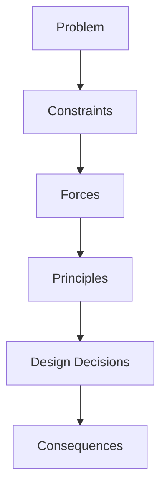

# Software Engineering Fundamentals

*Phase 1 — Software Engineering Fundamentals*

**Phase Intent:** You don't learn technologies, you learn the problems they solve. Phase 1 builds the mental models of software quality, API design and architecture trade-offs that you will reuse in every later phase.

**Learning Outcome:** By the end you can read code and designs, identify coupling, cohesion and architectural smells, and reason about when to apply a principle vs when to break it.

## Why This Phase Exists

The problem: code grows, teams change, requirements shift, performance degrades, and the same bugs return.

Fundamental engineering principles are responses to these problems. They exist to reduce complexity, increase predictability, and make systems easier to change safely.

## Problem Space

* Complexity grows faster than features
* Change introduces risk
* Teams need shared reasoning
* Quality degrades without explicit design

## Core Concepts

* **Quality attributes:** correctness, maintainability, testability, performance, security
* **Coupling and cohesion:** what belongs together and why
* **Separation of concerns:** reducing interference
* **Abstraction:** hiding detail to focus on intent
* **Design principles:** SOLID as responses to specific change problems

## Underlying Forces

* Change frequency vs stability
* Team size vs coordination cost
* Readability vs performance
* Safety vs speed

## Visual Model

## Reasoning

* Why do we need tests? Because change must be safe.
* Why do we modularize? To localize change.
* Why do we prefer explicit contracts? To reduce implicit coupling.

## Trade-offs

* Abstraction vs indirection
* DRY vs readability
* Early optimization vs clarity
* Framework speed vs learning cost

## Decision Framework

Ask:

1. What is changing?
2. Who changes it?
3. What breaks if we are wrong?
4. What do we optimize for now, what can we defer?

## Cases

* Monolith with high change velocity
* Legacy codebase with no tests
* Team split across modules

## Constraint Mutation

* What if the team doubles?
* What if latency becomes critical?
* What if the codebase must be maintained by juniors?

## Failure

* Over-abstraction creating indirection
* Premature optimization hiding bugs
* Test suites that test implementation not behavior

## General Principle

Design for change. Principles are not rules; they are hypotheses about future change.

## Transfer

Given a new domain, can you identify coupling, predict change, and propose a modularization that localizes risk?

## Mental Model

*Code is a design communication tool. Every structure encodes an assumption about future change.*

## Compact Takeaway

Understand the forces, then the principles make sense.