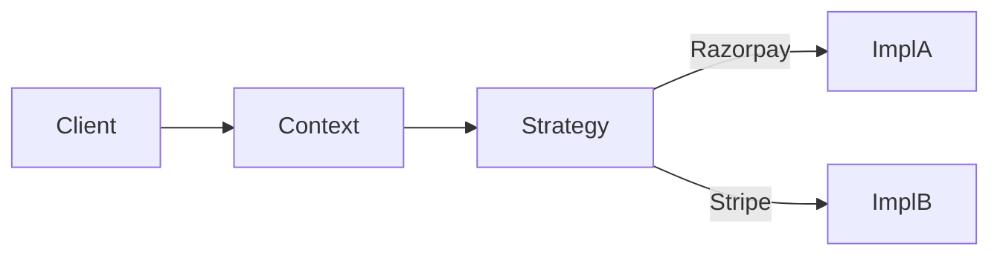

# Design patterns

> **Learning Path:** Architect's Developer Foundation
> **Section:** 1.1.10 — 1. Programming mastery

## 1. Problem

நீங்கள் 5 வருஷமா code எழுதுறீங்க. ஒரு service-ல ஒரு logic-ஐ நீங்கள் மூன்றாவது தடவை copy-paste பண்ணும்போது உங்களுக்கு தெரியும் — இது இனி maintenance nightmare ஆகப் போகுது.

ஒரு e-commerce platform-ல payment gateway வேணும். ஆரம்பத்தில் Razorpay மட்டும். 6 மாசத்தில் PayPal, Stripe வேணும். ஒவ்வொரு gateway-க்கும் API shape வேற, error handling வேற, retry logic வேற.

இங்கே என்ன வலிக்கிறது?
* Code duplicate ஆகிறது
* Business logic gateway details-உடன் கலந்து விடுகிறது
* ஒரு gateway மாறினால் பல files மாற வேண்டி வருகிறது
* New developer வந்தால் "இதை எப்படி extend பண்ணுறது?" என்று தெரியாமல் இருக்கிறது

இந்த வலி தான் design patterns வந்த காரணம்.

## 2. Mental Model

Design pattern என்பது **code template இல்லை**. அது ஒரு பெயர் பெற்ற reasoning.

> ஒரு recurring problem + constraints + forces இருக்கு. அதுக்கு பலர் பரிசோதித்து ஒரு shape-ஐ கண்டுபிடிச்சிருக்காங்க. அந்த shape-க்கு பெயர் தான் pattern.

நீங்கள் pattern-ஐ மனப்பாடம் பண்ணுவதில்லை. நீங்கள் pattern-ஐ ஒரு architectural vocabulary ஆக பயன்படுத்துகிறீர்கள்.

ஒரு architect-க்கு pattern என்பது: "இந்த constraint-க்கு இந்த shape சரியாக இருக்கும், இந்த trade-off வரும்" என்று பேசும் மொழி.

## 3. How It Works

Pattern-ஐ புரிந்துகொள்ள 3 விஷயங்கள் மட்டும் பார்த்தால் போதும்:

1. **Context**: எப்போது இது வரும்? எந்த force இருக்கு?
2. **Forces**: Coupling, change, reuse, performance எது முக்கியம்?
3. **Shape**: Components எப்படி பிரிக்கப்படும், dependency எப்படி போகும்?

உதாரணமாக Strategy pattern.

Context: Same algorithm family, different implementations.
Forces: Runtime-ல behavior மாற வேண்டும், client code மாறக்கூடாது.
Shape: Context holds a reference to a Strategy interface. Strategy implementers encapsulate variation.

## 4. Architectural Reasoning

ஒரு architect design pattern-ஐ தேர்வு செய்வது எதற்காக?

* **Change isolation**: Business rule மாறும். Infrastructure மாறாது. Pattern தேவை.
* **Coupling குறைக்க**: High-level module low-level details-ஐ குறிப்பிடக்கூடாது.
* **Reuse**: Common flow-ஐ extract பண்ணி அதை parameterize பண்ண வேண்டும்.

உதாரண flow:

Client Context-ஐ மட்டும் தெரியும். Gateway implementation தெரியாது.

இது Factory pattern-உடன் சேரும்: Object creation logic-ஐ centralize பண்ணி client-க்கு hide பண்ணுவது.

## 5. Trade-offs

**Abstraction cost.** Pattern பயன்படுத்தினால் extra interfaces, extra indirection வரும். Small script-க்கு over-engineering.

**Learning overhead.** Team-க்கு common vocabulary இல்லை என்றால் pattern code unreadable ஆகும்.

**Indirection debugging.** Call stack நீளும். ஒரு bug-ஐ trace பண்ணுவது கொஞ்சம் கடினம்.

**Premature pattern.** Problem இல்லாமல் pattern போட்டால் code complex ஆகி விடும். Pattern என்பது வலி வந்த பிறகு தீர்வு.

முக்கிய failure mode: Pattern-ஐ copy-paste பண்ணி forces-ஐ புரியாமல் பயன்படுத்துவது. அப்போது code boilerplate மட்டுமே கிடைக்கும், value கிடைக்காது.

## 6. Practical Example

Order service-ல payment process.

Problem: New payment provider ஒவ்வொரு மாதமும் வரலாம். Each provider has different API, retry policy, idempotency key format.

Reasoning:
* Constraint: Zero downtime deploy, no code change in Order service core flow.
* Option 1: if-else chain. Quick but brittle.
* Option 2: Strategy + Factory.

Decision: PaymentProcessor interface define பண்ணி, RazorpayProcessor, StripeProcessor implement பண்ணு. Factory config-இலிருந்து correct strategy-ஐ திருப்பி கொடுக்கும்.

Result: New provider வந்தால் new class மட்டும் add. Order service மாறாது. Testing easy. Operational change config மூலம்.

இதே reasoning தான் Repository pattern-ல database access abstraction-க்கு, Adapter pattern-ல third-party API shape mismatch-க்கு.

## 7. Reasoning Challenge

உங்களிடம் Notification service இருக்கு. Email, SMS, WhatsApp, Push தேவை. ஒவ்வொரு channel-க்கும் format வேறு, rate limit வேறு, failure retry வேறு. Business team ஒவ்வொரு வாரமும் priority மாற்றுகிறார்கள்.

இ
