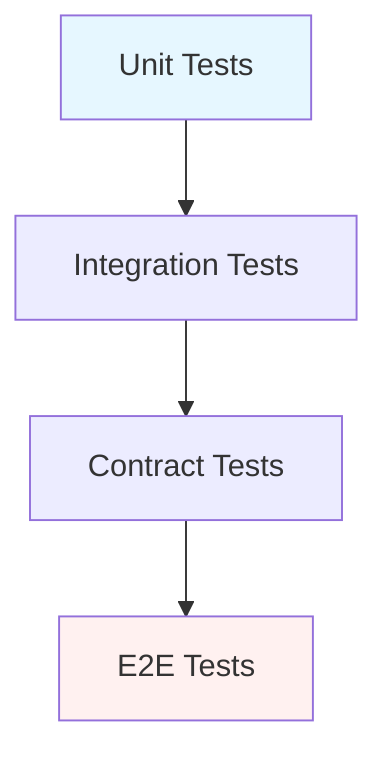

# Testing

> **Learning Path:** Architect's Developer Foundation
> **Section:** 1.1.12 — 1. Programming mastery

# Testing — Architect-க்கு ஏன் முக்கியம்?

## 1. Problem

நீங்க ஒரு feature release பண்ணப் போறீங்க. Code review முடிஞ்சுது. Staging-ல பார்த்தா fine. Production-க்கு push பண்ணியதும் checkout flow break ஆகுது.

என்ன நடந்தது? ஒரு சின்ன refactoring, மறுபக்கம் இருந்த service அதை expect பண்ணின format-ஐ மாத்திடுச்சு. அந்த change-க்கு யாரும் catch பண்ணல.

இது தான் core pain. **Change பண்ணும்போது break ஆகாம இருக்கணும்.** ஆனா change இல்லாம system grow பண்ண முடியாது.

அதனால engineers tests-ஐ உருவாக்கினாங்க. Tests என்பது documentation அல்ல. Change-க்கு safety net.

## 2. Mental Model

Test என்பது ஒரு executable specification.

> "இந்த system இப்படி behave பண்ணணும்" என்று நீங்க சொன்னதை code-ல எழுதுவது.

அதன் மூலம் உங்களுக்கு கிடைக்குறது:
* **Fast feedback** — தவறு தெரிய fast
* **Confidence to refactor** — அச்சமில்லாம மாற்றலாம்
* **Living documentation** — code எப்படி use ஆகணும்னு test சொல்லும்

Architect-க்கு முக்கியம்: test strategy என்பது architecture decision. இது speed, cost, reliability-ஐ நேரடியா தீர்மானிக்கும்.

## 3. How It Works

ஒரே test எல்லாத்துக்கும் போதாது. Feedback loop speed மாறும்.

* **Unit test** — ஒரு function/class தனியா சரியா வேலை செய்யுதா. Fast, isolated, mock பண்ணலாம்.
* **Integration test** — DB, cache, message queue மாதிரி real dependencies-உடன் வேலை செய்யுதா.
* **Contract test** — Service A Service B-ஐ call பண்ணும்போது API shape, schema மாறாம இருக்கா? Microservices-ல இது critical.
* **E2E test** — user flow முழுசா run ஆகுதா. Slow ஆனா high confidence.

Pyramid logic: அடிப்பகுதியில் அதிக unit tests, மேலே குறைவு E2E. ஏன்னா unit fast, cheap, stable. E2E slow, expensive, flaky.

## 4. Architectural Reasoning

எப்போ எந்த test முக்கியம்?

* **Team size பெருசு, services அதிகம்** → Contract tests முக்கியம். இல்லாட்டி breaking change silent-ஆ production-க்கு போகும்.
* **External dependencies அதிகம்** → Integration tests-ஐ isolate பண்ணி, test doubles use பண்ணுங்க. Real payment gateway-க்கு ஒவ்வொரு CI run-லயும் hit பண்ண முடியாது.
* **High change velocity** → Fast feedback loop வேணும். Unit tests ரொம்ப fast, CI-ல சில நொடிகளில் முடியணும்.
* **Regulated domain, finance/health** → Audit trail, E2E & integration coverage கண்டிப்பா வேணும்.

Architect கேட்க வேண்டியது: "இந்த test fail ஆனால் நமக்கு எவ்வளவு நேரத்தில் தெரியும்? அது எவ்வளவு பணம்/பிராண்ட் damage-ஐ தடுக்கும்?"

## 5. Trade-offs

* **Coverage vs Maintenance cost.** 100% coverage chase பண்ணா, tests-ஐ maintain பண்ணவே team முழுசும் போயிடும். Flaky tests CI-ஐ trust-இல்லாம ஆக்கும்.
* **Speed vs Confidence.** Unit tests fast ஆனா system interaction miss ஆகும். E2E confident ஆனா slow, fragile.
* **Real vs Mock.** Real DB use பண்ணினா realistic, ஆனா slow & non-deterministic. Mock பண்ணினா fast ஆனா fake confidence கொடுக்கலாம்.
* **Test data & environments.** Production-like environment maintain பண்ணுறது காஸ்ட். Too much fidelity = slow pipeline.

முக்கிய failure mode: **Flaky test**. Network timeout, race condition, shared state. அது developer-ஐ ignore பண்ண habit-க்கு கொண்டு போகும். அப்புறம் test-க்கு value இல்லாம போயிடும்.

## 6. Practical Example

Payment service
