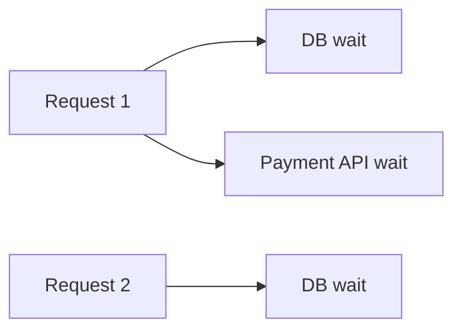

# Concurrency

> **Learning Path:** Architect's Developer Foundation
> **Section:** 1.1.7 — 1. Programming mastery

## 1. Problem

உங்களிடம் ஒரு API service இருக்கு. ஒரு request வந்தா அது DB-ல query பண்ணி, external payment API-க்கு call பண்ணி, பிறகு response தரணும்.

Single thread-ல sequential-ஆ பண்ணினா:
`DB wait 50ms` + `payment API wait 100ms` = 150ms ஒரு request-க்கு.

அதே நேரத்துல CPU idle-ஆ இருக்கு. 100 req/s வேணும், ஆனா ஒரு thread 6-7 req/s தான் முடியுது.

இன்னொரு பக்கம், இரண்டு requests ஒரே user balance-ஐ update பண்ண முயற்சிக்குது. இரண்டும் படித்தது 1000, இரண்டும் -500 பண்ணி 500 என்று எழுதுது. உண்மையில் 0 ஆக இருக்கணும்.

Performance பிரச்சனை + correctness பிரச்சனை. இதுக்கு தான் concurrency தேவைப்படுது.

## 2. Mental Model

Concurrency = ஒரே நேரத்தில் பல வேலைகள் *progress* ஆகுது. 
Parallelism = அவை உண்மையில் ஒரே நேரத்தில் run ஆகுது, multiple CPU cores-ல.

முக்கிய idea: **CPU busy இருக்கும் போது தான் speed கிடைக்கும், wait பண்ணும் போது இல்லை.**

ஒரு thread I/O wait பண்ணும் போது, scheduler அடுத்த thread-ஐ run பண்ண விடும். CPU core idle ஆகாமல் இருக்கும்.

## 3. How It Works

Basic building blocks:

* **Thread / Goroutine / Task**: ஒரு unit of execution. OS scheduler அதை run பண்ணும்.
* **Event loop + async/await**: I/O wait-ல thread block ஆகாமல், callback-ஆக மாற்றி CPU-வை வேறு work க்கு use பண்ணும்.
* **Shared memory + synchronization**: பல threads ஒரே data-ஐ touch பண்ணும்போது lock, mutex, semaphore, atomic operations தேவை.

Simple flow:

Single thread: A wait -> stall. 
Concurrent: Thread 1 wait ஆனால் Thread 2 run ஆகும்.

## 4. Architectural Reasoning

Concurrency உதவுவது எப்போது?

* **I/O bound workloads**: DB, HTTP call, file read, message queue consume. Wait நேரம் அதிகம், CPU குறைவு. இங்கே concurrency = throughput.
* **CPU bound workloads**: image resize, encoding, computation. இங்கே parallelism + more cores தேவை. Concurrency alone போதாது.

Architect decision:
I/O bound service-க்கு async runtime + non-blocking I/O எடுப்பது சரி. Go goroutines, Node.js event loop, Java virtual threads எல்லாம் இதுக்கு தான்.

CPU bound-க்கு thread pool size = CPU cores அளவுக்கு வைக்கணும். அதிக thread வைத்தால் context switch overhead மட்டும் கூடும்.

Alternatives:
* Single threaded + batch processing: latency அதிகம், simple.
* Process per request: resource waste.
* Concurrency with proper isolation: best trade-off.

## 5. Trade-offs

**Correctness vs Performance**
Shared state + concurrent access = race condition. Lock போட்டா correctness வரும், ஆனால் contention ஆகும், throughput குறையும்.

**Complexity**
Concurrency bug reproduce பண்ண கஷ்டம். Deadlock, livelock, starvation எல்லாம் production-ல தான் வெளியே வரும்.

**Resource cost**
அதிக threads = more memory, more context switch. 10k threads வைக்க முடியாது. அதனால் async / lightweight tasks தேவை.

**Failure mode**
One thread crash ஆனால் whole process பாதிக்கலாம். Isolation இல்லாமல் system unreliable ஆகும்.

## 6. Practical Example

Order service. Inventory decrement பண்ணும் போது:

பழைய design: ஒவ்வொரு order request-க்கும் DB row lock போட்டு sequential-ஆ update.

புதிய design: Read inventory, check, decrement. இரண்டு requests ஒரே நேரத்தில் வந்தால் oversell ஆகும்.

Solution: DB level `SELECT ... FOR UPDATE` அல்லது atomic `UPDATE inventory SET qty = qty - 1 WHERE qty > 0`. Application layer-ல mutex பயன்படுத்தி critical section protect பண
