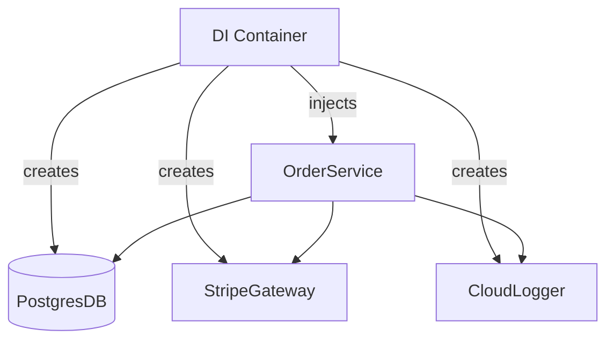

# Dependency injection

> **Learning Path:** Architect's Developer Foundation
> **Section:** 1.1.9 — 1. Programming mastery

## 1. Problem

உங்க codebase-ல `OrderService` இருக்கு. உள்ளே இப்படி இருக்கு:

```python
class OrderService:
    def __init__(self):
        self.db = Database()
        self.payment = StripeGateway()
        self.logger = FileLogger()
```

இப்போது என்ன பிரச்சனை?

* Test பண்ணும்போது உண்மையான Database, Stripe-ஐ call பண்ண வேண்டியிருக்கு. Mock போட முடியல.
* Staging-ல Razorpay use பண்ணணும், Production-ல Stripe. Code மாற்றி deploy பண்ணனும்.
* Logger-க்கு மேலே metrics decorator போடணும்னா `OrderService` class-ஐயே திறக்க வேண்டும்.

ஒரு class தன்னோட dependency-களை தானே உருவாக்கும் போது, அது creation-உம் usage-உம் ஒன்றாகி விடுகிறது. மாற்றம், test, reuse எல்லாம் கஷ்டம்.

இதுதான் **tight coupling** பிரச்சனை.

## 2. Mental Model

Dependency Injection என்பது: **ஒரு object தனக்கு தேவையான dependencies-ஐ தானே create பண்ணாமல், வெளியில் இருந்து கொடுக்கப்படுகிறது.**

Chef-க்கு உதாரணம் கொடுப்போம். Chef சமைக்கிறார், ஆனால் காய்கறியை தானே வயலில் போய் வளர்க்க மாட்டார். Kitchen அவருக்கு தேவையான ingredients-ஐ கொடுக்கும். அதேபோல், Service தன் வேலையை பார்க்கும், dependency-களை வெளியில் இருந்து receive செய்யும்.

Core idea: **Inversion of Control**. Object எதை use பண்ணும்னு சொல்லும், எப்படி create பண்ணனும்னு வெளியே இருக்கும்.

## 3. How It Works

Constructor injection தான் மிக clean வடிவம்.

```python
class OrderService:
    def __init__(self, db: DatabasePort, payment: PaymentGateway, logger: Logger):
        self.db = db
        self.payment = payment
        self.logger = logger
```

Usage:

```python
db = PostgresDB()
payment = StripeGateway()
logger = CloudLogger()

service = OrderService(db, payment, logger)
```

இங்கே `OrderService` எந்த concrete class-ஐயும் தெரிந்து கொள்ள வேண்டியதில்லை. Interface / Port-ஐ மட்டும் expect பண்ணும்.

Setter injection, field injection உண்டு, ஆனால் constructor injection தான் immutable, test-friendly.

Container வந்தால் wiring automate ஆகும். Spring, NestJS, Python dependency-injector போன்றவை lifecycle manage பண்ணும். ஆனால் concept அதேதான்: create outside, pass inside.

## 4. Architectural Reasoning

எப்போது useful?

* **Testability தேவைப்படும் போது.** Real DB/LLM/External API-க்கு பதிலாக Fake/Mock-ஐ inject பண்ணலாம்.
* **Environment-க்கு ஏற்ப implementation மாற வேண்டும் போது.** Prod-ல Stripe, Test-ல FakePayment, Local-ல InMemoryRepo.
* **Cross-cutting concerns add பண்ண வேண்டும் போது.** Logger, Retry, CircuitBreaker, Metrics wrapper-ஐ decorator-ஆக inject பண்ணலாம்.

Alternatives என்ன?
* **Service Locator / Global Singleton.** எல்லாம் ஒரு central registry-ல இருந்து fetch பண்ணும். எளிது ஆனால் hidden dependency, test கஷ்டம்.
* **Direct instantiation.** மேலே பார்த்தது. சிறிய script-க்கு okay, large system-க்கு கட்டுபடாது.

Architect ஏன் DI தேர்வு பண்ணுகிறார்? System boundaries clear ஆகும். Service-க்கு என்ன தேவைன்னு constructor signature-லயே தெரியும். Change impact குறையும்.



## 5. Trade-offs

* **Testability vs Boilerplate.** Constructor parameters அதிகமாகும். 7-8 dependencies வந்தால் class-ஐ use பண்ண கஷ்டம். அப்போது Facade அல்லது Context object பற்றி யோசிக்க வேண்டும்.
* **Explicitness vs Magic.** Container auto-wire பண்ணும்போது wiring எங்கே நடக்குதுன்னு தெரியாமல் போகலாம். Startup failure runtime-ல வரும்.
* **Lifecycle ownership.** DI container singleton vs transient scope manage பண்ண வேண்டும். DB connection pool-ஐ ஒவ்வொரு request-க்கும் உருவாக்கக்கூடாது.
* **Learning cost.** Junior dev-க்கு
