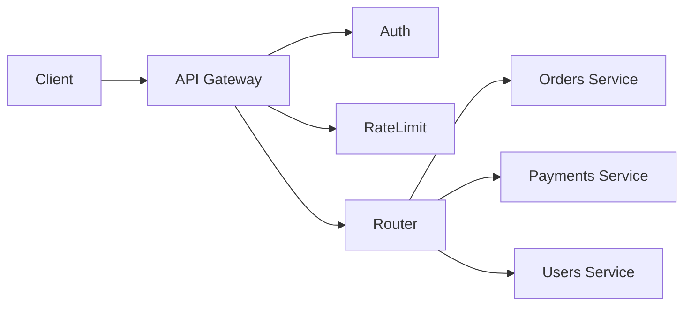

# API gateways

> **Learning Path:** Architect's Developer Foundation
> **Section:** 1.2.12 — 2. API engineering

## 1. Problem

உங்க system-ல 15-20 microservices இருக்கு. Orders, Payments, Inventory, Users, Recommendations.

ஒரு mobile app இருந்து ஒரு page load பண்ணணும்னா, 3-4 services-ஐ call பண்ணணும். Client-க்கு ஒவ்வொரு service-க்கும் வெவ்வேறு base URL, வெவ்வேறு auth scheme, வெவ்வேறு version தெரியணும்.

பிறகு requirements வரும்:
* எல்லா external call-க்கும் JWT validate பண்ணணும்
* Tenant-க்கு rate limit வைக்கணும்
* API key இருக்கா இல்லையான்னு check பண்ணணும்
* Request/response log, metrics எடுக்கணும்
* Mobile client-க்கு v1 response, partner-க்கு v2 response தேவைப்படும்
* DDoS வந்தா முதல்ல block பண்ணணும்

இதை ஒவ்வொரு service-லயும் செய்தா என்ன ஆகும்? Code duplicate ஆகும். ஒரு rule மாறினா 20 repo-ல மாற்றணும். New service வரும்போது மறந்துடுவாங்க. Team coordination nightmare.

இந்த cross-cutting concerns-ஐ centralize பண்ண ஒரு single entry point தேவைப்பட்டது. அதுதான் API Gateway.

## 2. Mental Model

API Gateway ஒரு building-ன் main entrance + reception + security check போல.

எல்லா external request-ம் முதல்ல gateway வழியா வரும். Gateway அங்கே authentication, rate limiting, routing பண்ணி, request-ஐ சரியான backend service-க்கு அனுப்பும். Response-ஐ திருப்பி அனுப்பும் முன் transformation, aggregation செய்யும்.

Clients-க்கு backend complexity தெரியாது. ஒரே URL, ஒரே auth, ஒரே contract.

## 3. How It Works

பெரும்பாலும் இது ஒரு reverse proxy layer.

Request flow:
1. Client `api.company.com/orders` call பண்ணும்
2. Gateway TLS terminate பண்ணும், JWT validate பண்ணும், API key check பண்ணும்
3. Path based routing: `/orders` -> Orders service, `/payments` -> Payments service
4. Request transform செய்யலாம்: header add பண்ணி, payload map பண்ணி
5. Backend-க்கு forward பண்ணும், response வாங்கி client-க்கு திருப்பி அனுப்பும்

Aggregation use case: ஒரு single request வந்து gateway அதை 3 service-க்கு parallel call பண்ணி ஒரே response-ஆ aggregate பண்ணும். Client-க்கு latency குறையும்.

## 4. Architectural Reasoning

Gateway useful ஆகும் போது:

* Multiple backend services உள்ளன, external clients நேரடியாக access பண்ணக்கூடாது
* Cross-cutting concerns: auth, rate limiting, logging, monitoring, CORS, versioning
* Different client types: mobile, web, partner - அவங்களுக்கு different response format வேணும்
* Centralized policy enforcement தேவை

எப்போது தேவையில்லை?

* Single monolith system இருக்கும்போது
* Internal service-to-service communication-க்கு. அதுக்கு service mesh பார்க்கலாம்
* Ultra low latency trading system போன்றது, ஒரு hop கூட கூடாது

Alternatives:
* Each service handles its own auth, rate limiting - குறைந்த coupling ஆனா duplication
* Edge proxy like Cloudflare/AWS API Gateway - managed option
* Sidecar proxy per service - mTLS, observability

நீங்க choose பண்ணுவது centralization vs duplication trade-off பார்த்து.

## 5. Trade-offs

**Latency add ஆகும்.** ஒரு extra network hop, TLS terminate, validation. 5-20ms கூடும். High throughput system-ல இது matter ஆகும்.

**Single point of failure + bottleneck.** Gateway down ஆனா எல்லாம் down. அதனால high availability, horizontal scaling, multi-region தேவை.

**Coupling risk.** எல்லா client-ம் gateway-ஐ depend பண்ணும். Gateway-ல logic அதிகமாகி business logic ஆக மாறிடும். அது anti-pattern.

**Operational complexity.** Gateway config, routing rules, version management ஒரு team-ல இருக்கணும். Change ஒன்னு பாதிக்கும் எல்லா service-யும்.

Failure mode: Gateway memory leak ஆனா எல்லா request-ம் fail. அதனால circuit breaker, rate limiting, proper autoscaling முக்கியம்.

## 6. Practical Example

E-commerce platform.

Clients: iOS app, Android app, Web, Partner API.

Backend: Orders, Catalog, Inventory, Pricing, Recommendations, User Profile.

API Gateway-ல:
* JWT validation + tenant extraction
* Rate limit: per API key, 1000 req/min for free tier, 10000 for paid
* Path routing: `/v1/orders` -> orders-svc:8080
* Aggregation endpoint: `/v1/home` - gateway catalog, recommendations, pricing-க்கு parallel call பண்ணி ஒரே JSON ஆ திருப்பி அனுப்பும்
* Response transformation: Partner-க்கு fields filter பண்ணி கொடுக்கும்

New service add பண்ணும்போது code மாற்றாமல
