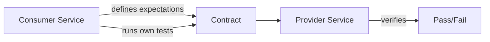

# Contract testing

> **Learning Path:** Architect's Developer Foundation
> **Section:** 1.2.13 — 2. API engineering

## Problem

உங்ககிட்ட இரண்டு service இருக்கு. `Order Service` consumer, `Payment Service` provider. Order Service, Payment Service-ஐ call பண்ணி payment create பண்ணுது.

Payment team ஒரு field-ஐ rename பண்ணிட்டாங்க: `amount` -> `amountInCents`. அல்லது response-ல ஒரு field-ஐ optional-ல இருந்து required ஆக்கிட்டாங்க. அல்லது error code மாறிட்டு.

Order Service அப்படியே deploy ஆகி, production-ல runtime-ல தான் failure வருது. Integration test இருந்தாலும், அது weekly run ஆகுது. அல்லது staging-ல both services ஒன்ணா test பண்ண முடியல.

இதுதான் pain. API மாறினா யாருக்கு break ஆகும்னு தெரியாது. Changes fast, teams independent. End-to-end test எல்லாம் slow, flaky, expensive.

**What goes wrong if we don't have this?** Silent breakage, delayed feedback, teams blame each other, release slow.

## Mental Model

Contract testing என்பது provider-க்கும் consumer-க்கும் இடையே ஒரு agreement. Consumer சொல்றது: "நான் உன்னை இப்படி call பண்ணுவேன், நீ இப்படி respond பண்ணனும்". Provider சொல்றது: "சரி, நான் அந்த contract-ஐ fulfill பண்ண முடியும்".

இது integration test அல்ல. இது API boundary-யை define பண்ணி, அதை automate பண்ணி, independent-ஆ validate பண்ணுறது.

Think of it as a legal contract, not a handshake.

## How It Works

Consumer-driven contract.

1. Consumer side: உனக்கு தேவையான request shape, headers, response schema, status codes, error scenarios எல்லாம் define பண்ணு. Tools like Pact இதை capture பண்ணி contract file ஆக save பண்ணும்.
2. Provider side: அந்த contract file-ஐ download பண்ணி, உன் service run ஆகும்போது அந்த expectations satisfy ஆகுதா என்று verify பண்ணு. Provider verification test.

Flow:

Consumer-ன் change உடனே contract update ஆகும். Provider CI-ல verify பண்ணி fail ஆனா, merge தடுக்கப்படும். Feedback loop minutes level.

## Architectural Reasoning

Contract testing useful ஆகும் போது:

- Multiple teams, independent deploy cadence. Service A release ஆகாமல் Service B block ஆகக்கூடாது.
- Public API, third-party consumers இருக்கும் போது.
- Integration test suite slow / flaky. Real environment setup கஷ்டம்.

இது solve பண்ணுவது: **change impact visibility**. யார் break ஆவாங்கன்னு தெரியும்.

Alternatives:

- **End-to-end / integration tests**: realistic ஆனா slow, environment dependent, feedback late.
- **OpenAPI schema validation**: structure check பண்ணும், ஆனா business expectations like specific error codes, state transitions capture பண்ணாது.
- **Manual coordination**: Slack-ல "நான் field மாற்றினேன்" சொல்லுறது. Scale ஆகாது.

Architect choose பண்ணுறது contract testing-ஐ when **API boundary stability matters more than internal implementation freedom**. Provider-க்கு internal refactor செய்ய freedom இருக்கு, but contract break பண்ணக்கூடாது.

## Trade-offs

1. **Consumer-driven vs Provider burden**: Consumer contract define பண்ணுவது realistic, ஆனா provider-க்கு maintenance overhead. Contract drift ஆனால் false confidence வரும்.
2. **Coverage vs Cost**: எல்லா path-க்கும் contract எழுதுறது கஷ்டம். Happy path மட்டும் test பண்ணினால் edge cases miss ஆகும்.
3. **Versioning complexity**: Provider v2 release பண்ணும்போது, consumer v1-ஐயும் support பண்ணணுமா? Contract per version maintain பண்ணணும்.
4. **Not a replacement for integration test**: Contract API shape-ஐ check பண்ணும். Business logic correctness, data consistency, performance இதை check பண்ணாது.

Failure mode: Contract pass ஆனாலும் real integration fail ஆகலாம், உதாரணமாக timeout, network failure, authentication nuance.

## Practical Example

Enterprise e-commerce. `Order Service` consumer, `Inventory Service` provider.

Order Service expects:
`POST /inventory/reserve` with body `{sku, qty}` -> 200 with `{reservationId, expiresAt}`. 409 if insufficient stock.

Inventory team database schema refactor பண்ணி, response-ல `expiresAt` field-ஐ ISO string இல்லாமல் epoch milliseconds ஆக்கிட்டாங்க.

Consumer contract test immediately fail ஆகும், because consumer expects string parseable as ISO. Provider CI-ல red ஆகும். Merge block ஆகும். Slack alert வரும் முன்னாடியே catch ஆகும்.

இங்கே contract testing இல்லைன்னா, order checkout flow production-ல fail ஆகி, reservation miss ஆகி revenue loss.

## Reasoning Challenge

உங்களுக்கு 20 microservices இருக்கு. ஒரு `Notification Service` இருக்கு. அதை 8 different consumer services use பண்றாங்க. Notification team email format-ஐ மாற்ற வேண்டியிருக்கு, ஆனா breaking change வேண்டாம்.

Contract testing implement பண்ணுவீங்களா? Consumer-driven contract ஒன்னா, provider verification ஒன்னா? Versioning எப்படி handle பண்ணுவீங்க? Trade-off என்ன?

## Key Takeaways

- Contract testing என்பது API boundary-யை enforce பண்ணும் trust mechanism, integration test replacement அல்ல.
- Consumer expectations-ஐ capture பண்ணி, provider independent-ஆ verify பண்ணுறதுதான் core value.
- இது release safety-ஐ அதிகரிக்கும்,
