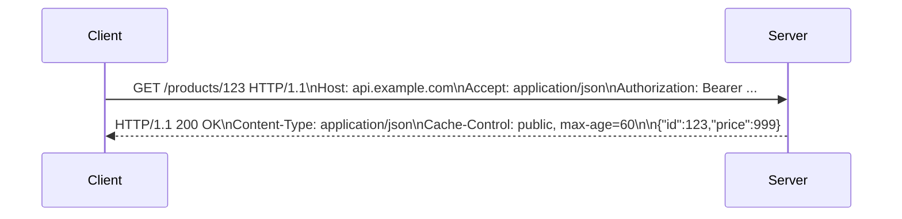

# HTTP

> **Learning Path:** Architect's Developer Foundation
> **Section:** 1.2.2 — 2. API engineering

### 1. Problem

உங்களிடம் ஒரு service இருக்கு. அதை browser, mobile app, மற்ற microservices எல்லாம் கூப்பிடணும். Network unpredictable. Connection drop ஆகும், client retry பண்ணும், server scale பண்ணணும்.

இப்போ நீங்களே ஒரு custom binary protocol வடிவமைத்தால் என்ன ஆகும்? Client-க்கும் server-க்கும் பேச்சு வாக்குவாதம், version mismatch, firewall-ல block, caching இல்லை, debugging கஷ்டம். ஒவ்வொரு client-க்கும் தனி integration.

HTTP வந்தது இந்த chaos-ஐ குறைக்க. ஒரு common contract கொடுத்து, internet-ல வேலை செய்யும் ஒரு simple request-response model.

### 2. Mental Model

HTTP ஒரு stateless request-response protocol.

Client ஒரு request அனுப்பும்: **method + path + headers + optional body**. Server அதற்கு **status code + headers + optional body** திருப்பி அனுப்பும். அவ்வளவுதான்.

Session state server-ல வைக்கப்படாது. ஒவ்வொரு request-ம் தனியாக புரிந்துகொள்ளக்கூடியதாக இருக்கும். இது scaling-க்கு முக்கியம்.

Analogy: Restaurant order slip. Table number இல்லாமல் order slip மட்டும் வந்தால் kitchen அதை செய்ய முடியும். Slip-ல என்ன வேண்டும், எப்படி செய்ய வேண்டும் என்று தெளிவாக இருக்கும்.

### 3. How It Works

ஒரு typical flow:

Request line-ல முக்கியம்: method, resource, HTTP version.

Methods-ல semantic உண்டு:
* `GET` - read, safe, idempotent
* `POST` - create, generally non-idempotent
* `PUT` - replace, idempotent
* `PATCH` - partial update, idempotent if designed well
* `DELETE` - remove, idempotent

Status code 2xx success, 4xx client error, 5xx server error. இது caller-க்கு immediate reasoning கொடுக்கும்.

Headers மூலம் content negotiation, caching, auth, retry logic எல்லாம் பேசப்படும். Body-ல JSON/XML போன்ற payload.

HTTP/1.1-ல keep-alive மூலம் connection reuse. HTTP/2 multiplexing, header compression. HTTP/3 QUIC மூலம் connection migration. Architect-க்கு இது latency மற்றும் head-of-line blocking trade-off.

### 4. Architectural Reasoning

HTTP தேர்வு செய்யப்படுவது ஏன்?

* **Interoperability**: Browser, mobile, 3rd party எல்லாம் HTTP புரிந்துகொள்ளும்.
* **Statelessness**: Server-க்கு session store வேண்டாம். Any instance எந்த request-ஐயும் handle பண்ணலாம். Horizontal scale எளிது.
* **Cacheability**: GET response-ஐ CDN, reverse proxy, browser எல்லாம் cache பண்ணலாம். `Cache-Control`, `ETag`, `Last-Modified` headers மூலம் invalidation கட்டுப்படுத்தலாம்.
* **Observability**: Every request என்பது log-க்கு ஒரு தனித்த entry. Tracing, rate limiting, auth middleware எல்லாம் layer-ல செய்யலாம்.

gRPC / message queue எப்போது? Internal service-to-service, low latency, binary schema, streaming தேவைப்பட்டால். External API, public consumption, caching தேவைப்பட்டால் HTTP நல்லது.

Idempotency முக்கிய architectural decision. Network timeout-ல client retry பண்ணும். `POST /payments` இரண்டு முறை run ஆனால் double charge. அதனால் idempotency-key header வைத்து server duplicate request-ஐ கண்டறியும்.

### 5. Trade-offs

* **Stateless vs Efficiency**: Stateless scaling எளிது, ஆனால் ஒவ்வொரு request-லயும் auth token, context repeat ஆகும். Session cookie / server side session வைத்தால் bandwidth குறையும், ஆனால் stickiness / state store சிக்கல் வரும்.
* **Text vs Binary**: HTTP text based, human readable, debug எளிது. Overhead அதிகம். gRPC binary compact, ஆனால் browser friendly இல
