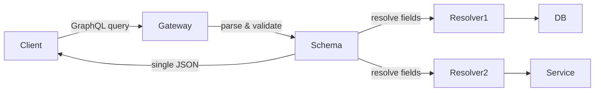

# GraphQL

> **Learning Path:** Architect's Developer Foundation
> **Section:** 1.2.5 — 2. API engineering

## Problem

உங்க mobile app-ல user profile screen இருக்கு. அதுக்கு user name, avatar, email தேவை. ஆனா உங்க REST API `/users/{id}` என்றால் user-ன் full object தருது — name, email, phone, address, orders history, preferences... எல்லாம்.

Mobile network slow, data cost இருக்கு. Client-க்கு தேவையான 3 fields-க்கு 200 fields download ஆகுது. இதுதான் **over-fetching**.

மறுபுறம் product listing page-க்கு product name + price மட்டும் போதும். ஆனா filter மாறும்போது price மட்டும் மாற்றணும்னா முழு list-ஐயும் மறுபடியும் fetch பண்ண வேண்டியிருக்கு. இது waste.

இன்னொரு pain: ஒரு screen-க்கு 3 different REST endpoints தேவைப்படுது. Profileக்கு `/users`, recent orders-க்கு `/orders?userId=`, recommendations-க்கு `/recommendations`. 3 round trips, 3 network latency. Mobile-ல இது feel-ஆக தெரியும். இதுதான் **under-fetching / chatty API**.

Versioning-ம் கஷ்டம். Client-க்கு new field வேண்டும்னா backend-ல `/v2` API விடணும், அல்லது backward compatibility maintain பண்ணணும். Mobile release cycle slow.

இந்த pain எல்லாம் சேர்ந்ததால தான் GraphQL பிறந்தது.

## Mental Model

REST-ல server decides "என்ன data shape தரணும்". GraphQL-ல client decides "எனக்கு என்ன வேண்டும்" என்பதை.

ஒரே endpoint `/graphql`. Client ஒரு query எழுதி சொல்லும்: எனக்கு user id 123-க்கு name, avatar மட்டும் வேண்டும். அல்லது user + orders + orders.items என்று nested வேண்டும்.

Server-க்கு schema இருக்கு. அந்த schema-ப்படி resolver-கள் data fetch பண்ணும். Client-க்கு தேவையான fields மட்டும் திரும்பும். No over-fetch, no under-fetch.

இது API contract-ஐ client-driven ஆக்குகிறது.

## How It Works

Core pieces மூன்று:

**Schema**: Type system. `type User { id: ID!, name: String, avatar: String, orders: [Order] }`. இது API-யின் contract.

**Query Language**: Client GraphQL query மூலம் shape கேட்கிறது.
```graphql
query {
  user(id: "123") {
    name
    avatar
  }
}
```

**Resolver**: ஒவ்வொரு field-க்கும் backend-ல் ஒரு function. GraphQL engine query-வை parse பண்ணி, dependencies-ஐ figure out பண்ணி resolvers-ஐ call பண்ணும்.

ஒரு request flow:



Mutations for writes, Subscriptions for real-time events. ஆனா core idea ஒன்றே: client specifies shape.

## Architectural Reasoning

GraphQL useful ஆகும் போது:

- **Multiple clients, different data needs**: Mobile, web, internal dashboard எல்லாம் same backend-ஐ use பண்ணும், ஆனா data shape வேறுபடும்.
- **Frontend teams want autonomy**: Backend change செய்யாமல் frontend-க்கு new field add பண்ணலாம். Schema evolution incremental ஆகும்.
- **Aggregate data from multiple services**: ஒரு query-ல user service, order service, recommendation service எல்லாவற்றையும் தேவையான field-களை மட்டும் கூட்டி தரலாம். Client-க்கு 1 round trip.

எப்போது REST-ஐ விட்டுவிடலாம்? Internal service-to-service communication-ல, அங்கு contract stable, caching heavy, அப்போ REST மிகவும் simple.

## Trade-offs

**Caching கடினம்.** REST URL மூலம் cache பண்ணலாம். CDN, HTTP cache எல்லாம் work ஆகும். GraphQL ஒரே endpoint `/graphql`, query body-ல வரும். HTTP cache கிட்டத்தட்ட பயன்படாது. Application level caching, persisted queries, query fingerprinting தேவை.

**N+1 problem.** Client `users { posts { comments { author } } }` கேட்டால் naive resolver ஒவ்வொரு user-க்கும் தனித்தனி DB call போகும். DataLoader போன்ற batching, field-level authorization, query complexity analysis தேவை. இது operational complexity கூட்டும்.

**Operational visibility.** REST-ல எந்த endpoint எவ்வளவு hit ஆகிறது என்று easy. GraphQL-ல ஒரே endpoint, ஆனா query patterns வேறுபடும். Logging, metrics, rate limiting-ஐ query cost basis-ல செய்ய வேண்டும்.

**Server complexity அதிகம்.** Schema design, resolver performance, authorization per field எல்லாம் team-க்கு புதிய skill set.

Every solution creates new problem.

## Practical Example

Enterprise e-commerce: Mobile app, Web app, Partner API.

Profile screen-க்கு mobile-க்கு name + avatar மட்டும். Web-க்கு name + avatar + email + settings. Partner API-க்கு name + loyalty points.

REST-ல 3 endpoints / versions. GraphQL-ல ஒரே schema:
```graphql
query GetUser($id: ID!) {
  user(id: $id) {
    name
    avatar
    email @include(if: $isWeb)
    loyaltyPoints @include(if: $isPartner)
  }
}
```

Backend ஒரு service, 3 clients திருப்தி. New field add பண்ணும்போது backward compatible. Frontend release இல்லாமல் iterate பண்ணலாம்.

ஆனா gateway-ல query complexity limiter வைக்க வேண்டும். யாராவது `users { orders { items { product { reviews { ... } } } }` என்று deep query அடித்தால் DB-யை down பண்ணிவிடும்
