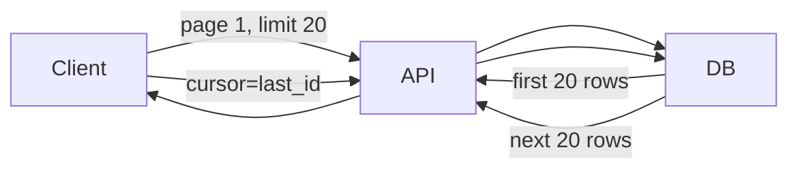

# Pagination

> **Learning Path:** Architect's Developer Foundation
> **Section:** 1.2.8 — 2. API engineering

## Problem

உங்க e-commerce app-ல ஒரு user ஒரு customer-ன் order history பார்க்கிறார். API call போகிறது: `GET /orders?customerId=123`.

அந்த customer-க்கு 2 மில்லியன் orders இருந்தால் என்ன ஆகும்?

Database ஒரே query-ல 2 மில்லியன் rows எடுக்கும். Network-ல அதை அனுப்ப வேண்டும். Mobile app அதை memory-ல load செய்யும். Response time 30 sec ஆகும். DB connection pool முழுவதும் block ஆகும். மற்ற users-க்கு latency போகும்.

இதை தடுக்கவே pagination தேவைப்படுகிறது. முழு dataset-ஐ ஒரே முறை கொடுக்காமல், சிறு window-களாக கொடுக்கிறோம்.

## Mental Model

Pagination என்பது tape-ல தொடர்ந்து வரும் data-வை ஒரு window மூலம் பார்ப்பது போல.

User-க்கு தேவை ஒரு முறை 10/20/50 items மட்டும். அடுத்த page-க்கு போகும்போது window-வை நகர்த்துகிறோம். Database, network, client memory மூன்றுக்கும் load குறையும்.

## How It Works

இரண்டு பிரதான வழிகள்.

**1. Offset / Limit pagination**
```
GET /orders?customerId=123&limit=20&offset=40
```
DB-க்கு `LIMIT 20 OFFSET 40` சொல்கிறோம். Simple, page number-ஐ support செய்கிறது. `page 3` என்று கேட்கலாம்.

**2. Cursor / Keyset pagination**
இங்கே offset கிடையாது. Last seen value-வை cursor-ஆக வைத்துக்கொள்கிறோம்.
```
GET /orders?customerId=123&limit=20&cursor=2024-11-01T10:00:00Z
```
DB-க்கு `WHERE created_at < cursor ORDER BY created_at DESC LIMIT 20`. Cursor என்பது stable sort key.

Mermaid flow:


## Architectural Reasoning

Pagination வருவதற்கு காரணம் constraints.

* **Latency**: User-க்கு உடனடியாக first page வேண்டும், முழு data வேண்டாம்.
* **Memory & Network**: Client-ல memory குறைவு, mobile data cost உண்டு.
* **DB Load**: Large scan + sort cost அதிகம். Small page-க்கு index seek போதும்.
* **Operability**: API timeout, retry logic எளிதாகிறது.

Alternatives என்ன? Streaming, full dump, search with filtering. Streaming continuous feed-க்கு நல்லது. ஆனால் random access வேண்டும் என்றால் pagination தான்.

Architect-ஆக நீங்கள் தேர்வு செய்யும் போது கேட்க வேண்டியது: User-க்கு page number தேவையா? அல்லது infinite scroll போதுமா? Data எவ்வளவு அடிக்கடி மாறுகிறது?

## Trade-offs

**Offset vs Cursor**

* Offset simple, `page 1000` என்று கேட்கலாம். ஆனால் deep page-ல DB still first 20,000 rows skip செய்ய வேண்டும். `OFFSET 1,000,000` என்பது slow மற்றும் cost அதிகம். Inserts/deletes நடக்கும் போது same item இரண்டு page-ல வரலாம் அல்லது skip ஆகலாம்.

* Cursor stable மற்றும் fast. DB index-ஐ தொடர்ந்து பயன்படுத்துகிறது. Deep page performance consistent. ஆனால் random access இல்லை. Page 1000-க்கு நேரடியாக jump செய்ய முடியாது. Sort order மாற்றினால் cursor invalid ஆகும்.

**Consistency**: Pagination + real-time writes = duplicate / missing items. Offset-ல இது அதிகம். Cursor-ல stable sort key இருந்தால் குறைவு.

**API Design**: `limit` க்கு max cap வைக்கவும். User 100,000 limit கேட்டால் DB crash ஆகும்.

## Practical Example

Enterprise order service. Mobile app infinite scroll.

`GET /orders?customerId=123&limit=20&cursor=...`

DB index: `(customerId, created_at DESC, id)`. Query fast.

First request-ல cursor இல்லை. Response-ல `nextCursor` திருப்பி கொடுக்கிறோம். Client அடுத்த page-க்கு அதை பயன்படுத்துகிறது.

Page number UI வேண்டாம் என்றால் cursor மட்டும் போதும். Admin UI-க்கு page number வேண்டும் என்றால் offset பயன்படுத்தலாம், ஆனால் deep page-க்கு warning கொடுக்கவும்.

## Reasoning Challenge

உங்க social feed-ல 100M posts உள்ளன. New posts தொடர்ந்து insert ஆகின்றன. Users infinite scroll விரும்புகிறார்கள். Offset pagination use செய்தால் என்ன problem வரும்? Cursor pagination use செய்தால் என்ன trade-off ஏற்படும்? Sort key-ஆக created_at மட்டும் போதுமா?

நீங்கள் எந்த pagination strategy தேர்வு செய்வீர்கள், ஏன்?

## Key Takeaways

* Pagination என்பது performance, memory மற்றும் UX constraint-
