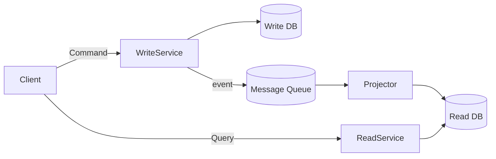

# CQRS

> **Learning Path:** Architect's Developer Foundation
> **Section:** 1.3.10 — 3. Application architecture

## 1. Problem

ஒரு பெரிய e-commerce application-ல order create பண்ணுறீங்க. Same `Order` table-ஐ வைத்து நீங்கள் இரண்டு வேலை செய்ய வேண்டி இருக்கு:

1. Write: inventory check, payment validation, discount rules, audit trail. இது slow, transactional, strict consistency வேணும்.
2. Read: customer-க்கு order history page, admin-க்கு sales dashboard, filter by status, date, amount. இது fast, flexible, lots of joins வேணும்.

ஒரே table-ல இரண்டையும் செய்தால் என்ன ஆகும்? Write செய்யும்போது table lock ஆகும், read slow ஆகும். Read-க்கு தேவையான denormalized columns write model-ல குழப்பம் வரும். Schema மாற்றினால் இரண்டு side-க்கும் impact. Scale பண்ண முடியாது.

இந்த conflict தான் painful. Read-க்கு ஒரு shape, Write-க்கு ஒரு shape வேணும். ஒரே model-ல இரண்டும் போகாது.

## 2. Mental Model

CQRS = **C**ommand **Q**uery **R**esponsibility **S**eparation.

எளிமையாக: Write path-ஐயும் Read path-ஐயும் வேறு வேறு பண்ணு.

* **Command side / Write Model**: Business invariants enforce பண்ணும் இடம். Create, Update, Delete. Strong consistency, validation, domain logic.
* **Query side / Read Model**: Presentation-க்கு தேவையான data shape. Read only, optimized for latency and throughput.

இரண்டும் different model, different database, different scaling rules கூட இருக்கலாம்.

## 3. How It Works

Client command அனுப்பும்.

`Client -> Command -> Write Service -> Write DB`

Write success ஆனதும் ஒரு domain event emit ஆகும், e.g., `OrderCreated`. 

அந்த event-ஐ ஒரு projector கேட்டு read model-ஐ update பண்ணும்.

`Write Service -> event -> Message Queue -> Read Projector -> Read DB`

Query வரும்போது:

`Client -> Query -> Read Service -> Read DB`

Read DB என்பது denormalized, read-optimized view. Eventual consistency இருக்கும்.

## 4. Architectural Reasoning

CQRS useful ஆகும் போது:

* Read vs Write load ratio பெரிசா வித்தியாசப்படும். 95% read, 5% write போன்ற system.
* Read model-க்கு complex filtering, aggregation வேணும். Write model-க்கு அது தேவையில்லை.
* Domain logic complex, write side-ல validation heavy.
* Different scaling requirements. Write service-ஐ 3 replica, Read service-ஐ 30 replica வேண்டும்.

Alternative என்ன? Traditional CRUD with same model, caching, read replicas. Read replica eventual consistency கொடுக்கும் ஆனால் model shape same தான். CQRS model shape வேறுபடுத்த அனுமதிக்கும்.

Choose பண்ணுறது என்பது complexity-க்கு மதிப்பு இருக்கா என்பதைப் பார்த்து.

## 5. Trade-offs

* **Complexity உயரும்.** இரண்டு model maintain பண்ணணும், projection logic, sync failure handle பண்ணணும். Team small என்றால் overkill.
* **Eventual consistency.** Command success ஆன பிறகும் read model update ஆக நேரம் எடுக்கும். User "I just created order, why not visible?" என்று கேட்பார். UX-ல stale read handle பண்ணணும்.
* **Operational overhead.** Message queue, projector failure, replay, idempotency தேவை.
* **Development speed குறையும்** initially. ஆனால் scale ஆகும்போது change isolation improve ஆகும்.

Failure mode: Projector crash ஆனால் read model stale ஆகும். Duplicate event வந்தால் read model duplicate projection ஆகும். Idempotency must.

## 6. Practical Example

Bank account transfer.

Write model: `AccountAggregate` with balance, overdraft rules, audit. Command `TransferMoney` validation strict. DB = PostgreSQL with ACID.

Read model: `AccountSummaryView` = accountId, current balance, last 5 transactions denormalized, ready for dashboard. DB = ClickHouse / materialized view.

Transfer command success ஆனதும் `MoneyTransferred` event emit ஆகும். Projector அதை கேட்டு Read DB-ல balance decrement, transaction list append பண்ணும்.

Admin dashboard 10x faster ஆகும். Write side schema change impact read side-க்கு போகாது.

## 7. Reasoning Challenge

உங்களிடம் order service இருக்கு. 20 consumers அதே order events-ஐ தேவைப்படுத்துகிறார்கள். ஒவ்வொருவருக்கும் processing speed வெவ்வேறு. Producer-ஐ block பண்ணக்கூடாது. Replay வேண்டும். Read API-க்கு sub-100ms latency வேண்டும்.

இங்கே CQRS + event-driven architecture எப்படி உதவும்? Write side-ஐ எப்படி isolate செய்வீர்கள்? Read model eventual consistency-ஐ user-க்கு எப்படி explain பண்ணுவீர்கள்?

## 8. Key Takeaways

* Read needs and Write needs are fundamentally different. One model rarely fits both at scale.
* CQRS separates Command and Query responsibilities, allowing different models, storage and scaling.
