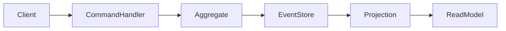

# Event sourcing

> **Learning Path:** Architect's Developer Foundation
> **Section:** 1.3.11 — 3. Application architecture

# Event sourcing

## 1. Problem

நீங்கள் ஒரு order service வைத்திருக்கிறீர்கள். Order-ன் current state மட்டும் database-ல இருக்கு: `status = 'shipped'`, `amount = 1200`.

இப்போது கேள்விகள் வருகின்றன:
* இந்த order எப்போது created ஆச்சு? யார் create பண்ணினார்?
* `paid` ஆனதும், `shipped` ஆனதும் எப்போது? எந்த user action-ல இருந்து வந்தது?
* Customer support-க்கு full audit trail வேண்டும். Finance-க்கு ஒரு view வேண்டும், Operations-க்கு வேற view வேண்டும்.

Traditional CRUD-ல நீங்கள் row-ஐ update பண்ணீர்கள். History overwrite ஆகிறது. Audit table, version column என்று patch போடலாம். ஆனால் race condition, partial update, inconsistent reasoning வரும்.

வேறொரு வலி: bug fix பண்ணி business logic மாற்றினால், கடந்த data எப்படி rebuild பண்ணுவது? Current state மட்டும் இருந்தால் past context மறைந்துவிடும்.

**What problem became painful enough?** State-ஐ மட்டும் store பண்ணுவது history, debugging, multiple read models, temporal queries-க்கு போதாது. Engineers-க்கு "எப்படி ஆச்சு" என்பது முக்கியம், "இப்போ என்ன" மட்டும் இல்லை.

## 2. Mental Model

Event sourcing-ல current state என்பது இல்லை. **State = fold of events**.

ஒரு ledger மாதிரி யோசி. Bank account-ல balance மட்டும் பார்க்காமல், ஒவ்வொரு transaction-ஐயும் append பண்ணி வைத்துக்கொண்டு balance-ஐ கணக்கிடுவது.

அதே போல் domain entity-க்கு `OrderCreated`, `PaymentReceived`, `OrderShipped` போன்ற immutable events-களை append பண்ணி வைக்கிறோம். அந்த stream-ஐ apply பண்ணினால் தான் current state கிடைக்கும்.

அதனால்:
* Write model = Event store, append only
* Read model = Projection, events-ல இருந்து build பண்ணப்பட்டது

## 3. How It Works

Request flow simple:

1. Client `PlaceOrder` command அனுப்புகிறான்
2. CommandHandler Aggregate-ஐ load பண்ணுகிறான். Aggregate-ன் state என்பது அதன் event stream-ஐ replay செய்து கிடைத்தது
3. Business invariant check பண்ணி, new events உருவாக்குகிறான்: `OrderCreated`
4. Events immutable-ஆக event store-ல append ஆகும். Idempotent, ordered.
5. Projection / subscriber அந்த events-ஐ consume செய்து read models-ஐ update பண்ணும்: `orders_view`, `analytics_view`, `search_index`

Current state தேவைப்பட்டால், events-ஐ replay செய்யலாம். Performance-க்கு `snapshot` எடுத்து வைக்கலாம். Snapshot என்பது ஒரு point-in-time state, அதன் பின்னால் உள்ள events மட்டும் apply பண்ணினால் போதும்.

## 4. Architectural Reasoning

Event sourcing useful ஆகும் போது:

* Auditability மற்றும் compliance முக்கியம்: financial, banking, healthcare
* Business process long lived, state transitions அதிகம்
* Multiple bounded contexts-க்கு same data வேண்டும், ஆனால் வெவ்வேறு view வேண்டும்
* Temporal query தேவை: "நேற்று 3 PM-க்கு இந்த order எந்த state-ல இருந்தது?"
* Event-driven architecture-ல decoupling வேண்டும்

Alternatives:
* CRUD + audit table: simple, ஆனால் audit incomplete, replay கடினம்
* Change Data Capture: database changes-ஐ capture பண்ணலாம், ஆனால் intent இல்லை, business meaning குறைவு
* Snapshot only: history இல்லை

Architect choose பண்ணுவது ஏனெனில் **source of truth event stream ஆக மாறுகிறது**. System-க்கு "why" தெரியும், "what" மட்டும் இல்லை.

## 5. Trade-offs

**Complexity** மிகப் பெரிய விலை. CRUD-ல `SELECT ... UPDATE` போதும். இங்கு command → event → projection pipeline வேண்டும்.

**Read model eventual consistency**. Event store-ல write ஆன உடனே read model update ஆகாது. User-க்கு "I just placed order" என்று பார்த்தால் காணாமல் போகலாம். Read-your-writes guarantee கொடுக்க வேண்டுமெனில் extra handling வேண்டும்.

**Schema evolution**. Events immutable. `OrderCreated v1` field மாற்றினால், பழைய events-ஐ migrate செய்ய வேண்டும் அல்லது upcaster எழுத வேண்டும். Versioning முக்கியம்.

**Replay cost**. Aggregate rebuild ஆனால் முழு stream-ஐயும் apply பண்ண வேண்டும். Large streams-க்கு snapshot, partitioning தேவை.

**Failure modes**: Projection lag, duplicate events, out-of-order delivery. Idempotent projection வேண்டும்.

ஒவ்வொரு solution-க்கும் trade-off உண்டு.

## 6. Practical Example

E-commerce order lifecycle.

`OrderAggregate` stream:
1. `OrderCreated {orderId, items, customerId, ts}`
2. `PaymentReceived
