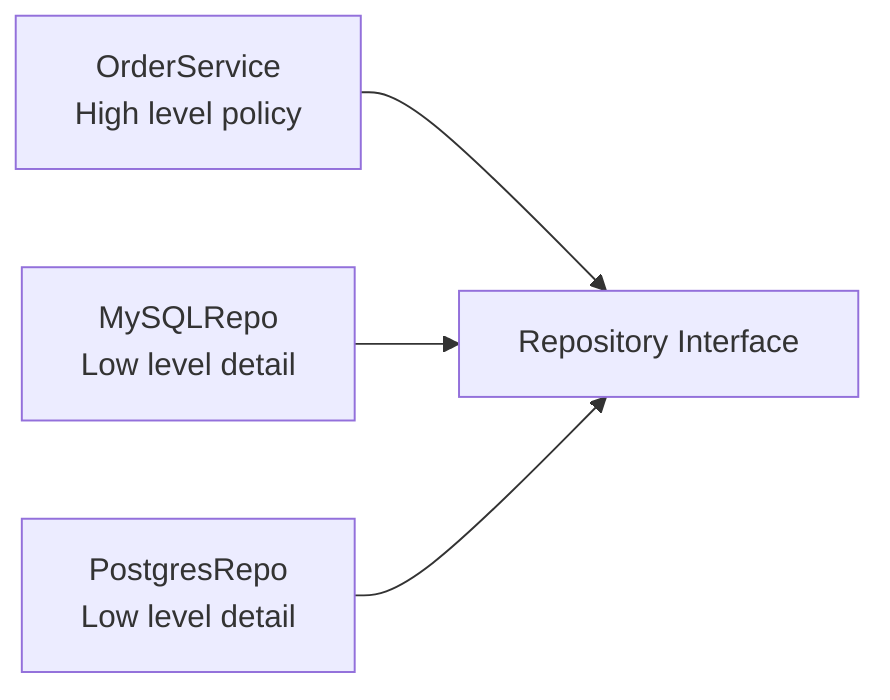

# Dependency inversion

> **Learning Path:** Architect's Developer Foundation
> **Section:** 1.3.12 — 3. Application architecture

## 1. Problem

உங்க codebase-ல `OrderService` இருக்கு. அது ஒரு order create பண்ணும்போது நேரடியாக `MySQLRepository.save()` call பண்ணுது.

இப்போ business கேட்குது:
- dev environment-க்கு in-memory repo வேணும்
- prod-ல cache layer சேர்க்க வேணும்
- MySQL இடத்தில் Postgres க்கு மாறணும்

என்ன ஆகும்? `OrderService`-ல இருக்குற எல்லா இடத்தையும் மாற்ற வேண்டி வரும். ஒரு low-level detail மாறினதுக்கு high-level business logic-க்கு ripple வரும்.

Testing-லயும் பிரச்சனை. `OrderService`-ஐ test பண்ண real database இல்லாம பண்ண முடியாது. Mock பண்ண கஷ்டம்.

இந்த pain தான் dependency inversion வர காரணம்.

## 2. Mental Model

Dependency Inversion Principle சொல்றது:

> High-level module-க்கு low-level module-ஐ தெரிய கூடாது. இரண்டும் ஒரு abstraction-ஐ depend பண்ணணும்.

அதாவது direction மாறணும். Low-level தான் high-level-ஐ தெரிஞ்சுக்கணும், அதுவும் interface மூலமாக.

ஒரு கட்டிடம் கட்டுறதுக்கு architect drawing பார்க்கிறார். Mason அந்த drawing-க்கு ஏத்த மாதிரி செங்கல் வைக்கிறார். Architect செங்கல் factory-ஐ தெரிஞ்சுக்க தேவையில்லை. Drawing தான் abstraction.

## 3. How It Works

பொதுவாக code இப்படி இருக்கும்:

`OrderService` --> `MySQLRepository`

DIP apply பண்ணினா:

`OrderService` --> `Repository` interface
`MySQLRepository` --> implements `Repository`
`PostgresRepository` --> implements `Repository`

`OrderService` இப்போ concrete class-ஐ தெரிஞ்சுக்காது. அது interface-ஐ மட்டும் கேட்கும். Implementation எது வரும் என்பதை composition root / DI container முடிவு பண்ணும்.

## 4. Architectural Reasoning

இது useful ஆகும் போது:
- Same abstraction-க்கு multiple implementations இருக்கும்போது. Payment gateway, Notification channel, Storage backend.
- Team parallel-ஆ வேலை பண்ணணும். High-level team interface-ஐ lock பண்ணிட்டு, low-level team implementation பண்ணலாம்.
- Testing க்கு fake implementation தேவைப்படும் போது.

Alternatives என்ன?
- Direct instantiation: வேகமாக start பண்ணலாம், ஆனால் change-க்கு fragile.
- Service Locator: hidden dependency, test க்கு கஷ்டம்.

ஏன் choose பண்ணுவீர்கள்? Change frequency வேறுபடும். Business rules அடிக்கடி மாறாது, data access / external integration அடிக்கடி மாறும். அதனால் stable abstraction-ஐ high-level-ல வைத்து, volatile detail-ஐ low-level-ல isolate பண்ணுவது.

## 5. Trade-offs

1. **Indirection cost**: Interface + factory / DI setup சேர்க்க வேண்டும். Small code base-க்கு over-engineering ஆகலாம்.
2. **Interface explosion**: எல்லாத்துக்கும் interface போட்டா, maintainability குறையும். Abstraction எங்கே வேணும் என்பதை தீர்மானிக்கணும்.
3. **Leaky abstraction**: Interface design மோசமாக இருந்தால், implementation detail high-level-க்கு leak ஆகும். அப்போ benefit போயிடும்.

Failure mode: Interface-ஐ ஒரு concrete implementation-க்கு ஏத்த மாதிரி design பண்ணிட்டா, அடுத்த implementation வரும்போது interface break ஆகும். அதனால் interface-ஐ use-case driven-ஆ design பண்ணணும்.

## 6. Practical Example

`PaymentService` business logic: validate order, calculate tax, call payment.

பழைய design:
`PaymentService` directly calls `RazorpayClient.charge()`.

இப்போ Stripe-உம் வேணும், plus test-க்கு fake payment வேணும்.

DIP design:
`PaymentService` depends on `PaymentGateway` interface with `charge(amount, currency)` method.

`RazorpayGateway implements PaymentGateway`
`StripeGateway implements PaymentGateway`
`FakePaymentGateway implements PaymentGateway` for tests

Deployment time-ல config-ஆல implementation select பண்ணலாம். `PaymentService` code மாறாது. New gateway add பண்ண 0 change to business logic.

## 7. Reasoning Challenge

உங்களிடம் `NotificationService` இருக்கு. இது order confirm ஆனதும் user-க்கு message அனுப்பணும்.

இப்போ requirement: Email, SMS, WhatsApp மூன்றும் support பண்ண வேணும். User preference-படி channel தேர்வு.

இன்னும் தேவை: dev-ல external provider call பண்ணாம mock notification வேணும்.

இங்கே என்ன abstraction வைப்பீர்கள்? `NotificationService` எதை depend பண
