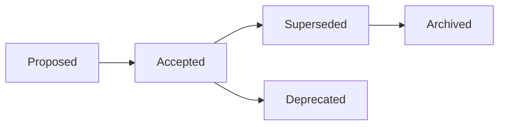

# Architecture Decision Records

> **Learning Path:** Architect's Developer Foundation
> **Section:** 1.3.13 — 3. Application architecture

## 1. Problem

ஒரு team-ல 2 வருஷம் முன்னாடி ஒரு முக்கியமான decision எடுத்தாங்க. உதாரணமா, Order service Inventory-ஐ synchronous REST-ல call பண்ணாம message queue-க்கு மாறினாங்க.

இப்போ ஒரு new engineer join பண்ணார். அவருக்கு கேள்வி: "ஏன் இந்த complexity? REST தானே simple?"

Slack-ல தேடினாலும் thread கிடைக்காது. PR description-ல ஒரு வரி இருக்கும். Code-ல comment இருக்காது. யார் decide பண்ணினாங்க, என்ன constraints இருந்தது, என்ன alternatives reject ஆனது — எல்லாம் lost.

இன்னொரு பக்கம், 6 மாசம் கழித்து business requirement மாறும். அதே decision-ஐ மறுபரிசீலனை செய்யும்போது, original reasoning எதுவும் இல்லாமல், "இது எப்படி வந்தது?" என்று மறுபடியும் விவாதம் start ஆகும்.

இந்த knowledge loss தான் painful. அதை தடுக்க தான் Architecture Decision Record வந்தது.

## 2. Mental Model

ADR என்பது ஒரு decision-க்கான time capsule.

என்ன problem இருந்தது, என்ன options பார்த்தோம், ஏன் இதை தேர்ந்தெடுத்தோம், என்ன trade-off accept பண்ணோம் — இதை ஒரு சிறிய markdown file-ல காலம் கடந்தும் படிக்கும்படி வைப்பது.

Code என்ன செய்கிறது என்பதை சொல்லும். ADR ஏன் அப்படி செய்ய வேண்டியிருந்தது என்பதை சொல்லும்.

## 3. How It Works

சாதாரணமாக repo-வில் `doc/adr/` அல்லது `.adr/` folder இருக்கும்.

ஒரு file பெயர்: `0001-use-event-driven-for-order-inventory.md`

முக்கிய பகுதிகள் மட்டும்:

* **Status:** Proposed / Accepted / Deprecated / Superseded
* **Context:** இப்போது என்ன இருக்கு, என்ன வலி இருக்கு
* **Decision:** என்ன தேர்ந்தெடுத்தோம்
* **Consequences:** Good / Bad
* **Alternatives considered:** ஏன் reject பண்ணோம்

Mermaid-ல simple lifecycle:

File git-ல version control-ல இருக்கும். Code change-க்கு commit செய்வது போல ADR-ம் commit ஆகும். யார் எப்போது மாற்றினார்கள் என்பது history-ல தெரியும்.

## 4. Architectural Reasoning

ADR பயன்படும் போது:

* Cross service boundary முடிவு எடுக்கும்போது
* Irreversible or costly to change decisions: database choice, synchronous vs async, API style, deployment model
* Team size > 3, அல்லது distributed team
* On-call engineer இரவில் incident-ல "ஏன் இப்படி இருக்கு?" என்று புரிந்து கொள்ள வேண்டும்

Alternatives? 
* Wiki page: அது code-க்கு ஒத்திசையாது, stale ஆகும்
* PR description: தேட கஷ்டம், reasoning சுருக்கமாக இருக்கும்
* Tribal knowledge: பேர் leave பண்ணினால் போய்விடும்

ADR தேர்வு செய்யப்படுவது ஏன்? ஏனென்றால் decision + context ஒன்றாக repo-வில் இருக்கும். Review process-ல discussion capture ஆகும்.

## 5. Trade-offs

* **Overhead vs clarity:** ஒவ்வொரு சிறிய மாற்றத்திற்கும் ADR எழுத முடியாது. Architecturally significant decisions மட்டுமே. நிறைய ADR என்றால் யாரும் படிக்க மாட்டார்கள்.
* **Truth vs history:** Accepted ADR-ஐ supersede பண்ண வேண்டும், delete பண்ணக்கூடாது. இல்லையெனில் ஏன் மாறினோம் என்பது தெரியாது.
* **Speed vs documentation:** Hotfix-ல ADR எழுத முடியாது. அப்படி நடந்தால் பின்னால் retro-ல ADR create பண்ணி "recorded after the fact" என்று mark பண்ணுவது நல்ல practice.
* **Failure mode:** ADR-ஐ எழுதி மறந்துவிட்டால் அது useless. Code review-ல ADR link கேட்பது, template enforce பண்ண
