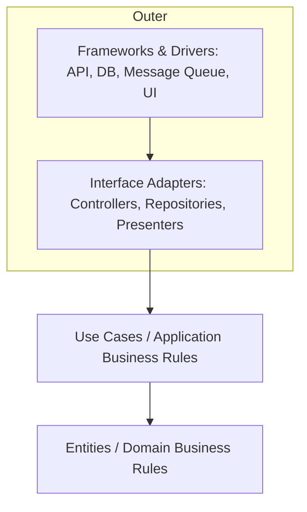

# Clean Architecture

> **Learning Path:** Architect's Developer Foundation
> **Section:** 1.3.2 — 3. Application architecture

## Problem

ஒரு real product-ல start பண்ணும்போது code simple-ஆ இருக்கும்.

`POST /orders` handler-லயே நீங்கள் validation பண்ணுவீங்க, database-க்கு SQL எழுதுவீங்க, payment gateway SDK-ஐ call பண்ணுவீங்க, email அனுப்புவீங்க. ஒரு file-ல எல்லாம்.

6 மாதம் கழிச்சு:
* UI web-ல இருந்து mobile app-க்கு மாறுது
* MySQL-ல இருந்து Postgres-க்கு மாறணும்
* Payment gateway Razorpay-ல இருந்து Stripe-க்கு மாறணும்
* Business rule மாறுது: free shipping > 5000 INR

இப்போது ஒரு சின்ன மாற்றம் கூட 5 files-ல touch பண்ண வேண்டியதாகுது. Test எழுத முடியல, mock பண்ண கஷ்டம். Business logic HTTP framework-க்கும் DB driver-க்கும் கட்டுப்பட்டு போய் இருக்கு.

**Problem என்ன?** Business rules எங்கே இருக்கணுமோ அங்கே இல்லை. Framework, database, UI எல்லாம் core logic-ஐ control பண்ணுது.

## Mental Model

Clean Architecture-ன் core idea ஒன்னு தான்: **Business logic framework-களை தெரிஞ்சுக்கக் கூடாது. Framework தான் business logic-ஐ தெரிஞ்சுக்கணும்.**

Onion மாதிரி layers. மையத்துல domain, வெளியே வெளியே infrastructure.

Dependencies உள்ளே நோக்கி மட்டும் போகணும். Outer layer inner layer-ஐ use பண்ணலாம், reverse இல்லை.

## How It Works

Uncle Bob Clean Architecture 4 concentric layers:



1. **Entities** - Core business rules. `Order`, `Money`, `DiscountPolicy`. Pure domain logic, no framework dependency.
2. **Use Cases** - Application specific business rules. `PlaceOrder`, `CancelOrder`. Orchestrates entities, defines use case input/output.
3. **Interface Adapters** - Translators. Controller HTTP request-ஐ Use Case input-க்கு மாற்றும். Repository interface DB-ஐ மறைக்கும். Presenter response-ஐ format பண்ணும்.
4. **Frameworks & Drivers** - Rails, Express, MySQL, Postgres, Stripe SDK, React. மிக வெளியே.

Dependency Rule: Inner circle எதுவும் outer circle-ஐ import பண்ணக்கூடாது. Use Case-க்கு DB எப்படி இருக்குன்னு தெரியாது. அது `OrderRepository` interface-ஐ மட்டும் தெரிஞ்சுக்கும். Implementation வெளியே இருக்கும்.

## Architectural Reasoning

இது useful ஆகும் போது:

* Business rules long lived, frameworks short lived. Framework மாறினாலும் core logic மாறாமல் இருக்க வேண்டும்.
* Same use case-ஐ multiple interfaces-ல expose பண்ண வேண்டும்: REST API, gRPC, CLI, background job.
* Testability முக்கியம். Business logic-ஐ pure unit test பண்ண வேண்டும், DB/network இல்லாமல்.
* Team size பெரியதாகி, boundaries clear-ஆ வைக்க வேண்டும்.

Alternatives: Hexagonal Architecture, DDD Onion Architecture. Conceptually same. Clean Architecture more explicit about layers.

Architect choose பண்ணுறார் என்றால் change frequency குறைவானதை மையத்தில் வைக்க, change அதிகமானதை வெளியில் வைக்க.

## Trade-offs

* **Complexity & boilerplate**: Small script-க்கு overkill. Layer கூடினால் files கூடும், indirection வரும்.
* **Learning curve**: Junior engineers-க்கு flow புரிய நேரம் எடுக்கும்.
* **Initial speed**: Prototype-க்கு slow. முதலில் direct code வேகமானது.
* **Operability**: Good isolation, but debugging flow cross layers-ல traverse பண்ண வேண்டும்.

Failure mode: மக்கள் interface adapters-லயும் business logic-ஐ எழுத ஆரம்பிப்பார்கள். அப்போது dependency rule break ஆகும்.

## Practical Example

Order placement.

`PlaceOrderUseCase` entities மட்டும் use பண்ணும்.

```text
Controller -> PlaceOrderUseCase -> Order Entity -> DiscountPolicy Entity
                      |
                      -> OrderRepository.port -> MySQL/Postgres implementation
                      -> PaymentGateway.port -> Stripe/Razorpay implementation
```

Business rule "free shipping > 5000" `Order` entity-ல இருக்கும். Controller-ல இல்லை. UI மாறினாலும் rule மாறாது. Payment gateway மாறினாலும் Use Case மாறாது, implementation மட்டும் மாறும்.

Test: Use Case-ஐ run பண்ணும்போது in-memory Repository மற்றும் Fake PaymentGateway கொடுத்து pure unit test எழுதலாம்.

## Reasoning Challenge

உங்களிடம் 2 வருட பழைய monolith இருக்கு. Order creation logic 70% controller-
