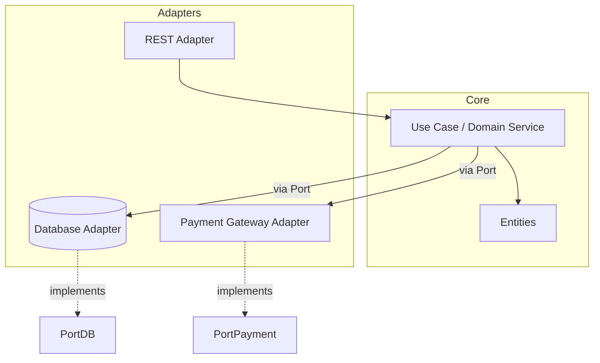

# Hexagonal architecture

> **Learning Path:** Architect's Developer Foundation
> **Section:** 1.3.3 — 3. Application architecture

# Hexagonal Architecture

## 1. Problem

உங்களிடம் ஒரு service இருக்கு. அது ஆரம்பத்தில் simple REST API ஆக தொடங்கியது. காலப்போக்கில் அதற்குள் business logic, database access, external payment gateway call, email send, logging, validation எல்லாம் கலந்து விட்டது.

இப்போது requirement வருகிறது:
* Database-ஐ PostgreSQL-ல இருந்து MongoDB-க்கு மாற்ற வேண்டும்
* Payment gateway-ஐ Razorpay-ல இருந்து Stripe-க்கு மாற்ற வேண்டும்
* API-ஐ REST-ல இருந்து gRPC-க்கு மாற்ற வேண்டும்

இதை செய்யும்போது core business logic எல்லாம் மாற வேண்டியிருக்கிறது. ஏன்? ஏனென்றால் business logic நேரடியாக framework, database driver, HTTP library-க்கு கட்டுப்பட்டு இருக்கிறது.

Test பண்ணவும் கஷ்டம். Real database இல்லாமல் unit test எழுத முடியவில்லை. External service mock பண்ண external service code-க்குள் ஊடுருவ வேண்டி இருக்கிறது.

**இந்த pain தான் Hexagonal Architecture வந்த காரணம்.** Core business rules-ஐ external world-ல இருந்து தனிமைப்படுத்தி, மாற்றங்களை adapter மூலம் மட்டும் handle செய்ய வேண்டும்.

## 2. Mental Model

நினைத்துக்கொள்ளுங்கள் உங்கள் application ஒரு hexagon.

நடுவில் இருப்பது **Domain Core** - உங்கள் business logic, entities, use cases. இது எந்த framework-ஐயும் தெரியாது, எந்த database-ஐயும் தெரியாது.

Hexagon-ன் வெளிப்புறமாக இருப்பது **Ports and Adapters**.

* Port = ஒரு interface. Core எதை expect செய்கிறது என்பதற்கான contract.
* Adapter = அந்த contract-ஐ implement செய்யும் concrete code. Database adapter, REST adapter, message queue adapter, etc.

Core ஒருபோதும் adapter-ஐ தெரிந்து கொள்ளாது. Core மட்டும் ports-ஐ பார்க்கும். Adapters தான் core-க்கு சேவை செய்யும்.

அதாவது dependency direction முக்கியம்: **Adapters depend on Core, Core does NOT depend on Adapters.**

## 3. How It Works

ஒரு typical flow:

1. HTTP request வருகிறது
2. REST Adapter request-ஐ receive செய்து, core-ல உள்ள use case-க்கு தேவையான input-ஐ தயார் செய்கிறது
3. Use case business rule-ஐ run செய்கிறது
4. Use case தேவையான data-வை பெற Port-ன் மூலம் கேட்கிறது
5. Database Adapter அந்த Port-ஐ implement செய்து data-வை திருப்பி கொடுக்கிறது
6. Use case result-ஐ திருப்பி கொடுக்கிறது, Adapter அதை HTTP response-ஆக மாற்றுகிறது

Core-ல உள்ள code-ல `import` statement-ல எந்த Spring, Express, SQLAlchemy, Kafka கூட இருக்காது. முழுக்க pure business logic.

## 4. Architectural Reasoning

இது எப்போது useful?

* Business logic long-term ஆக stable ஆக இருக்கும், அதன் சுற்றுச்சூழல் தொடர்ந்து மாறும்.
* Multiple external systems-ஐ integrate செய்ய வேண்டும்.
* Testing-ஐ fast, isolated ஆக வைக்க வேண்டும்.
* Team-ல domain experts உடன் infrastructure engineers வேறு வேலை செய்ய வேண்டும்.

Alternatives:
* Layered Architecture: Controller -> Service -> Repository. இது simple ஆனால் service layer external concerns-ஐ தெரிந்து கொள்ளும்.
* Clean Architecture: Hexagonal-ன் விரிவாக்கம், அதே core idea.

ஏன் Hexagonal choose செய்வீர்கள்? Because you want **changeability** without touching core. Framework upgrade, database migration, third-party API switch எல்லாம் adapter மட்டும் மாற்றினால் போதும். Core tests மாறாது.

## 5. Trade-offs

* **Complexity & Boilerplate:** Small app-க்கு over-engineering. Port, Adapter என்று extra layers வரும். Team-க்கு learning curve உண்டு.
* **Indirection cost:** Simple CRUD app-ல direct repository use செய்வது வேகமாக இருக்கும். Hexagonal அதை slower ஆக்கும்.
* **Operational complexity:** Adapter lifecycle manage செய்ய வேண்டும். எந்த adapter fail ஆனால் core-ஐ affect செய்யாமல் isolate செய்ய வேண்டும்.
* **Failure mode:** Adapter-ல exception வந்தால் core-க்கு எப்படி propagate செய்வது என்பதை வடிவமைக்க வேண்டும். Core எப்போதும் domain exception மட்டுமே throw செய்ய வேண்டும்.

ஒரு solution ஒரு புது problem create செய்யும். இங்கே அது abstraction cost.

## 6. Practical Example

Enterprise Order service.

Core domain:
`PlaceOrder` use case, `Order`, `OrderItem` entities.

Ports:
* `OrderRepositoryPort` - save/load order
* `PaymentPort` - charge customer
* `NotificationPort` - send confirmation

Adapters:
* `PostgresOrderRepositoryAdapter` implements OrderRepositoryPort
* `RazorpayPaymentAdapter` implements PaymentPort
* `EmailNotificationAdapter` implements NotificationPort

இப்போது நீங்கள் payment gateway மாற்ற வேண்டும். Core code-ல ஒரு line கூட மாறாது. Stripe adapter எழுதி, DI config-ல adapter reference மாற்றினால் போதும். Existing unit tests எல்ல
