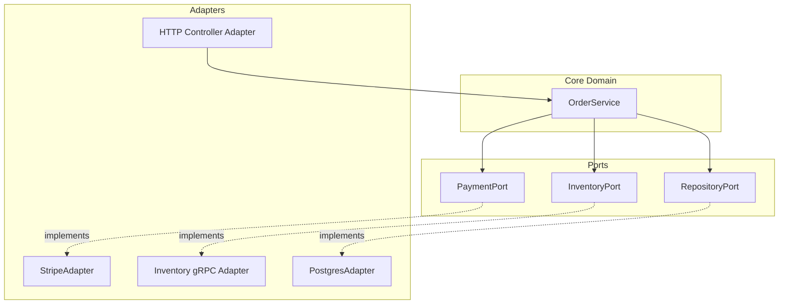

# Ports & adapters

> **Learning Path:** Architect's Developer Foundation
> **Section:** 1.3.4 — 3. Application architecture

## 1. Problem

உங்களிடம் ஒரு Order Service இருக்கு. Business logic எழுதும்போதே MySQL repository call, REST controller, Stripe SDK call எல்லாம் ஒரே class-ல இருக்கு.

இப்போ requirement வருது:
- DB-ஐ Postgres-க்கு மாற்ற வேண்டும்
- Payment provider-ஐ Stripe-ல இருந்து Razorpay-க்கு மாற்ற வேண்டும்
- Unit test எழுத வேண்டும், ஆனால் DB யும் Stripe API-யும் தேவைப்படுது

இங்கே என்ன நடக்கும்? Business logic வெளி world-க்கு கட்டுப்பட்டுவிடும். ஒரு external change வந்தால் domain code மாற வேண்டி வரும். Test செய்ய external dependency தேவைப்படும். இதுதான் painful.

**What goes wrong if we don't have this?** Core logic-ஐ மாற்றாமல் infrastructure மாற்ற முடியாது.

## 2. Mental Model

Ports & Adapters = Hexagonal Architecture.

Domain logic core-ல இருக்கும். அது வெளி உலகத்தை பார்க்காது. அது பார்ப்பது **Port** என்கிற interface மட்டும்தான்.

Port = "எனக்கு என்ன தேவை" என்கிற contract. எப்படி implement பண்ணுவது என்பது adapter-க்கு தெரியும்.

Dependency direction முக்கியம்: **Domain depends on Port, Adapter depends on Domain**. Domain, framework/DB/payment SDK-ஐ தெரிந்து வைக்காது.

அனாலஜி: Domain ஒரு restaurant kitchen. Port என்பது "food delivery interface". Adapter என்பது Swiggy adapter, Zomato adapter. Kitchen-க்கு தெரிய வேண்டியது plate ஒன்று வெளியே போக வேண்டும் என்பது மட்டும். எந்த app என்பது kitchen-க்கு முக்கியமில்லை.

## 3. How It Works

Domain layer-ல business rule மட்டும் இருக்கும்.

```text
domain -> PaymentPort (interface)
PaymentPort -> StripeAdapter / RazorpayAdapter
```

Domain code:

`paymentPort.charge(orderId, amount)` என்று கூப்பிடும். Implementation தெரியாது.

Adapter layer-ல DB Repository Adapter, HTTP Controller Adapter, Message Queue Adapter இருக்கும்.

இது dependency inversion principle-ன் practical shape.

## 4. Architectural Reasoning

இது useful ஆகும் போது:
- Business logic long life, infrastructure short life
- Multiple implementations தேவை: test stub, real adapter
- Team boundaries: domain team vs platform team

Alternatives:
- Layered architecture: Controller -> Service -> Repository. இதில் service layer ஒரு implicit port ஆக இருக்கும், ஆனால் dependency direction strict அல்ல.
- Clean Architecture: Ports & Adapters-ன் variant. Similar idea, more layers.

ஏன் choose பண்ணுவது? ஒரு architectural decision-ஐ பாதுகாக்க வேண்டும்: **Business rule-ஐ infrastructure change-ல இருந்து protect பண்ணுவது**.

Cost: extra interfaces, extra projects/files. Small script-க்கு overkill. Enterprise service-க்கு value தரும்.

## 5. Trade-offs

**Testability vs Boilerplate**
Port-க்கு fake adapter கொடுத்து domain-ஐ isolated-ஆக test பண்ணலாம். ஆனால் ஒவ்வொரு interaction-க்கும் interface + implementation இரண்டும் எழுத வேண்டும்.

**Flexibility vs Complexity**
Payment provider மாற்றுவது ஒரு adapter மாற்றுவது மட்டும்தான். ஆனால் new developer-க்கு flow புரிய architecture diagram வேண்டும்.

**Coupling reduction vs Indirection**
Domain clean ஆகும். ஆனால் call stack நீளும்: Domain -> Port -> Adapter -> DB. Debug செய்யும் போது jump அதிகம்.

Failure mode: Port design தவறாக விட்டால் domain leak ஆகும். Adapter தேவைக்கு அதிகம் தெரிந்து விடும். அப்போது port-ன் பயன் இல்லை.

## 6. Practical Example

Enterprise Order Management:

Domain: `Order`, `OrderService.placeOrder()` - business rule: inventory check, price calc, tax.

Ports:
- `InventoryPort` : reserve items
- `PaymentPort` : charge customer
- `NotificationPort` : send confirmation
- `OrderRepositoryPort` : save order

Adapters:
- `InventoryAdapter` talks to Redis / gRPC Inventory service
- `PaymentAdapter` talks to Stripe/Razorpay SDK
- `NotificationAdapter` talks to Kafka / email service
- `OrderRepositoryAdapter` talks to Postgres via JPA

இப்போ Postgres-ல இருந்து DynamoDB-க்கு மாற வேண்டும் என்றால்? `OrderRepositoryAdapter` மட்டும் மாறும். `OrderService` மாறாது.

Testing-ல `PaymentPort` ஐ `FakePaymentAdapter` கொடுத்து unit test ஓடும். Network call இல்லை.



## 7. Reasoning Challenge

உங்களிடம் 5 வருடம் பழைய monolith இருக்கு. Business logic-ல நேரடியாக JDBC call, HTTP client call இருக்கு. Team 2 பேர். அடுத்த 6 மாதத்தில் ஒரு external API மட்டும் மாற போகிறது.

Ports & Adapters முழுமையாக refactor செய்வீர்களா? அல்லது அந்த ஒரு API-க்கு மட்டும் adapter extract செய
