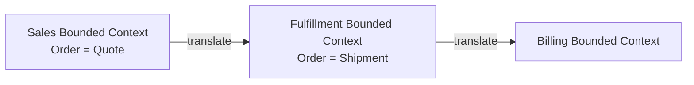

# Domain-Driven Design

> **Learning Path:** Architect's Developer Foundation
> **Section:** 1.3.7 — 3. Application architecture

## 1. Problem

உங்க team 3 வருஷமா ஒரு insurance claims system maintain பண்ணுது. Business வளர்ந்து, rules மாறுது. Domain expert சொல்றது "claim-ஐ approve பண்ணும்போது fraud check, policy limit, customer tenure எல்லாம் பார்க்கணும்". Developer கேட்கறது "field என்ன, table எது, API endpoint என்ன".

Requirement doc வந்ததும் interpretation வேறுபடுது. Code-ல business logic எங்கெங்கே இருக்குன்னு யாருக்கும் தெரியாது. Service layer-ல if-else குவியல், database entity-கள் தான் object-ஆக மாறியிருக்கு. Small change-க்கு பல இடத்துல touch பண்ணணும். Bug வருது, regression வருது.

இது என்ன problem? **Domain knowledge code-ல capture ஆகல**. Ubiquitous Language இல்லாம, model technical மட்டும் ஆகி போச்சு. இதை தான் Domain-Driven Design சரி பண்ண வந்தது.

## 2. Mental Model

DDD என்பது framework இல்லை. Software model-ஐ business domain-உடன் align பண்ணும் ஒரு டிசைன் discipline.

Core idea: **Model என்பது code-க்காக மட்டும் இல்லை, business reality-க்காக**. Domain expert-கள் பேசும் language-ஐயே code-ல use பண்ணனும். அப்போ தான் model தவறாம இருக்கும்.

DDD பெரிய system-ஐ small, coherent pieces-ஆக பிரிக்குது. ஒவ்வொரு piece-க்கும் தனியான language, rules, data ownership இருக்கும். அதுக்கு பேர் Bounded Context.

## 3. How It Works

தேவையான concept-கள் மட்டும்:

**Ubiquitous Language**: Team முழுவதும் ஒரே வார்த்தைகளை use பண்ணுவது. "Policy", "Claim", "Premium" என்பது business definition-ஐ follow பண்ணும். Documentation-லயும் code-லயும் ஒன்னா இருக்கும்.

**Bounded Context**: System-ஐ business meaning-படி பிரித்தல். Sales context-ல Order என்பது வேறு, Fulfillment context-ல Order என்பது வேறு. இரண்டுக்கும் தனி model இருக்கலாம். Context boundary-ல translation layer வேண்டும்.

**Aggregate**: Consistency boundary. ஒரு aggregate root உள்ளே உள்ள entities/value objects எல்லாம் ஒன்றாக save/delete ஆகும். உதாரணமாக `Policy` aggregate root, அதன் `PolicyHolder`, `Cover` objects உள்ளே இருக்கும். External code aggregate root வழியாக தான் access பண்ணும்.

**Entity vs Value Object**: Entity-க்கு identity இருக்கும் - CustomerId. Value Object-க்கு identity இல்லை, state மட்டும். Money, Address, DateRange போன்றவை Value Object.

**Repository**: Aggregate-ஐ persistence-ல இருந்து load/save பண்ணும் abstraction. Domain logic-ஐ DB details-ல இருந்து தனியாக வைக்கும்.

**Domain Service vs Application Service**: Domain Service - business logic இது ஒரு entity-க்குள் fit ஆகாது. Application Service - use case orchestration, transactions, external calls.

## 4. Architectural Reasoning

இது எப்போ useful?

Complex domain, rules constantly evolve, business impact direct - அப்போ. Banking, insurance, logistics, e-commerce pricing போன்றவை.

Constraint-ஐ address பண்ணுது: **Knowledge gap & model decay**. Code business-ஐ reflect பண்ணாம போனால் change cost அதிகரிக்கும்.

Alternatives: Anemic Domain Model + transactional script, அல்லது CRUD over database tables. அது simple CRUD app-க்கு வேலை செய்யும். ஆனால் business rule complex ஆகும்போது model இல்லாமல் logic service layer-ல scattered ஆகி விடும்.

Architect choose பண்ணும் போது: Team size பெருசா இருந்தால், multiple Bounded Context-கள் தேவை. Ubiquitous Language maintain பண்ண domain expert collaboration வேண்டும். அது இல்லாமல் DDD forced பண்ணினால் overhead தான் மிஞ்சும்.

## 5. Trade-offs

**Complexity overhead**: Small CRUD app-க்கு DDD over-engineering. Aggregate, Repository, Domain Service எல்லாம் boilerplate ஆகும்.

**Mapping to persistence**: Aggregate consistency boundary-க்கு transaction வேண்டும். Large aggregate = performance problem. Small aggregate = consistency ensure பண்ண கஷ்டம். ORM mapping tricky.

**Learning curve & discipline**: Ubiquitous Language maintain பண்ண team discipline வேண்டும். Name change வந்தால் whole model change. Team-க்கு domain knowledge வேண்டும், pure coding skill மட்டும் போதாது.

**Bounded Context integration cost**: Context-களுக்கு இடையே data duplication, eventual consistency, anti-corruption layer வேண்டும்.

Failure mode: Aggregate too big
