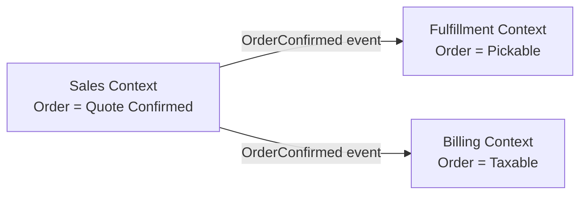

# Bounded contexts

> **Learning Path:** Architect's Developer Foundation
> **Section:** 1.3.8 — 3. Application architecture

## 1. Problem

ஒரு பெரிய product-ஐ நீங்க 3-4 வருஷம் கட்டிய பிறகு என்ன நடக்கும்? Team size வளரும். Code base பெருசாகும். அதே வார்த்தைக்கு வெவ்வேறு இடத்தில் வெவ்வேறு அர்த்தம் வர ஆரம்பிக்கும்.

உதாரணமா, `Order` என்று சொன்னால்:
* Sales team-க்கு Order = quote confirm ஆனது
* Fulfillment team-க்கு Order = pick & pack செய்ய தயாரானது
* Finance team-க்கு Order = invoice generate ஆனது

ஒரே codebase-ல இதை எல்லாம் manage பண்ண முயற்சி செய்தால், model மாற்றம் ஒரு இடத்தில் வேறு இடத்தை break பண்ணும். Meeting-ல "Order status update பண்ணுங்க" என்றால் யாருக்கு என்ன வேண்டும் என்று தெளிவாக தெரியாது.

Pain point என்ன? **Shared language இல்லாததால் வரும் confusion, coupling, மற்றும் uncontrolled change.**

## 2. Mental Model

Bounded context என்பது ஒரு தெளிவான எல்லை. அந்த எல்லைக்குள் ஒரு domain model உண்டு, அந்த model-க்கு ஒரு ubiquitous language உண்டு. அந்த language அந்த context-க்குள் மட்டும் சரியாக வேலை செய்யும்.

நினைத்துக்கொள்ளுங்கள்: ஒரு நிறுவனத்தில் ஒவ்வொரு துறைக்கும் தனி dictionary இருக்கிறது. HR-ல "employee", Finance-ல "employee" என்பது வேறு. அவர்கள் ஒன்றாக வேலை செய்யும்போது translation layer வேண்டும்.

அதேதான் software-லும். Bounded context = அந்த துறையின் model + language + rules ஆகியவற்றின் தெளிவான எல்லை.

## 3. How It Works

ஒரு system-ல் பல bounded contexts இருக்கும். ஒவ்வொன்றும்:

* தனக்கே உரித்தான domain model, entities, value objects
* தனக்கு தேவையான database
* தனக்கான business rules
* தனக்கான ubiquitous language

Contexts இடையே தொடர்பு வரும்போது நீங்கள் 2 வழி செய்யலாம்:
1. **Shared Kernel** - மிக சிறிய common model ஐ share பண்ணுவது
2. **Anti-corruption Layer** - ஒரு context இன் language/model ஐ மற்ற context-க்கு translate பண்ணும் adapter layer

Context Map வரைந்து யார் யாரை depend பண்ணுகிறார்கள், யார் upstream/downstream என்பதை தெளிவாக வைக்க வேண்டும்.

## 4. Architectural Reasoning

Bounded context தேவைப்படும் போது?

* Team > 1, domain knowledge வேறுபடும் போது
* Same term வெவ்வேறு meaning கொண்டு வரும்போது
* Change ஒரு பகுதியில் மட்டும் இருக்க வேண்டும், மற்ற பகுதியை தொடக்கூடாது என்று வேண்டும்போது
* Scalability, deployment independence தேவைப்படும்போது

Alternative என்ன? Monolithic shared model. ஒரே database, ஒரே ubiquitous language force பண்ணுவது.

ஏன் bounded context தேர்வு செய்வது? **Coupling குறைக்க, autonomy கொடுக்க, change-ஐ localize செய்ய.**

Decision consequence: நீங்கள் duplication ஏற்படுத்துகிறீர்கள். `Order` என்பது 2 contexts-ல 2 வெவ்வேறு tables/models ஆக இருக்கும். அது okay. Consistency உடனடியாக இருக்காது, eventual consistency தேவைப்படும்.

## 5. Trade-offs

* **Clarity vs Duplication**: Bounded context தெளிவு கொடுக்கும், ஆனால் ஒரே concept க்கு multiple representations வரும். Sync பண்ண வேண்டும்.
* **Autonomy vs Consistency**: ஒவ்வொரு context தனியாக deploy ஆகலாம், ஆனால் cross-context transaction செய்வது கடினம். Saga pattern போன்றவை தேவை.
* **Complexity of integration**: Anti-corruption layer, context map, event contracts maintain பண்ண வேண்டும். Small team-க்கு over-engineering ஆகும்.
* **Failure mode**: Context boundary தெளிவாக இல்லாவிட்டால் leakage ஆகும். ஒரு context இன் internal model மற்ற context-ல expose ஆகி coupling திரும்ப வரும்.

## 6. Practical Example

Enterprise e-commerce:

Context 1: **Sales & Catalog**
Model: `Product`, `Cart`, `OrderQuote`. Order என்பது customer confirm செய்து payment start ஆனது.

Context 2: **Fulfillment**
Model: `PickableOrder`, `Shipment`. Order என்பது warehouse-க்கு pick request அனுப்பப்பட்டது.

Context 3: **Billing**
Model: `Invoice`, `Tax`. Order என்பது taxable event.

Sales context `OrderConfirmed` event publish செய்யும். Fulfillment அதை கேட்டு தன்னுடைய `PickableOrder` ஐ உருவாக்கும். Billing தன்னுடைய `Invoice` ஐ உருவாக்கும்.

ஒவ்வொருவரும் தங்கள் language-ல் வேலை செய்வார்கள். Change ஒன்று Sales-ஐ மட்டும் பாதிக்கும்.

## 7. Reasoning Challenge

உங்களிடம் ஒரு
