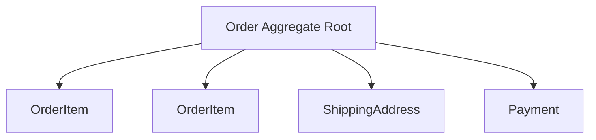

# Aggregates

> **Learning Path:** Architect's Developer Foundation
> **Section:** 1.3.9 — 3. Application architecture

## 1. Problem

ஒரு e-commerce order system பார்ப்போம். `Order`, `OrderItem`, `ShippingAddress`, `Payment` எல்லாம் தனித்தனி table-ல இருக்கு.

Customer ஒரு item-ஐ add பண்ணும்போது, total price மாறும். Discount apply ஆகும்போது item count-உம் மாறும். Payment success ஆன பிறகு தான் order status `CONFIRMED` ஆகணும்.

இப்போ இந்த entities-ஐ தனித்தனியா update பண்ணினால் என்ன ஆகும்?
- ஒரு service Order-ஐ மாற்றுது, இன்னொரு service OrderItem-ஐ மாற்றுது, இரண்டும் ஒரே நேரத்தில் ஓடினால் total amount inconsistent ஆகிடும்.
- Order-ஐ delete பண்ணிட்டு OrderItem மீதி இருக்கும்.
- Business rule: `Order total = sum(items) - discount`. இந்த invariant எங்க enforce பண்ணுவது?

Data model-ல தனித்தனி tables சரியாக இருக்கலாம். ஆனால் **business consistency** எங்கே maintain பண்ணுவது என்பது problem.

## 2. Mental Model

Aggregate என்பது **consistency boundary**.

ஒரு குழு domain objects-ஐ ஒன்றாக பிணைத்து, அவற்றின் மீது ஒரே transaction-ல மாற்றம் செய்யும் ஒரு unit.

உதாரணமாக Order aggregate-ன் உள்ளே உள்ள `OrderItem`, `Address` எல்லாம் Order-ஐ சார்ந்து வாழ்கின்றன. அவற்றை தனியாக மாற்ற முடியாது.

Aggregate root என்பது அந்த குழுவின் gatekeeper. வெளியிலிருந்து யாரும் child objects-ஐ நேரடியாக touch பண்ண முடியாது, எல்லாம் root வழியாக தான்.

> Analogy: ஒரு family bank account. Account holder தான் root. Spouse, children என்பவர்கள் entities. Withdraw, deposit எல்லாம் account holder மூலமாக தான். Balance என்ற invariant அங்கே enforce ஆகிறது.

## 3. How It Works

Aggregate root ஒன்று வைத்துக்கொண்டு, அதன் உள்ளே entities மற்றும் value objects வைக்கிறோம்.

Rules:
- External world-க்கு aggregate root மட்டும் தெரியும். `order.addItem()`, `order.applyDiscount()`, `order.confirmPayment()` போன்ற methods மட்டும் expose ஆகும்.
- Child objects-க்கு public setters இருக்காது. Root மட்டுமே அவற்றை மாற்றும்.
- Persistence சமயத்தில் aggregate முழுவதும் ஒரே unit of work-ல save ஆகும். Database-ல இது ஒரே transaction ஆகலாம்.
- Invariants எல்லாம் root-ல enforce ஆகும். `total must be >=0`, `items can't be empty for confirmed order` போன்றவை.

## 4. Architectural Reasoning

**When useful?**
- Multiple entities ஒன்றோடொன்று tightly coupled business rules கொண்டிருக்கும் போது.
- Strong consistency தேவைப்படும் boundary-ல.

**Alternatives?**
- Anemic model: entities தனித்தனி update. Simple ஆனால் invariant leak ஆகும்.
- Process manager / Saga: cross aggregate consistency eventual consistency-க்கு.
- Database foreign key constraints மட்டும்: data integrity இருக்கும், business invariant இருக்காது.

Architect ஏன் aggregate தேர்வு செய்வார்?
Domain model-ஐ protect பண்ண, business rules-ஐ centralized location-ல வைக்க, accidental inconsistent state-ஐ தடுக்க.

## 5. Trade-offs

**Size vs Performance**
Aggregate சின்னதாக இருந்தால் transaction light, concurrency நல்லா இருக்கும். பெரிதாகி `Order` + `Customer` + `Inventory` எல்லாம் ஒன்றாக வந்தால், ஒரு மாற்றத்துக்கு அதிக data load/save ஆகும். Lock contention அதிகரிக்கும்.

**Consistency vs Scalability**
Aggregate உள்ளே strong consistency கிடைக்கும். ஆனால் aggregate-க்கு வெளியே eventual consistency தேவைப்படும். Example: Order aggregate மாற்றும் போது Inventory aggregate தனியாக உள்ளது, அதை sync பண்ண Saga வேண்டும்.

**Coupling**
Root வழியாக மட்டுமே மாற்றம் என்பதால், domain logic centralized ஆகிறது. ஆனால் over-sized aggregate ஆனால் domain model rigid ஆகிவிடும்.

Failure mode: aggregate too big ஆகி, `SELECT * FROM order_items WHERE order_id = ?` ஒவ்வொரு read-ல heavy ஆகும். Read path-க்கு separate read model த
