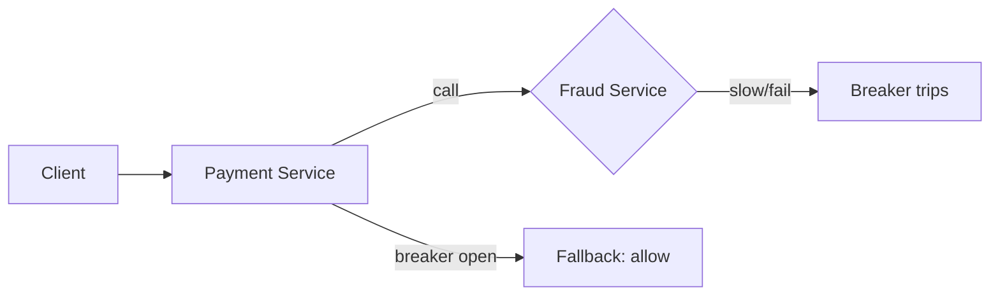

# Circuit breakers

> **Learning Path:** Distributed Systems
> **Section:** 3.1.11 — Core concepts

## 1. Problem

உங்க system-ல Service A, Service B-ஐ REST call பண்ணுது. Normal-ல 50ms-ல response வருது.

ஒரு நாள் Service B slow ஆக ஆரம்பிக்குது. அல்லது DB-ல deadlock, அல்லது network partition. Response time 5 sec ஆகுது, அப்புறம் timeout.

Service A என்ன பண்ணும்? அது retry பண்ணும். ஒவ்வொரு request-க்கும் 3 முறை retry.

இப்போ Service A-க்கு 1000 RPS வருது. Service B-க்கு போகும் request 1000 x 3 = 3000 ஆகுது.

Service B already sick. இன்னும் load ஏத்தி அதை முழுசா down பண்ணிடுது.

இதுதான் cascading failure. ஒரு service fail ஆனதும் அதை கூப்பிடும் எல்லா service-மும் சேர்ந்து முழு system-ஐ கீழே இழுத்துடும்.

இதை தடுக்காம இருந்தா latency spike, thread pool exhaustion, resource starvation எல்லாம் வரும்.

## 2. Mental Model

Electrical circuit breaker-ஐ நினைச்சுக்கோங்க.

Circuit open ஆனா current போகாது. Fuse blow ஆனா house burn ஆகாது.

Software-ல அதே idea. ஒரு downstream service unhealthy ஆனதும், அதுக்கு request அனுப்புறதை உடனே stop பண்ணனும். Fail fast, don't pile up.

Breaker 3 state-ல இருக்கும்: Closed, Open, Half-Open.

## 3. How It Works

**Closed**: Normal. Request அனுப்புறோம். Failure rate/error count-ஐ track பண்ணுறோம்.

ஒரு threshold cross ஆனா, உதாரணமா last 10 sec-ல 50% requests fail / error rate > 5 அல்லது latency p99 > 1 sec.

**Open**: Breaker trip ஆகுது. இனிமே Service B-க்கு request அனுப்பவே மாட்டோம். உடனே fast fail திருப்பி கொடு. `Service Unavailable` or fallback.

இது Service B-க்கு breathing space கொடுக்கும். அதே நேரம் Service A-ன் thread pool-ஐ protect பண்ணும்.

Timeout period முடிஞ்சதும்:

**Half-Open**: Probe request ஒன்னு அனுப்பி பார்க்கிறோம். Success ஆனா Closed-க்கு திரும்பும். Fail ஆனா மீண்டும் Open.

Implementation-ல failure count, success count, sliding window, error types என்ன count பண்ணணும் nu decide பண்ணணும். Timeout ஆனதை failure-ஆ count பண்ணலாம்.

## 4. Architectural Reasoning

Circuit breaker useful ஆகும் போது:

* Service A synchronous call பண்ணும், downstream failure-ஐ tolerate பண்ண முடியாது
* Downstream slow / flaky ஆகும்
* Retry policy இருக்கும், அது avalanche-ஐ உருவாக்கும்

Alternatives:

* **Timeout மட்டும்**: Timeout 2 sec வச்சா, request இன்னும் 2 sec wait பண்ணும். Threads block ஆகும்.
* **Retry with backoff**: Load-ஐ அதிகப்படுத்தும்.
* **Bulkhead**: Isolation கொடுக்கும், ஆனா downstream-ஐ heal பண்ணாது.
* **Graceful degradation / fallback**: Circuit breaker-உடன் சேர்ந்து போகும்.

நீங்கள் choose பண்ணுவது ஏன்? Because you want failure-ஐ contain பண்ணி, blast radius குறைக்க.

## 5. Trade-offs

* **Availability vs Freshness**: Breaker open ஆனதும் stale data / fallback தரணும். User experience degrade ஆகும், ஆனா system survive ஆகும்.
* **False positive**: Transient spike-க்கு breaker trip ஆகி, healthy service-ஐ block பண்ணிடும். Threshold tuning முக்கியம்.
* **State management**: Breaker state per instance-ல local-ஆ இருந்தா, each pod different decision எடுக்கும். Distributed state வேணும்னா complexity அதிகம். பெரும்பாலும் local breaker போதும்.
* **Observability**: Breaker open/close events, metrics, logs இல்லாம breaker blind ஆக இருக்கும்.

Failure mode: Half-Open-ல probe request அதிகமா அனுப்பி மீண்டும் overload பண்ணிடக்கூடாது. Rate limit பண்ணனும்.

## 6. Practical Example

Payment service -> Fraud detection service call பண்ணுது. Fraud service DB slow ஆனா 3 sec எடுக்குது.

Payment service-ல circuit breaker வச்சோம். Error rate > 50% for 10s அல்லது p99 latency > 1s என்றால் open.

Breaker open ஆனதும், Payment service immediate `risk = low` fallback திருப்பி கொடுத்து transaction continue பண்ணும். Metrics alert fly ஆகும்.

Fraud service heal ஆனதும் half-open probe success ஆகி closed ஆகும்.

இல்லாம இருந்தா payment service threads எல்லாம் block ஆகி, payment கூட accept பண்ண முடியாது.

## 7. Reasoning Challenge

உங்களிடம் Order service இருக்கு. அது Inventory service-ஐ call பண்ணும். Inventory service 200 ms-ல respond பண்ணும். Peak sale-ல traffic 10x ஆகும்.

Inventory service ஒரு முறை 30 sec-க்கு hang ஆனதும், Order service threads முழுவதும் stuck ஆகுது. Timeout 5 sec வச்சிருக்கீங்க. Retry 2 முறை.

இங்கே circuit breaker வச்சா எப்படி configure பண்ணுவீங்க? Threshold என்ன வைப்பீங்க? Open state-ல fallback என்ன கொடுக்க முடியும்? ஏன்?

## 8. Key Takeaways

* Circuit breaker என்பது cascading failure-ஐ தடுக்க fail fast பண்ணும் மெக்கானிசம்.
* Closed → Open → Half-Open state machine தான் core mental model.
* Timeout மட்டும் போதாது. Unhealthy dependency-க்கு request அனுப்புறதை நிறுத்துவது தான் protection.
* Breaker-உடன் fallback/graceful degradation இல்லாம value குறைவு.
* Thresholds, window size, half-open probe rate-ஐ tune பண்ணாம breaker-
