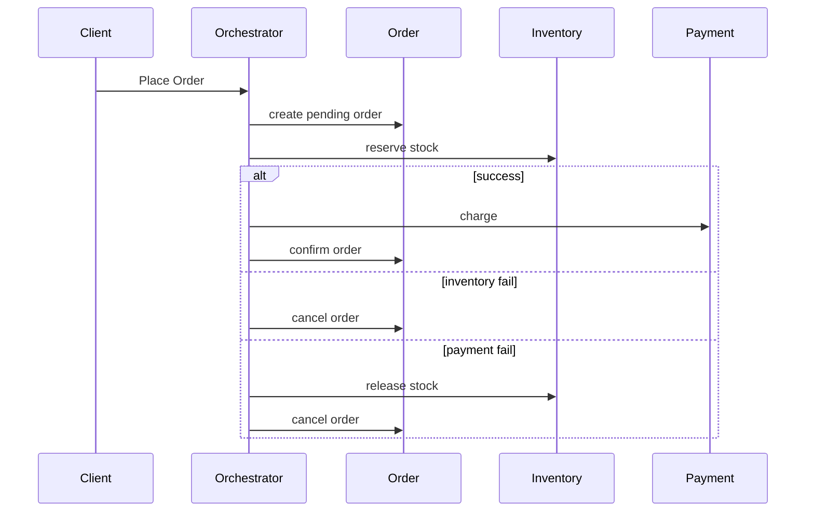

# Distributed transactions

> **Learning Path:** Distributed Systems
> **Section:** 3.1.14 — Core concepts

### 1. Problem

Monolith-ல் ஒரு DB transaction எளிது. `BEGIN ... COMMIT` பண்ணினா order table-ல write, inventory table-ல update, எல்லாம் ஒன்னா success ஆகும் இல்லைனா எதுவும் இல்லை.

இப்போ system-ஐ microservices-ஆ split பண்ணினீங்க. Order service-க்கு தனி database, Inventory service-க்கு தனி database, Payment service-க்கு தனி database.

ஒரு order place பண்ணும்போது மூன்றும் மாறணும். 
Order create ஆகணும், Inventory deduct ஆகணும், Payment charge ஆகணும்.

நெட்வொர்க் failure வந்தா? Payment success ஆனா inventory deduct fail ஆனா? Client retry பண்ணா double charge ஆகுமா?

இதுதான் distributed transaction-ன் core pain. **ஒரே business operation-க்கு பல services, பல databases தேவைப்படும்போது atomicity-யை எப்படி maintain பண்ணுவது?**

### 2. Mental Model

Local transaction = ஒரு DB engine உள்ளே locks + WAL கொண்டு guarantee பண்ணும்.

Distributed transaction = பல independent systems-க்கு இடையில் அதே guarantee-வை ஏற்படுத்த முயற்சி.

அடிப்படையில் இரண்டு வழிகள்:
* **Strong consistency வேண்டும் என்று பிடிவாதம் பிடி** → 2PC போன்ற coordinator based approach
* **Availability முக்கியம், சிறிது delay ஏற்படலாம்** → Saga pattern, eventual consistency

### 3. How It Works

**2PC - Two Phase Commit**
Coordinator ஒரு transaction-ஐ manage பண்ணும்.

Phase 1 - Prepare: Coordinator எல்லா participant services-க்கும் "நீ ready-வா?" என்று கேட்கும். எல்லாரும் yes என்றால் மட்டும் proceed.
Phase 2 - Commit: Coordinator commit command அனுப்பும்.

Problem: coordinator down ஆனால் participants block ஆகி இருப்பார்கள். Network partition வந்தால் transaction hang ஆகும். Latency அதிகம்.

**Saga**
Long running transaction-ஐ சிறிய local transactions-ஆக split பண்ணி, failure வந்தால் compensating transaction ஓட வைக்கும்.

Order service: Order created
→ Inventory service: Inventory deducted, fail ஆனால் compensate
→ Payment service: Payment charged, fail ஆனால் refund

Choreography: Event-க்கு subscribe பண்ணி next step trigger.
Orchestration: Central saga orchestrator flow-ஐ manage பண்ணும்.

Idempotency மற்றும் outbox pattern இங்கே must.

### 4. Architectural Reasoning

Distributed transaction தேவைப்படுவது:
* Business invariant cross service-ல் இருக்கும்போது. Ex: total money in system must stay constant for transfer.
* Money movement, inventory allocation, seat booking போன்றவை.

Alternative:
* Domain-ஐ மறுபடி design பண்ணி boundary-யை மாற்றுவது. சில business rules-ஐ service-க்குள்ளேயே கொண்டு வந்து distributed transaction-ஐ தவிர்க்கலாம்.
* Eventual consistency ஏற்றுக்கொண்டு read model-ஐ separate பண்ணுவது.

எப்போது 2PC choose பண்ணுவீர்கள்? Very low volume, strong consistency must, participants குறைவு. Banks internal settlement போன்றவை.

எப்போது Saga choose பண்ணுவீர்கள்? High throughput, availability முக்கியம், failure recoverable. E-commerce order flow போன்றவை.

### 5. Trade-offs

* **Consistency vs Availability:** 2PC strong consistency தரும் ஆனால் coordinator single point of failure, availability குறையும். Saga availability அதிகம் ஆனால் intermediate state-ல் inconsistency தெரியும்.
* **Latency:** 2PC synchronous coordination → latency அதிகம். Saga async → faster response but final state-க்கு time எடுக்கும்.
* **Complexity & Operability:** Saga-வில் compensating logic-ஐ சரியாக எழுத வேண்டும். Retry, idempotency, timeout, dead letter queue எல்லாம் manage பண்ண வேண்டும். 2PC simpler to reason but harder to operate at scale.
* **Failure modes:** Network partition-ல் 2PC blocking ஆகும். Saga-ல் compensation chain fail ஆகலாம், manual intervention தேவைப்படலாம்.

### 6. Practical Example

Order placement flow with Saga orchestration:

Order service local transaction commit, event publish பண்ணும். Outbox pattern-ல் event DB-லேயே write பண்ணி பின் relay பண்ணும். இதனால் at-least-once delivery guarantee.

### 7. Reasoning Challenge

உங்களிடம் Bank transfer service இருக்கு. Account A service-லும் Account B service-லும் தனி DB. Transfer-க்கு debit, credit இரண்டும் ஒன்னா நடக்கணும்.

Requirement: 99.99% availability வேண்டும், latency < 500ms. Network partition ஏற்படலாம்.

2PC use பண்ணலாமா? Saga use பண்ணலாமா? Compensating transaction
