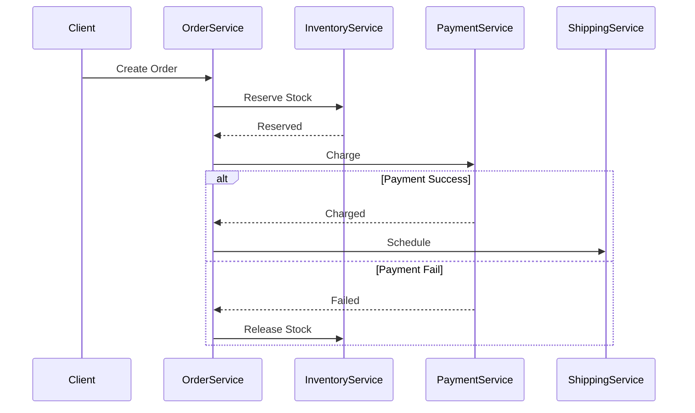

# Saga pattern

> **Learning Path:** Distributed Systems
> **Section:** 3.1.16 — Core concepts

## Problem

ஒரு e-commerce order-ஐ place பண்ணும்போது என்ன நடக்கணும்? 
OrderService ஒன்னு create பண்ணும், InventoryService stock-ஐ reserve பண்ணும், PaymentService payment-ஐ charge பண்ணும், ShippingService shipment-ஐ schedule பண்ணும்.

இது ஒரு distributed system. நாலு service, நாலு database. 
ஒரே ACID transaction-ல இதை wrap பண்ண முடியாது. Network failure வரும், service down ஆகும், timeout ஆகும்.

இப்போது என்ன ஆகும்? Payment success ஆனது, Inventory reserve ஆகலை. அல்லது Inventory reserve ஆனது, Payment fail ஆனது. Order half-done. Customer-க்கு என்ன சொல்றது? Money stuck ஆகும், stock stuck ஆகும்.

2PC போன்ற distributed transaction-ஐ பயன்படுத்தலாம். ஆனால் அது coordinator-ஐ single point of failure ஆக்கும், latency அதிகமாகும், availability குறையும். High scale-ல practical இல்லை.

**Pain point:** Multiple services-ல் ஒரு business operation-ஐ atomic-ஆக முடிக்கணும், ஆனால் distributed transaction செய்ய முடியாது.

இங்கேதான் Saga pattern வருகிறது.

## Mental Model

Saga என்பது long-running business transaction. அது பல local transactions-ஆக பிரிக்கப்படும். ஒவ்வொரு service-ம் தன்னுடைய database-ல் ACID transaction செய்து commit பண்ணும்.

ஒரு step fail ஆனால், முந்தைய step-களை undo செய்ய compensating transaction run ஆகும்.

உதாரணமாக: Reserve Inventory -> Charge Payment -> Schedule Shipping. 
Payment fail ஆனால் Compensate: Release Inventory.

இது eventual consistency-ஐ accept பண்ணி, availability-ஐ காப்பாற்றுகிறது.

## How It Works

Saga-வில் இரண்டு வழிகள்:

**1. Orchestration**
ஒரு central Saga Orchestrator இருக்கும். அது flow-ஐ control பண்ணும்.
OrderService event trigger ஆனதும் Orchestrator InventoryService-க்கு reserve கட்டளை கொடுக்கும். Success என்றால் அடுத்த step PaymentService-க்கு கட்டளை. Fail என்றால் compensating actions-ஐ reverse order-ல் trigger பண்ணும்.

**2. Choreography**
Central controller இல்லை. Services events publish பண்ணி, மற்ற services listen பண்ணும்.
Inventory reserved event வந்ததும் PaymentService தானாக payment try பண்ணும். Payment failed event வந்ததும் InventoryService தானாக release பண்ணும்.

Flow example:

## Architectural Reasoning

Saga useful ஆகும் போது:

* Business transaction பல services-ஐ கடந்து போகிறது
* Each service-க்கு autonomy வேண்டும், தனி database, தனி release cycle
* Strong consistency க்கு பதிலாக eventual consistency accept செய்யலாம்
* High availability முக்கியம், distributed lock / 2PC afford பண்ண முடியாது

Alternatives:
* 2PC / XA transaction: strong consistency தரும், ஆனால் availability, latency, coupling cost அதிகம்
* Monolith transaction: simple ஆனால் scalability, team autonomy இல்லை
* Eventual consistency without compensation: data corruption வரும்

Architect choose saga when **business operation is a workflow, not a single DB write**.

## Trade-offs

* **Consistency vs Availability:** Saga eventual consistency தரும். Intermediate state user-க்கு தெரியும். "Order pending payment" போன்ற state handle பண்ண வேண்டும்.
* **Complexity moves to application:** Compensation logic எழுத வேண்டும். Idempotent retries வேண்டும். State tracking வேண்டும்.
* **Failure modes:** Compensating transaction-ம் fail ஆகலாம். அப்போது manual intervention / retry with backoff தேவை. Saga state machine-ஐ track பண்ண வேண்டும்.
* **Observability கடினம்:** End-to-end trace, saga execution log, timeout handling எல்லாம் explicit design வேண்டும்.

ஒவ்வொரு architectural solution-க்கும் trade-off உண்டு. Saga availability-ஐ தருகிறது, ஆனால் code complexity-ஐ உங்கள் மீது திருப்புகிறது.

## Practical Example

Bank transfer use case:
Debit AccountService, Credit AccountService, Send Notification.

Saga orchestrator ஒன்று இருக்கிறது.
Step 1: Debit succeeds. Step 2: Credit fails due to timeout.
Orchestrator compensating action trigger பண்ணி Credit retry, அல்லது Debit-ஐ reverse பண்ணும்.

Payment gateway timeout ஆனால், client retry பண்ணலாம். Idempotency key இல்லாமல் double debit ஆகும். ஆகவே ஒவ்வொரு local transaction-ம் idempotent ஆக இருக்க வேண்டும்.

## Reasoning Challenge

உங்களிடம் Order, Inventory, Payment, Loyalty services உள்ளன. Order create ஆனதும் Inventory reserve, Payment charge, Loyalty points deduct என்று மூன்று steps.

ஒரு user அதே order-ஐ duplicate click பண்ணி இரண்டு request அனுப்புகிறார். Network timeout-ல் முதல் request success ஆகியிருக்கலாம். இரண்டாவது request வந்தால் என்ன நடக்கும்? Saga-வை orchestration vs choreography-ல
