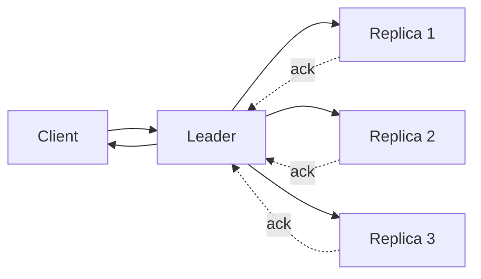

# Strong consistency

> **Learning Path:** Distributed Systems
> **Section:** 3.1.18 — Core concepts

## 1. Problem

ஒரு distributed system-ல data-வை multiple replicas-ல வைக்கிறோம். Availability, latency, fault tolerance-க்காக.

இப்போ user ஒரு write பண்ணினார். அடுத்த சில மில்லி seconds-ல அதே data-வை read பண்ணும்போது, பழைய value தெரிந்தால் என்ன ஆகும்?

Bank app-ல balance update பண்ணிட்டு, refresh பண்ணா முந்தைய balance தெரியுது. E-commerce-ல stock 1 உள்ள product-ஐ யாரோ buy பண்ணிட்டு, நீங்க "Add to cart" பண்ணும்போது still available ஆக தெரியுது. Payment success ஆனதும், order status pending ஆக இருக்கு.

இது business logic-ஐ break பண்ணும். User trust போய்விடும். அதனால் தான் engineers-க்கு **"எழுதினதை உடனே படிக்க முடியணும்"** என்ற guarantee வேண்டும்.

## 2. Mental Model

Strong consistency என்பது simple: **எல்லா clients-க்கும் system ஒரே global order-ல writes-ஐ பார்க்கும், எந்த stale read-ம் கிடைக்காது.**

மூன்று guarantees முக்கியம்:
* **Read-your-writes:** நீங்கள் எழுதியது, உங்கள் அடுத்த read-ல தெரியும்.
* **Monotonic reads:** ஒரு value பார்த்துவிட்டால், பின்னாடி பழைய value திரும்ப தெரியாது.
* **Monotonic writes:** நீங்கள் எழுதிய update-கள் order-ல apply ஆகும்.

Mental model ஆக நினைக்கவும்: Single source of truth இருப்பது போல் behave பண்ண வேண்டும், ஆனால் பின்னால் replicas இருக்கு.

## 3. How It Works

Strong consistency-க்கு coordination தேவை.

Simplified flow:
Client -> Leader -> Quorum commit -> Acknowledgement

1. Write request leader-க்கு வரும். Leader அதை majority replicas-க்கு replicate பண்ணும்.
2. Majority ack வந்த பிறகு தான் client-க்கு success திருப்பி அனுப்பும். இது quorum write.
3. Read request-க்கு, leader-ல இருந்து read பண்ணினால் போதும். அல்லது read quorum பயன்படுத்தி latest committed value-ஐ guarantee பண்ணலாம்.

Linearizability என்பது formal definition: operation-கள் ஒரு total order-ல நடந்தது போல் தோன்ற வேண்டும், real time order-ஐ மீறாமல்.

Consensus protocols like Raft/Paxos இதை enable பண்ணுகின்றன. Leader election, log replication, commit index இதெல்லாம் core mechanisms.

## 4. Architectural Reasoning

Strong consistency எப்போது useful?

* Financial transactions, payment ledger, account balance
* Inventory reservation where oversell கூடாது
* User profile critical fields: email, phone, KYC status
* Authorization data: role change உடனே reflect ஆகணும்

என்ன constraint-ஐ address பண்ணுது? Correctness over availability. Business invariant break ஆகக்கூடாது.

Alternatives:
* Eventual consistency: write fast, propagate later. Low latency, high availability.
* Causal consistency: read-your-writes guarantee, but global order இல்லை.
* Session consistency: same session-ல monotonic guarantee.

Architect choose பண்ணும்போது கேட்க வேண்டியது: "Stale read ஆனால் business-க்கு cost என்ன?" Cost high என்றால் strong consistency.

## 5. Trade-offs

Strong consistency-ன் முக்கிய trade-offs:

* **Latency vs Correctness:** Quorum wait பண்ண வேண்டும். Cross-region write 100ms ஆகலாம். Eventual consistency 10ms.
* **Availability vs Consistency:** Network partition வந்தால், CAP theorem-படி strong consistency வைக்க வேண்டுமென்றால் availability drop ஆகும். Leader unavailable என்றால் writes block ஆகும்.
* **Throughput:** Coordination overhead குறைத்து throughput-ஐ limit பண்ணும். Write bottleneck leader-ல வரும்.
* **Operational complexity:** Leader failover, split brain prevention, clock sync, fencing needed.

Failure modes: Leader fail ஆனால் election time-ல writes stall ஆகும். Client retry பண்ணும்போது duplicate write வராமல் idempotency வேண்டும்.

## 6. Practical Example

Bank transfer service.

User A -> User B க்கு ₹1000 transfer.

System-ல account balance strong consistent replica set-ல இருக்கு.

Write path: Debit A, Credit B as single atomic transaction via leader. Majority commit ஆன பிறகு தான் "Success" response. அதற்கு முன் client timeout ஆனாலும், retry பண்ணும்போது idempotent key-ஆல் duplicate debit தடுக்கப்படும்.

Read path: Balance check செய்யும்போது leader-ல இருந்து read பண்ணினால், just committed transfer தெரியும். User refresh பண்ணினால் stale balance தெரியாது.

இங்கே eventual consistency வைத்தால், debit நடந்து credit இன்னும் replicate ஆகாமல் இருந்தால் money disappear ஆனது போல் தோன்றும். அது acceptable இல்லை.

## 7. Reasoning Challenge

உங்கள் system-ல 20 ms latency budget உள்ள global read-heavy product catalog உள்ளது. 3 regions
