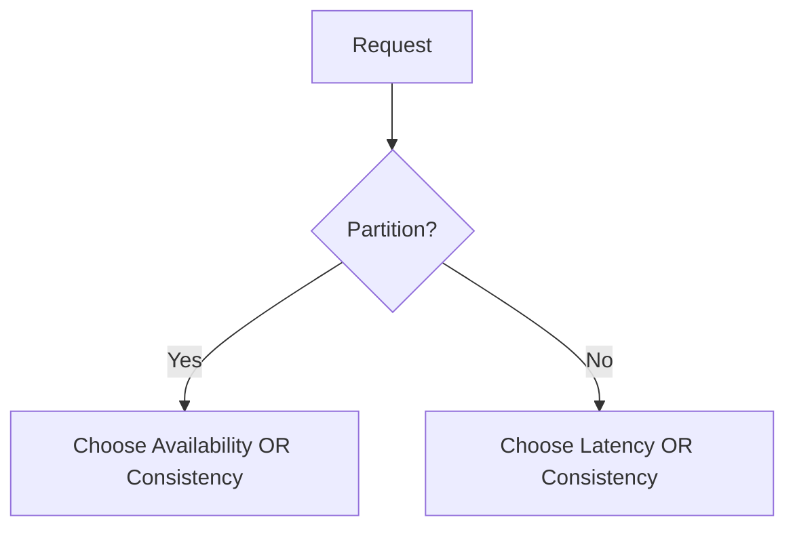

# PACELC

> **Learning Path:** Distributed Systems
> **Section:** 3.1.20 — Core concepts

## 1. Problem

உங்களிடம் 3 data centers-ல replicas இருக்கும் ஒரு distributed database இருக்கு. Users worldwide-ல இருந்து read/write வருது.

CAP சொல்றது: network partition வந்தா consistency மற்றும் availability-க்குள்ள தேர்ந்தெடுக்கணும். Partition இல்லாத normal time-ல என்ன நடக்கும்? அதை CAP சொல்லவே இல்ல.

நிஜத்துல partition இல்லாதப்பவும் ஒரு trade-off இருக்கு. ஒரு write-ஐ எல்லா replicas-க்கும் sync பண்ணினா strong consistency கிடைக்கும், ஆனா read/write latency அதிகமாகும். ஒரு replica-க்கு மட்டும் write பண்ணி பிறகு async replicate பண்ணினா latency குறையும், ஆனா stale read வர வாய்ப்பு இருக்கு.

இந்த normal operation-லயும் latency vs consistency தேர்வு இருக்குன்னு புரிஞ்சுக்கணும். அதுதான் PACELC வர காரணம்.

## 2. Mental Model

PACELC = **PA**rtition **C**hoose **E**... **L**atency **C**hoose **C**onsistency

எளிமையா:
* **Partition வந்தா:** Availability vs Consistency தேர்வு
* **Partition இல்லாட்டி:** Latency vs Consistency தேர்வு

ஒரு system எப்பவும் ஒன்னு இல்ல ரெண்டும் கொடுக்க முடியாது. Design decision என்பது எந்த சூழல்ல எதை prioritize பண்ணுறோம்னு.

## 3. How It Works

System-ஐ இரண்டு mode-ல பார்க்கணும்.

**Partition mode:** Network split ஆனா. Majority quorum கிடைக்காத node-கள் write accept பண்ணக்கூடாது என்றால் consistency தேர்வு. Accept பண்ணுனா availability தேர்வு. இது CAP-ன் பழைய பகுதி.

**Normal mode:** Network healthy. இப்போது question latency.
* Strong consistency வேணும்னா read quorum + write quorum தேவை. அதாவது multiple replicas-ஐ தொடணும். Latency அதிகம்.
* Eventual consistency / read-your-writes relax பண்ணினா local replica-ல read/write பண்ணலாம். Latency குறையும், consistency குறையும்.

PACELC வெறும் theorem இல்ல. இது ஒரு reasoning framework.

## 4. Architectural Reasoning

இது எப்போ useful?
* Multi-region database, cache layer, payment ledger, user profile service போன்ற distributed data-வை design பண்ணும்போது.

Constraint என்ன?
* User-facing read latency < 100ms வேணும் vs financial data-க்கு strong consistency வேணும்.
* Cross-region replication network cost, cost per request.

Options:
* CP system: partition-ல consistency தேர்வு. Normal-லயும் strong consistency தேர்வு → latency அதிகம். உதாரணம்: Spanner-like, ZooKeeper.
* AP system: partition-ல availability தேர்வு. Normal-ல latency தேர்வு → eventual consistency. உதாரணம்: Cassandra, DynamoDB with eventual reads.
* Hybrid: read path-ல latency தேர்வு, write path-ல consistency தேர்வு. உதாரணம்: read local, write quorum.

Architect ஏன் choose பண்ணுவார்?
Business requirement-ஐ பார்த்து. Banking transaction = partition-ல consistency, normal-லயும் consistency. Social feed = partition-ல availability, normal-ல latency.

## 5. Trade-offs

* **Latency vs Consistency:** Strong consistency க்கு quorum coordination வேணும். இது tail latency-ஐ increase பண்ணும். Read latency குறைக்கணும்னா stale data accept பண்ணணும்.
* **Availability vs Consistency during partition:** Consistency choose பண்ணினா minority partition unavailable ஆகும். Users error பார்ப்பாங்க. Availability choose பண்ணினா conflicting writes create பண்ணும், முடிவுல reconciliation complexity வரும்.
* **Operational complexity:** Eventual consistency systems-ல conflict resolution policy, vector clocks, last-write-wins போன்ற design வேணும்.
* **Cost:** Cross-region sync செய்ய network egress cost, replica count increase பண்ணுது.

Failure mode முக்கியம்: Partition-ல availability தேர்வு செய்த system-ல split-brain வந்து data divergence ஆகும். Normal mode-ல latency தேர்வு செய்த system-ல read-after-write inconsistency user-க்கு confusing experience கொடுக்கும்.

## 6. Practical Example

UPI transaction ledger.

Partition mode-ல: Consistency தேர்வு. பணம் double spend ஆகக்கூடாது. Partition வந்தா write block பண்ணு. Availability விட correctness முக்கியம்.

Normal mode-ல: Write quorum 3 regions-ல பரப்பு, read quorum-ம் அதே level. Latency கொஞ்சம் அதிகம் ஆனாலும் strong consistency வேணும். இங்க PACELC = PA / EC.

அதே நிறுவனத்தின் user profile service: Partition mode-ல availability தேர்வு. User profile read/write fail ஆகக்கூடாது. Normal mode-ல latency தேர்வு. Local region replica-ல read பண்ணு, async replicate பண்ணு. Stale photo accept பண்ணலாம். இங்க PACELC = PA / EL.

ஒரே company-க்குள்ள இரண்டு வெவ்வேறு PACELC decision.

## 7. Reasoning Challenge

உங்களிடம் global e-commerce cart service இருக்கு. Peak sale-ல 10k writes/sec. Read latency SLA 50ms. Partition rare ஆனா possible.

நீங்கள் partition-ல availability தேர்வு செய்ய விரும்புகிறீர்கள். Normal operation-ல latency vs consistency எதை தேர்வு செய்வீர்கள்? எதை
