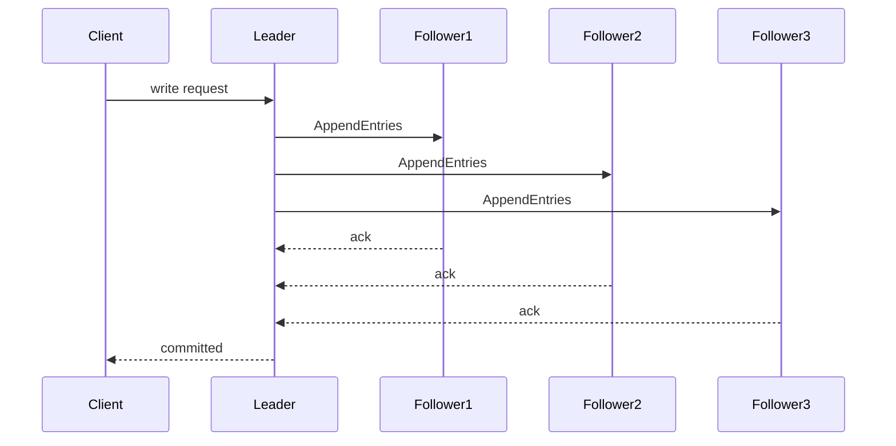

# Consensus

> **Learning Path:** Distributed Systems
> **Section:** 3.1.21 — Core concepts

## Problem

உங்களிடம் 5 nodes உள்ளது. எல்லாம் ஒரே state-ஐ maintain பண்ணணும். Client ஒரு write request அனுப்புகிறார்.

என்ன நடக்கும்?
Node A request-ஐ accept பண்ணி state மாற்றும். Node B network glitch-ல request-ஐ miss பண்ணும். Node C crash ஆகும். Network partition ஆகி 2 nodes ஒரு குழுவில், 3 nodes இன்னொரு குழுவில் தனித்து இருக்கும்.

இப்போது system-ல எது சரியான state? எந்த write-ஐ commit பண்ணலாம்? யார் decide பண்ணுவது?

இந்த ambiguity தான் distributed system-ல painful. Availability வேண்டும், ஆனால் different nodes வெவ்வேறு value-ஐ commit பண்ணினால் data corruption ஆகும். பணம், inventory, order status போன்றதில் இது வேலை செய்யாது.

**Consensus** என்பது இந்த குழப்பத்திற்கான பதில்: failures இருந்தாலும், network தாமதம் இருந்தாலும், group-ல பெரும்பாலான nodes ஒரே value-ஐ ஒப்புக்கொள்ள வேண்டும்.

## Mental Model

Consensus = ஒரு குழுவின் nodes ஒரு முடிவில் உடன்படுவது.

அடிப்படை ஒப்பந்தம் 3 விஷயங்கள்:
* **Agreement**: எந்த node-ம் commit செய்தால், எல்லோரும் அதே value-ஐ commit செய்ய வேண்டும்.
* **Validity**: commit ஆன value ஒரு proposer-ல இருந்து வந்ததாக இருக்க வேண்டும்.
* **Termination**: சரியாக இயங்கும் nodes ஒரு முடிவை அடையும்.

உதாரணமாக ஒரு distributed log-ல next entry என்ன என்பதை எல்லா replicas-ம் ஒப்புக்கொள்ள வேண்டும். இல்லையெனில் replay செய்யும்போது state diverge ஆகும்.

## How It Works

Consensus-க்கு பொதுவான வடிவம்: propose -> accept -> commit.

Leader இல்லாத system-ல யார் propose பண்ணுவது என்று தெரியாது, அதனால் protocol message passing மூலம் quorum-ஐ அடைகிறது.

Paxos, Raft போன்ற protocols இதை solve செய்கின்றன:
* Proposer ஒரு value-ஐ suggest பண்ணுகிறது.
* Acceptors majority quorum-ல accept செய்தால் value chosen ஆகிறது.
* Leader election + log replication இணைந்தால், consensus ஒரு replicated state machine-ஐ உருவாக்குகிறது.

Raft-ல mental model எளிது: leader தேர்வு, log replication, safety. Leader தான் client request-ஐ accept செய்கிறது, followers-க்கு replicate செய்கிறது, majority acknowledge வந்ததும் commit செய்கிறது.

Leader crash ஆனால் election trigger ஆகி, new leader log consistency check செய்து எல்லா nodes-ம் அதே order-ல entries apply செய்கின்றன.

## Architectural Reasoning

Consensus எப்போது தேவை?
* Multiple replicas ஒரே source of truth-ஐ முன்வைக்க வேண்டும்.
* Leader election, membership change, configuration update போன்ற decisions.
* Replicated state machine: database, distributed lock service, cluster manager.

Constraint இது address செய்கிறது: **partition tolerance + consistency** கூடவே இருக்கும் போது, யார் எப்போது commit செய்யலாம் என்று தீர்மானிக்க.

Alternatives:
* **No coordination**: last write wins, conflict resolution later. Low latency, high availability, ஆனால் correctness இல்லை.
* **Central coordinator**: single node decides. Simple, ஆனால் SPOF, scalability limit.
* **Consensus**: coordinated decision, fault tolerant.

Architect தேர்வு செய்யும் போது கேட்கும் கேள்வி: "நாம் diverge ஆன state-ஐ tolerate பண்ண முடியுமா?" பணம், inventory, config changes-க்கு answer இல்லை. அப்போ consensus must.

## Trade-offs

1. **Availability vs Consistency**: Network partition-ல majority quorum கிடைக்கவில்லை என்றால் write reject செய்ய வேண்டும். CP behavior. Read availability வேண்டுமென்றால் stale read அனுமதிக்க வேண்டும்.

2. **Latency**: Consensus-க்கு majority ack வேண்டும். Cross-region-ல 2 round trips = tens to hundreds of ms. Single node write-ஐ விட slow.

3. **Complexity & Operability**: Leader election, log compaction, split brain prevention, clock skew, fencing. Small team-க்கு operational overhead அதிகம்.

4. **Failure modes**: Leader flapping, network partition-ல minority partition எழுத முடியாது. By design, system progress stall ஆகலாம். Safety உத்திரவாதம், liveness guarantee இல்லை.

## Practical Example

Enterprise payment ledger service 3 data centers-ல run ஆகிறது. ஒரு payment create ஆகும்போது balance update commit ஆக வேண்டும்.

Raft based log replication பயன்படுத்தினால், leader DC1-ல இருக்கும். Write வந்ததும் leader entry-ஐ log-ல append செய்து DC2, DC3-க்கு replicate
