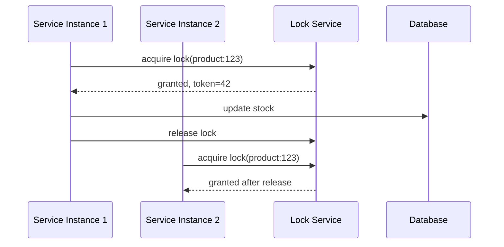

# Distributed locking

> **Learning Path:** Distributed Systems
> **Section:** 3.1.23 — Core concepts

## 1. Problem

Monolith-ல ஒரு request வந்தா, database row lock போதும். ஒரே JVM-ல ஒரே process-ஐ block பண்ணிடலாம்.

இப்போ system-ஐ microservices-ஆ split பண்ணிட்டீங்க. 10 instances of inventory service ஒரே நேரத்துல ஓடுது. Flash sale-ல 1000 users ஒரே product-க்கு order பண்ணுறாங்க.

இரண்டு instances ஒரே நேரத்துல stock = 5 பார்த்து, இரண்டும் stock -1 பண்ணி 4 ஆக்குது. Database final stock 4 ஆக இருக்கணும், ஆனா உண்மையில் 2 orders consume ஆகி stock 3 ஆக இருக்கணும்.

Local lock போட்டாலும் வேலைக்கு ஆகாது. Lock ஒரு node-க்குள்ள மட்டும் தான் வேலை செய்யும். வேற node அதை பார்க்காது.

இங்க தான் தேவை வருது: **பல machines-ல ஓடும் processes-க்கு இடையே mutual exclusion** வேணும். அதுதான் distributed lock.

## 2. Mental Model

Distributed lock என்பது ஒரு centralized coordinator-கிட்ட "இந்த resource-க்கு lock வேணும்"னு கேட்கிறது. Lock கிடைச்சவன் மட்டும் critical section-ல enter பண்ண முடியும். மற்றவங்க wait பண்ணணும்.

முக்கிய விஷயம்: lock-க்கு lifetime இருக்கணும். ஒரு node crash ஆனாலும் lock நிரந்தரமா தங்கிடக் கூடாது. அதனால lease / TTL கொடுக்கிறோம்.

இது database transaction போல இல்லை. Network partition, clock skew எல்லாம் வரும். அதனால perfect lock கிடைக்காது. Trade-off தான்.

## 3. How It Works

Basic flow simple தான்:

1. Client A `acquire lock(key="product:123", ttl=10s)` கேட்குது
2. Lock service check பண்ணி lock இல்லைன்னா set பண்ணி, owner id + expiry கொடுக்குது
3. Client A critical work முடிச்சதும் `release lock`
4. முடிக்க முடியலைன்னா TTL முடிஞ்சதும் lock auto expire ஆகும்

Real world-ல extra safety வேணும்:

* **Fencing token**: lock acquire பண்ணும்போது increasing token கொடுக்கிறோம். Resource update பண்ணும்போது token-ஐ check பண்ணி, stale holder எழுத முடியாது.
* **Renew / extend**: long work-க்கு lease-ஐ background-ல renew பண்ணணும்.
* **Try with timeout**: wait forever பண்ணக்கூடாது. max wait, backoff.

mermaid diagram:

## 4. Architectural Reasoning

Distributed lock எப்போ useful?

* Short critical section, high contention ஒரு resource-க்கு
* Database-level constraint போட முடியாத distributed process coordination வேணும்
* Example: leader election, rate limiter per key, preventing duplicate job execution

Alternatives யோசிக்கணும்:

* **Database unique constraint / serializable transaction**: பல சமயம் போதும். Stock decrement-க்கு `UPDATE ... WHERE stock > 0` போதும். Lock தேவையே இல்லாம போகும்.
* **Partitioning**: key-ஐ shard பண்ணி contention குறைக்கலாம்.
* **Saga / outbox**: long workflow-க்கு lock வச்சு வைக்கக் கூடாது.

அதனால lock use பண்ணுறதுக்கு முன் கேள்வி: இதை data model-ல solve பண்ண முடியுமா? முடியலைன்னா தான் distributed lock.

Choose எதை?
* Redis + Redlock pattern: low latency, simple, but split brain risk
* ZooKeeper / etcd: strong consistency, watch based, slower
* Database advisory lock: already consistent DB இருந்தா easy

## 5. Trade-offs

**Availability vs Correctness**: Network partition வந்தால் lock service down ஆனா எல்லா service-ம் stall ஆகும். Lock service ஒரு single point of failure ஆகும்.

**Latency**: Every critical section-க்கு network roundtrip வேணும். Throughput குறையும்.

**Safety**: TTL சின்னதா வச்சால் node slow ஆனால் lock pre-empt ஆகும். பெரிசா வச்சால் crash ஆனால் resource long time lock-ல மாட்டும்.

**Deadlock / livelock**: Multiple locks acquire order consistent-ஆ இருக்கணும். இல்லைன்னா deadlock.

**Clock skew**: TTL based expiry accurate time sync தேவை. NTP drift இருந்தா problem.

முக்கிய failure mode: split brain. Two nodes same time lock acquire பண்ணிட்டா,
