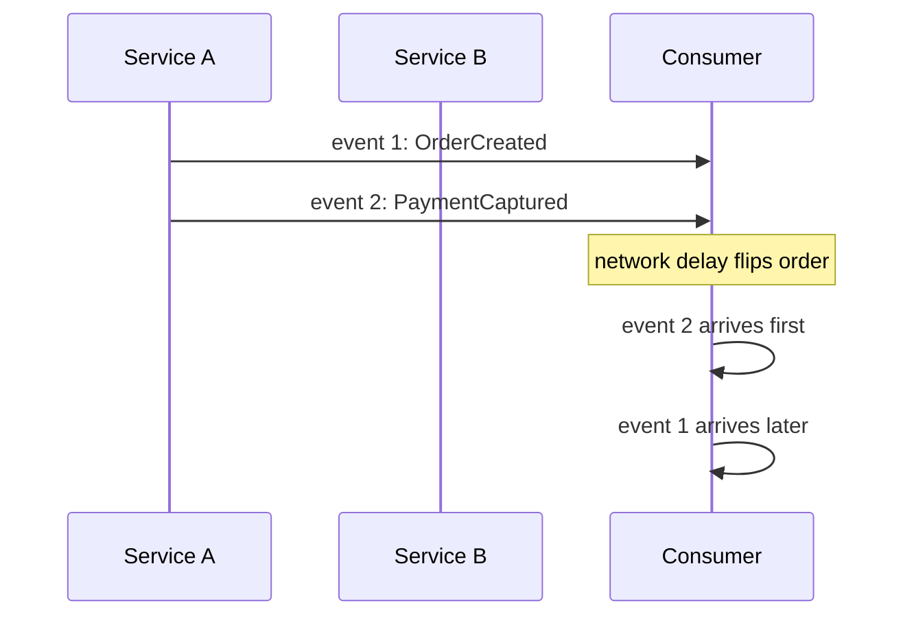

# Ordering

> **Learning Path:** Distributed Systems
> **Section:** 3.1.24 — Core concepts

## 1. Problem

ஒரு distributed system-ல் 3 service-கள் இருக்கு: Order Service, Payment Service, Inventory Service.

User ஒரு order create பண்ணும்போது, Order Service-ல் `OrderCreated` event publish ஆகும். Inventory Service அதை கேட்டு stock reserve பண்ணும். Payment Service கேட்டு payment initiate பண்ணும்.

இப்போ network-ல் jitter இருக்கு. `OrderCreated` message ஒன்று 50ms-ல வரும், அடுத்த message 10ms-ல வரும். Consumer-களுக்கு வரும் வரிசை மாறும்.

இன்னொரு உதாரணம்: User profile-ல் `EmailUpdated` event வந்தது, அதே user-க்கு சில மில்லி செகண்ட் கழித்து `AccountDeleted` event வந்தது. Consumer-க்கு Delete முதலில் வந்தால், பிறகு வரும் Update-ஐ ப்ராசஸ் பண்ணினால் deleted account-ஐ மீண்டும் alive ஆக்கிடும்.

**பிரச்சினை என்ன?** Clock sync பண்ண முடியாது, network delay unpredictable. `happened before` என்பதை physical timestamp-ல மட்டும் நம்ப முடியாது. Ordering இல்லாமல் state diverge ஆகும்.

## 2. Mental Model

Ordering என்பது "யார் முதலில் நடந்தது" என்பதை distributed nodes-க்கு இடையில் ஒரே மாதிரி புரிய வைப்பது.

மூன்று வகை:

* **Total Order**: எல்லா nodes-க்கும் events ஒரே வரிசையில் தெரியும். A before B எல்லாருக்கும் ஒன்னு.
* **Causal Order**: `A` நடந்ததால் தான் `B` நடந்தது என்ற causal dependency மதிக்கப்படும். Independent events-க்கு order கட்டாயம் இல்லை.
* **Partial Order**: எந்த order guarantee-ம் இல்லை. Consumer தான் sort பண்ணிக்கோ.

## 3. How It Works

Physical clock-ல நம்பாமல் logical ordering பயன்படுத்துவோம்.

* **Lamport timestamp**: ஒவ்வொரு event-க்கும் counter. Send பண்ணும் போது counter++ , receive பண்ணும் போது max(local, received)+1. இது causal order-க்கு போதும், total order அல்ல.
* **Vector Clock**: ஒவ்வொரு node-க்கும் தனி counter. "நான் என்ன தெரிந்திருக்கிறேன்" என்பதை track பண்ணும். Causal dependency detect பண்ண உதவும்.
* **Sequence Number / Leader**: Single writer or leader assigns monotonic sequence number. Total order கிடைக்கும். Kafka partition, Raft log இதை தான் செய்கிறது.
* **Total Order Broadcast**: Paxos / Raft-based broadcast. All replicas same order-ல apply பண்ணும்.

Consumer-க்கு order guarantee இல்லை என்றால் state தவறாக முடியும்.

## 4. Architectural Reasoning

Ordering தேவை எப்போ?

* **Financial ledger, payment, inventory**: Same entity-க்கு sequential updates வரும்போது total order வேண்டும். Refund payment-க்கு பிறகு தான் வர வேண்டும்.
* **Chat / audit log**: User experience-க்கு total order விரும்பப்படும்.
* **Eventual aggregation, analytics**: Partial order போதும். Count, sum போன்ற operations commutative.

Alternatives:
* Application level ordering: `entity_id` பார்த்து per-key single consumer. Simple, but throughput குறையும்.
* Use Kafka partition key = user_id. Same partition-ல் order preserve ஆகும்.
* Use vector clock for causal reasoning, no global order.

Architect தேர்வு: Consistency vs latency vs cost. Total order கொடுக்க leader / single partition வேண்டும். அது bottleneck ஆகும்.

## 5. Trade-offs

* **Total order vs Availability**: Total order-க்கு coordination வேண்டும். Network partition-ல் availability குறையும். CAP-ல் consistency choose பண்ணினால் availability sacrifice.
* **Latency**: Sequence number assign, wait for quorum செய்தால் latency அதிகரிக்கும்.
* **Scalability**: Global total order என்பது one partition / one leader. Throughput limit ஆகும். Per-key ordering scalable.
* **Failure mode**: Consumer crash ஆனால
