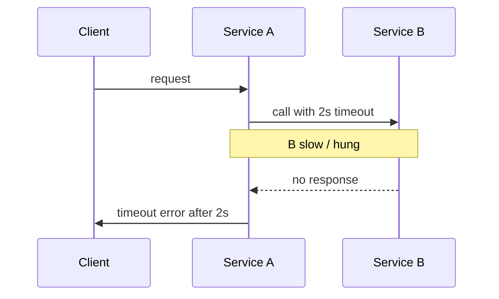

# Timeouts

> **Learning Path:** Distributed Systems
> **Section:** 3.1.8 — Core concepts

## 1. Problem

ஒரு distributed system-ல service A service B-ஐ call பண்ணுது. Network slow ஆகி, service B crash ஆகி, அல்லது GC pause-ல் மாட்டி இருக்கு. Client request வந்து, அது காத்துக்கிட்டே இருக்கு.

என்ன ஆகும்?
Thread pool நிரம்பி, request accept பண்ண முடியாது. Latency கூடி, user experience கெட்டு போகும். ஒரு slow downstream service முழு system-ஐயும் கீழே இழுத்துடும். இதுதான் cascade failure-ன் start.

உனக்கு தெரியாமல் வெயிட் பண்ணிக்கொண்டே இருப்பது ஆபத்து. அதனால் தான் timeout தேவை.

## 2. Mental Model

Timeout = ஒரு deadline.

நீ ஒரு வேலையை ஒரு குறிப்பிட்ட நேரத்துக்குள் முடிக்கணும். அதுக்கு மேல் காத்திருக்க மாட்டேன். விட்டுவிட்டு next step-க்கு போவேன் அல்லது fail பண்ணுவேன்.

இது "நான் இன்னும் காத்திருக்க மாட்டேன்" என்பதன் architectural version. System-ஐ predictable ஆக வைக்க, resource-ஐ மீளபெற, failure-ஐ fast detect பண்ண.

## 3. How It Works

Timeout மூன்று இடத்தில் வரும்.

**Client-side timeout:** Caller service தான் எவ்வளவு நேரம் காத்திருப்பேன் என்று decide பண்ணும். API call-க்கு 2s timeout set பண்ணினால், 2s-ல் response வரலைன்னா connection-ஐ close பண்ணி error திருப்பும்.

**Server-side timeout:** Service B தன்னுடைய processing எவ்வளவு நேரம் நடக்கும் என்று limit பண்ணும். Long running query-க்கு query timeout.

**Idle timeout:** Connection pool, HTTP keep-alive, message queue consumer இப்படி வெறுமனே இணைப்பை வைத்துக்கொண்டே இருக்க கூடாது.

ஒரு request flow:

Timeout hit ஆனதும் client கிட்ட error திருப்பி, thread-ஐ free பண்ணும். அதே request-ஐ retry பண்ணலாம், fallback கொடுக்கலாம்.

## 4. Architectural Reasoning

Timeout ஏன் தேவை?

* **Failure detection:** Hang ஆனதை விரைவில் தெரிந்து கொள்ள.
* **Resource protection:** Thread, connection, memory exhaust ஆகாமல் தடுக்க.
* **Latency control:** P99 latency-ஐ கட்டுப்படுத்த.
* **Cascading failure தடுப்பு:** ஒரு slow dependency முழு system-ஐ முடக்காமல்.

எப்போது பயன்படுத்துவது?

Distributed call, external API call, database query, message queue poll போன்ற எல்லா synchronous wait-லும் timeout வேண்டும்.

Default இல்லாமல் விடக்கூடாது. Language/runtime-ன் default timeout பெரும்பாலும் infinite ஆக இருக்கும். அதுதான் பிரச்சனை.

Alternative என்ன? காத்திருக்காமல் async மாடல் பயன்படுத்தலாம், circuit breaker போடலாம். ஆனால் அதற்கு முன் basic safety net timeout தான்.

## 5. Trade-offs

Timeout set பண்ணுவது எப்போதும் perfect இல்லை.

**Too short timeout:** Healthy request கூட fail ஆகும். False positive. தேவையில்லாத retry, unnecessary error.
**Too long timeout:** Hang நீடிக்கும். Resource waste. Cascade failure risk.

Timeout மட்டும் போதாது. Idempotency வேண்டும். இல்லைன்னா client timeout ஆனதும் retry பண்ணினால் duplicate payment, duplicate order நடக்கும்.

Timeout + retry combination ஆபத்தானது. Retry storm வரும். அதனால் exponential backoff, jitter, max retries வேண்டும்.

Timeout value எப்படி decide பண்ணுறது? Service-ன் normal p95 latency + network jitter + buffer. அது SLA-வை reflect பண்ணணும்.

Failure mode: Timeout hit ஆனால் server-side work தொடர்ந்து நடக்கலாம். Client-க்கு தெரியாது. Orphaned work. அதை handle பண்ண cancellation signal, request context propagation வேண்டும்.

## 6. Practical Example

Enterprise payment flow: API Gateway -> Order Service -> Payment Service -> Bank API.

Bank API சில நேரம் 10s எடுக்கும். Order Service-க்கு user-க்கு 3s-க்குள் response தேவை.

Order Service Payment Service-ஐ call பண்ணும்போது client-side timeout 2s வைக்கும். Timeout ஆனால் immediate fallback: "Payment pending, we will notify via email" என்று return பண்ணி, async worker bank status-ஐ poll பண்ணும்.

Payment Service-க்கு server-side timeout 30s. Bank API-க்கு call பண்ணும்போது 8s timeout.

இப்படி timeout-கள் layered ஆக இருக்கும். Each layer-க்கு சொந்த deadline.

## 7. Reasoning Challenge

உங்களிடம் API gateway இருக்கு. அதன் downstream 3 services இருக்கு. P95 latency 200ms, 800ms, 1.5s.

User SLA 2s. Gateway-க்கு எவ்வளவு timeout வைப்பீர்கள்? Downstream-க்கு தனித்தனி timeout எப்படி set பண்ணுவீர்கள்? Timeout ஆனால் retry பண்ணலாமா? ஏன்?

இதை யோசிக்கும்போது latency budget, retry cost, idempotency எல்லாம்
