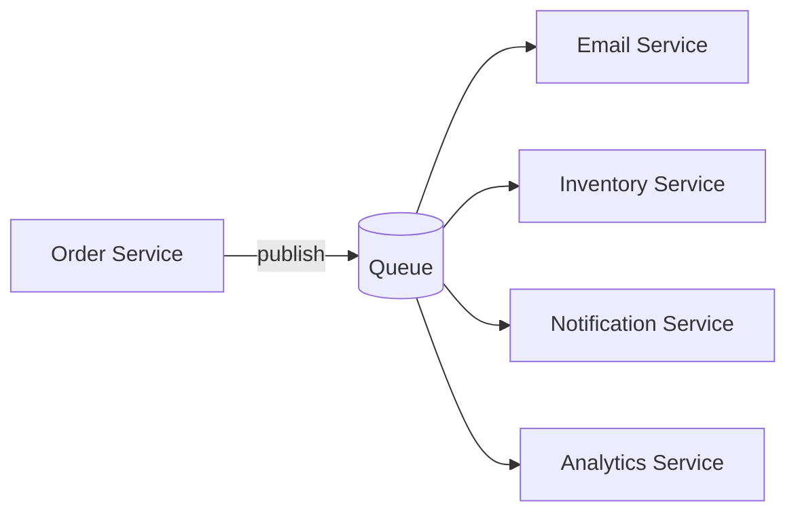

# Queues

> **Learning Path:** Distributed Systems
> **Section:** 3.2.1 — Messaging

## 1. Problem

நீங்கள் ஒரு order service வச்சிருக்கீங்க. User checkout பண்ணும்போது அதே request-ல payment service-ஐ call பண்ணி, inventory service-ஐ call பண்ணி, email service-ஐ call பண்ணி, notification service-ஐ call பண்ணி, analytics service-ஐ call பண்ணறீங்க.

இதுல என்ன ஆகும்?

* Payment service slow ஆனால் user checkout-ஐ wait பண்ண வேண்டும்.
* Email service down ஆனால் முழு order-ம் fail ஆகும்.
* Inventory service rate limit அடித்தால் order throughput முழுவதும் drop ஆகும்.
* ஒரு service crash ஆனால் caller-ம் crash ஆகிற மாதிரி தெரியும்.

Synchronous call என்பது tight coupling. Producer-ன் fate consumer-ன் fate-ஐயும் கட்டுப்படுத்தும். Latency add ஆகும், availability குறையும்.

இந்த pain தான் queue வர காரணம்.

## 2. Mental Model

Queue என்பது buffer + decoupling.

நீங்கள் ஒரு தபால் பெட்டி வைக்கிறீங்க. Producer message-ஐ போட்டுட்டு போய்விடும். Consumer எப்போது ready ஆனாலும் எடுத்துக்கொள்ளும்.

அதாவது **time decoupling** + **load decoupling** + **failure decoupling**.

Producer எப்போது வேண்டுமானாலும் produce பண்ணலாம், consumer எப்போது வேண்டுமானாலும் consume பண்ணலாம். இடையில் queue நிற்கும்.

## 3. How It Works

ஒரு message broker-ல் producer `push` பண்ணும், consumer `pull` பண்ணும்.

அடிப்படை contract:

* Producer message-ஐ queue-க்கு publish பண்ணும்.
* Queue message-ஐ persist பண்ணும்.
* Consumer message-ஐ acknowledge பண்ணிய பிறகு தான் remove ஆகும்.

அவ்வளவு தான். FIFO என்பது ideal, ஆனால் scale பண்ணும்போது ordering guarantee விலை மிக்கது.

Implementation-ல் முக்கிய விஷயங்கள்: durability, retry, DLQ, visibility timeout.

## 4. Architectural Reasoning

Queue எப்போது useful?

* Producer rate மற்றும் consumer rate வேறுபடும் போது. Traffic spike-ஐ smooth பண்ண.
* Consumer temporarily unavailable ஆகும் போது. Service down என்றாலும் message lost ஆகாது.
* Multiple consumers ஒரே event-ஐ வேறு வேறு வேகத்தில் process பண்ண வேண்டும் போது.
* Request-ஐ immediate response தேவையில்லாத background work-க்கு offload பண்ண.

Alternatives:

* Synchronous REST call: low latency, strong ordering, tight coupling.
* Direct DB polling: simple but inefficient, latency high.
* Event streaming like Kafka: replay, multiple consumer groups, ordering.

Queue-ஐ தேர்ந்தெடுக்கும் காரணம்: நீங்கள் availability-ஐ முக்கியமாக வைக்கிறீர்கள், latency-ஐ சற்று relax பண்ணலாம்.

## 5. Trade-offs

* **Latency vs Reliability:** Queue add ஆனால் latency increase ஆகும். ஆனால் reliability increase ஆகும்.
* **At-least-once vs Exactly-once:** Network failure-ல் consumer ack வராமல் போகலாம். Retry செய்யும் போது duplicate வரும். Idempotency handle பண்ண வேண்டும்.
* **Ordering:** Global ordering-க்கு single partition வேண்டும். Scale குறையும். Partial ordering தான் practical.
* **Operational complexity:** Queue fill ஆகி disk full ஆகும், consumer slow ஆனால் backlog grow ஆகும், poison message loop ஆகும். Monitoring, DLQ, scaling தேவை.
* **Cost:** Persistent storage, replication, throughput க்கு cost.

Failure modes: queue full, consumer crash mid-process, message lost on broker crash if not persisted, duplicate processing.

## 6. Practical Example

Order placed ஆனது.

Order service payment success பெற்றதும் `order.created` event-ஐ queue-க்கு publish பண்ணும்.

Queue-லிருந்து:

* Email service email அனுப்பும்.
* Push notification service notification அனுப்பும்.
* Inventory service stock deduct பண்ணும்.
* Analytics service event-ஐ consume பண்ணி dashboard update பண்ணும்.

Order service-க்கு user-க்கு response கொடுக்க 200ms தான் ஆகும். மற்ற வேலைகள் async-ல் நடக்கும். Email service 5 min down ஆனாலும் order success ஆகும். பிறகு queue-ல் backlog clear ஆகும்.

## 7. Reasoning Challenge

உங்களிடம் 20 consumers இருக்கு. எல்லாருக்கும் same event தேவை. Consumer processing speed வேறுபடுகிறது. Producer-ஐ block பண்ணக்கூடாது. Replay-ம் வேண்டும். 

இங்கே simple queue போதுமா? அல்லது fan-out topic / log-based streaming தேவையா? எ
