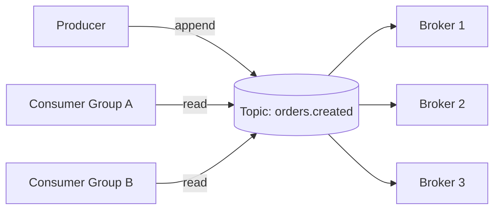

# Kafka

> **Learning Path:** Distributed Systems
> **Section:** 3.2.3 — Messaging

## Problem

ஒரு e-commerce system-ல் Order Service ஒரு order create பண்ணும்போது அதே நேரத்தில் Payment Service, Inventory Service, Notification Service, Analytics Service எல்லாம் தெரிந்துக்கணும்.

Synchronous HTTP call பண்ணினா என்ன ஆகும்?
Order Service Payment Service-க்கு call பண்ணுது, அங்கே timeout ஆகுது. Order user-க்கு stuck ஆகுது. Payment fail என்றால் inventory release ஆகுமா? ஒரு service down ஆனால் முழு flow-ம் break ஆகும்.

இன்னொரு problem: 50 consumers வேணும், ஒவ்வொன்றும் வேற வேற speed-ல் process பண்ணும். Producer-ஐ consumers வேகத்துக்கு wait பண்ணச் சொல்ல முடியாது. Events-ஐ replay பண்ணி debugging செய்யணும். இது direct point-to-point call-ல் சாத்தியமே இல்லை.

இங்கே தேவைப்படுவது **decoupling + durable buffer + independent scaling**.

## Mental Model

Kafka-வை ஒரு distributed commit log-ஆக நினைத்துக்கோ.

Producer events-ஐ ஒரு topic-க்கு append பண்ணும். அது immutable. Consumer groups என்பது அதே log-ஐ வெவ்வேறு offset-ல் read பண்ணும் independent readers.

Log என்பதால்:
* Produce பண்ணியதும் producer-க்கு ack வந்துவிடும், consumer எப்போது வேண்டுமானாலும் read பண்ணலாம்
* Consumer slow ஆனாலும் producer-க்கு block இல்லை
* Log-ஐ replay பண்ணலாம், reprocess பண்ணலாம்

Partition என்பது அந்த log-ன் scale unit. ஒரு topic-க்கு பல partitions, ஒவ்வொன்றும் ஒரு ordered log.

## How It Works

* **Topic + Partition**: `orders.created` topic, 12 partitions. Producer key-ன் hash-ன் மூலம் partition decide ஆகும். Same key எப்போதும் same partition-ல் வரும் → ordering guarantee.
* **Broker**: Kafka cluster. Data replicated across brokers. Leader partition handle writes, followers replicate.
* **Producer**: Events-ஐ send பண்ணும். `acks=all` என்றால் replication confirm ஆன பிறகே ack.
* **Consumer Group**: ஒரு group-ல் ஒரு partition-ஐ ஒரு consumer மட்டுமே consume பண்ணும். Group scale ஆனால் throughput scale ஆகும். Offset consumer-ஆல் manage ஆகும், automatic commit.

Flow:

Producer block ஆகாமல் write பண்ணும், consumers independent-ஆக read பண்ணும்.

## Architectural Reasoning

Kafka useful ஆகும் போது:
* **Fan-out தேவை**: ஒரு event-க்கு 10+ downstream systems தேவை. HTTP fan-out-ல் reliability குறைவு.
* **Backpressure handle பண்ண வேண்டும்**: Peak traffic-ல் consumers slow ஆகும்போது buffer வேண்டும்.
* **Replay தேவை**: Bug fix பண்ணி past events-ஐ reprocess பண்ண வேண்டும். Event sourcing, analytics rebuild.
* **Ordering guarantee**: Same key-க்கு strict order வேண்டும். Partition மூலம் கிடைக்கும்.

Alternatives: RabbitMQ / SQS. அவை queue model. One consumer per message, replay கடினம். Kafka log model-க்கு fit ஆகும்.

எப்போது choose பண்ணக்கூடாது? Low latency sub-millisecond messaging வேண்டும் என்றால், request-response வேண்டும் என்றால், அல்லது small team-க்கு operational overhead பெரிது என்றால்.

## Trade-offs

**Durability vs Latency**: `acks=all` + replication = durable ஆனால் latency அதிகம். `acks=1` fast ஆனால் broker failure-ல் data loss risk.

**Ordering vs Throughput**: Ordering வேண்டுமானால் partition key use பண்ண வேண்டும். ஒரு partition-க்கு ஒரு consumer மட்டுமே. Throughput வேண்டுமானால் partitions அதிகம், ஆனால் ordering scope குறுகும்.

**Operational complexity**: ZooKeeper/KRaft, partition rebalancing, consumer group lag, retention policy, disk I/O. Small team-க்கு இது cost.

**Replay என்பது poison message risk**: Buggy consumer reprocess பண்ணும்போது duplicate side effects வரும். Idempotent consumer வேண்டும்.

Failure mode: Consumer crash ஆனால் offset commit ஆகாவிட்டால் duplicate processing. Broker leader fail ஆனால் ISR shrink ஆகலாம். Retention குறைவாக set செய்தால் replay window மறைந்துவிடும்.

## Practical Example

Order flow:
Order Service `orders.created` topic-க்கு event publish பண்ணும்.

Consumer Group 1: Payment Service → payment processing
Consumer Group 2: Inventory Service → stock deduct
Consumer Group 3: Notification Service → email/SMS
Consumer Group 4: Analytics Service → warehouse DB-க்கு write

Payment Service 2x scale பண்ணினால், partitions-க்கு load distribute ஆகும். Notification Service slow ஆனால் அதன் lag மட்டும் அதிகரிக்கும், மற்றவர்களுக்கு impact இல்லை.

Black Friday-ல் traffic spike வந்தால் Kafka log buffer பண்ணும். Consumers catch up பண்ணும் போது, producers தொடர்ந்து write பண்ணலாம்.

## Reasoning Challenge

உங்களிடம் 20 consumers இருக்கு. எல்லாருக்கும் same event தேவை. Consumer processing speed வேறுபடுகிறது. Producer-ஐ block பண்ணக்கூடாது. Replay-ம் வேண்டும். இங்கே என்ன architecture தேர்வு செய்வீர்கள்? ஏன்?

* Consumer group ஒன்றுக்கு ஒரு consumer என்றால் fan-out கிடைக்காது.
* 20 independent consumer groups வ
