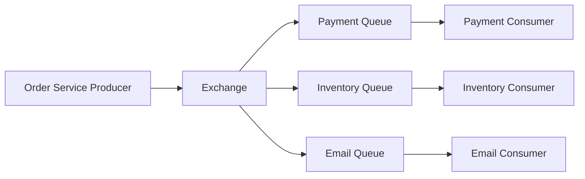

# RabbitMQ

> **Learning Path:** Distributed Systems
> **Section:** 3.2.4 — Messaging

### 1. Problem

ஒரு e-commerce system-ல Order Service order create பண்ணியதும் அதே நொடியில் Payment Service, Inventory Service, Email Service, Analytics Service எல்லாத்துக்கும் தெரிய வேண்டும்.

இதை synchronous HTTP call-ல செய்தால் என்ன ஆகும்?
Order Service Payment-க்கு call பண்ணும், Payment slow ஆக இருந்தால் Order request block ஆகும். Payment down ஆனால் Order create கூட fail ஆகும். Email service-க்கு தேவையான data வேறு speed-ல process ஆகும்.

இது coupling, cascade failure, latency spike எல்லாம் கொண்டு வரும்.

உண்மையான தேவை: **Producer உடனே திரும்ப வேண்டும், Consumer தனக்கு வசதியான speed-ல process பண்ண வேண்டும், failure வந்தாலும் message தொலையக்கூடாது.**

இந்த பிரச்சனைக்கு தான் messaging வந்தது.

### 2. Mental Model

RabbitMQ ஒரு post office மாதிரி.

Producer ஒரு message-ஐ தபால் பெட்டிக்குள் போடுகிறது. Consumer தனக்கான mailbox-ல இருந்து message எடுக்கிறது.

Producer யார் message எடுக்கிறார் என்று தெரிய வேண்டாம். Consumer எப்போது வருவார் என்று Producer காத்திருக்க வேண்டாம்.

Middle-ல RabbitMQ வந்து buffer பண்ணி, route பண்ணி, deliver பண்ணி, acknowledge பண்ணி கண்காணிக்கிறது.

### 3. How It Works

RabbitMQ AMQP protocol மேல் வேலை செய்கிறது.

Producer -> Exchange -> Queue -> Consumer

Exchange தான் router. Direct, Topic, Fanout மாதிரி types இருக்கு.
Queue தான் actual buffer. Message durability, persistence இங்கே control ஆகிறது.

Consumer message-ஐ receive பண்ணியதும் ack பண்ண வேண்டும். Ack வராவிட்டால் message requeue ஆகும். இதுதான் at-least-once delivery-க்கு base.

Producer publish பண்ணும், exchange routing key பார்த்து சரியான queue-க்கு போடும். Consumer queue-ல இருந்து pull பண்ணும்.

### 4. Architectural Reasoning

Messaging எப்போது useful?

* Service decoupling தேவைப்படும்போது. Service A Service B-யின் availability-ஐ depend பண்ணக்கூடாது.
* Workload spike-ஐ absorb பண்ண வேண்டும்போது. Traffic burst வந்தாலும் queue buffer பண்ணும்.
* Different processing speed உள்ள consumers இருக்கும்போது.
* Retry, DLQ, delayed processing மாதிரி reliability pattern தேவைப்படும்போது.

RabbitMQ specifically choose பண்ணுவது ஏன்?
Rich routing, mature broker, DLQ support, priority queue, TTL, clustering, management UI.

Alternatives: Kafka for high-throughput event streaming and replay, SQS for managed simple queue, Redis Streams for low latency. RabbitMQ middle ground: low latency + flexible routing + strong broker semantics.

### 5. Trade-offs

* **Latency vs Reliability:** Persistent message, disk write, ack செய்தால் latency அதிகரிக்கும். Fire-and-forget வேகம், but data loss risk.
* **Ordering guarantee கிடையாது default-ல.** Multiple consumers இருந்தால் order mix ஆகும். Partition per key மாதிரி design செய்ய வேண்டும்.
* **Exactly-once delivery கிடையாது.** At-least-once தான். Consumer idempotent ஆக இருக்க வேண்டும். இல்லை என்றால் duplicate processing.
* **Operational complexity.** Broker single point of failure ஆகும். Clustering, HA, mirrored queues, partition handling, monitoring எல்லாம் தேவை. Team size சிறியதாக இருந்தால் overkill.

Failure mode முக்கியம்: Consumer crash ஆனால் unacked message requeue ஆகும். Consumer slow ஆனால் queue grow ஆகும், memory pressure வரும். Producer வேகமாக போட்டால் consumer வேகமாக எடுக்க முடியாவிட்டால் backpressure வேண்டும்.

### 6. Practical Example

Order placed event.

Order Service message publish பண்ணும்:
`order.created {orderId: 123, userId: 456}` routing key `order.created`

Exchange type Topic. Bindings:
`payment.queue` -> `order.created`
`inventory.queue` -> `order.*`
`email.queue` -> `order.created`
`analytics.queue` -> `order.#`

Payment consumer fail ஆனால் message DLQ-க்கு போகும். Manual replay செய்யலாம்.

Order Service 50ms-ல respond பண்ணும். Payment, Inventory async-ல process ஆகும். User experience improve ஆகும்.

### 7. Reasoning Challenge

உங்களிடம் 20 consumers இருக்கு. எல்லாருக்கும்
