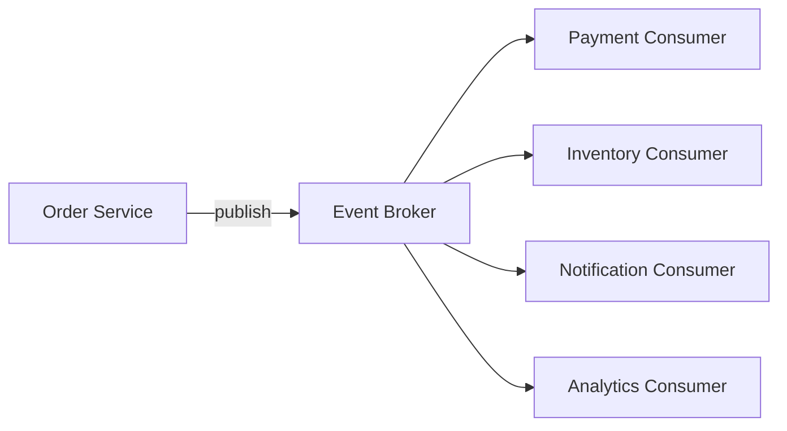

# Event-driven architecture

> **Learning Path:** Distributed Systems
> **Section:** 3.2.5 — Messaging

## 1. Problem

உங்களிடம் Order Service, Payment Service, Inventory Service, Notification Service இருக்கு.

ஒரு order place ஆனதும் Order Service நேரடியாக Payment Service-ஐ call பண்ணும், அது முடிஞ்சதும் Inventory-ஐ call பண்ணும், அப்புறம் Notification-க்கு call பண்ணும். எல்லாம் synchronous REST call.

இப்போ Payment Service slow ஆகுது. Timeout ஆகுது. அப்போ என்ன ஆகும்? Order Service-ன் thread block ஆகும். User request hang ஆகும். Inventory update delay ஆகும். ஒரு service fail ஆனால் முழு flow-ம் fail ஆகும்.

இன்னொரு பிரச்சனை: Notification team க்கு order event வேண்டும், Analytics team க்கும் வேண்டும், Fraud detection team க்கும் வேண்டும். Order Service இவர்கள் எல்லாரையும் தெரிஞ்சு வைத்துக்கொண்டு call பண்ண வேண்டும். ஒவ்வொரு புதிய consumer வந்தாலும் Order Service-ஐ மாற்ற வேண்டும்.

Tight coupling + cascading failure + point-to-point maintenance hell. இதுதான் event-driven architecture வர காரணம்.

## 2. Mental Model

Event-driven architecture என்பது **நிகழ்வு நடந்தது, அதை யார் வேண்டுமானாலும் கேட்கலாம்** என்ற model.

Producer ஒரு event-ஐ publish பண்ணும். Consumer கள் அதை subscribe பண்ணி தனியாக process பண்ணும். Producer யார் கேட்கிறார்கள் என்பதை தெரிந்து வைத்திருக்க வேண்டாம்.

அனுபவத்தில் சொன்னால்: Radio station ஒன்று broadcast பண்ணும். யார் radio on செய்தாலும் கேட்கலாம். Station யார் கேட்கிறார்கள் என்பதை கவலைப்படாது.

## 3. How It Works

Core pieces:

* **Event:** `OrderPlaced {orderId, userId, items}` போன்ற immutable fact.
* **Event Broker / Message Bus:** Kafka, RabbitMQ, AWS SNS/SQS போன்றது. Events-ஐ hold பண்ணி deliver பண்ணும்.
* **Producer:** Event generate பண்ணி publish பண்ணும்.
* **Consumer:** Topic/queue-க்கு subscribe பண்ணி event consume பண்ணும்.

Flow:

Producer synchronous wait பண்ணாமல் fire-and-forget பண்ணும். Broker delivery guarantee handle பண்ணும்.

## 4. Architectural Reasoning

Event-driven எப்போது useful?

* **Decoupling in time:** Producer உடனே முடிய வேண்டாம். Consumer தனது speed-ல் process பண்ணலாம். Backpressure broker-ல் handle ஆகும்.
* **Decoupling in space:** Services independent deploy ஆகும். New consumer add பண்ணினால் producer மாற்ற தேவையில்லை.
* **Resilience:** One consumer fail ஆனாலும் மற்றவர்களுக்கு தாக்கம் இல்லை. Retry, dead letter queue use பண்ணலாம்.
* **Audit & Replay:** Event log immutable. Past state reconstruct பண்ணலாம். New feature க்கு historical events replay பண்ணலாம்.

Alternatives:

* **Synchronous RPC:** Simple, strong consistency. ஆனால் tight coupling, cascade failure.
* **DB Polling:** Consumer DB-ஐ poll பண்ணும். Wasteful, latency high.
* **Batch ETL:** Near real-time இல்லை.

நீங்கள் choose பண்ணும் போது constraint பார்க்க வேண்டும்: latency tolerance, consistency requirement, team autonomy.

## 5. Trade-offs

* **Consistency:** Event-driven mostly eventual consistency தான். Payment success event வரும் முன் inventory reserve பண்ணக் கூடாது என்று தெரிய வேண்டும். Saga pattern போன்ற orchestration தேவைப்படும்.
* **Ordering & Duplication:** At-least-once delivery என்றால் duplicate event வரும். Consumer idempotent ஆக இருக்க வேண்டும். Ordering guarantee partition key-ல் மட்டுமே உறுதி.
* **Observability:** Request trace synchronous call-ல் எளிது. Event flow-ல் correlation id, out-of-order processing, long lag debug கடினம்.
* **Operational complexity:** Broker cluster manage பண்ண வேண்டும், retention, partitioning, scaling, schema evolution.

Every solution creates new problem.

## 6. Practical Example

E-commerce order flow:

Order Service `OrderPlaced` event publish பண்ணும்.

* Payment Service consume பண்ணி payment initiate பண்ணும், success ஆனால் `PaymentSucceeded` publish.
* Inventory Service `OrderPlaced` consume பண்ணி reserve பண்ணும்.
* Notification Service `PaymentSucceeded` consume பண்ணி email அனுப்பும்.
* Analytics Service எல்லா events-ஐ consume பண்ணி warehouse-ல் write பண்ணும்.

Payment Service 5 min downtime இருந்தாலும் Order Service வேலை செய்யும். Events broker-ல் accumulate ஆகும். Service back ஆனதும் consumer நிதானமாக process பண்ணும்.

இங்கே Order Service யாருக்கும் தெரியாது. New loyalty service வந்தால் போதும் `OrderPlaced` topic-ஐ subscribe பண்ணும்.

## 7. Reasoning Challenge

உங்களிடம் 20 consumers இருக்கு. எல்லாருக்கும் same `UserSignedUp` event தேவை.
