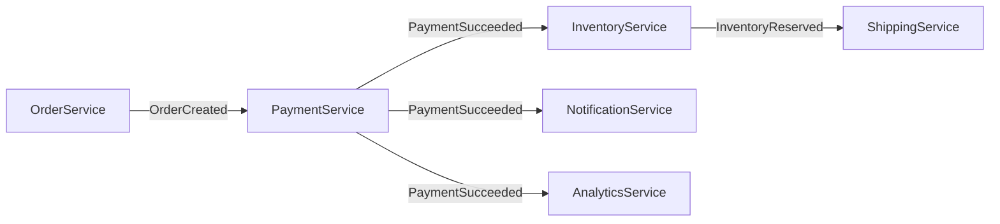

# Event choreography

> **Learning Path:** Distributed Systems
> **Section:** 3.2.6 — Messaging

# Event Choreography — Services events மூலம் தன்னிச்சையாக பேசிக்கொள்வது

## 1. Problem

ஒரு e-commerce flow பாருங்கள். Order வந்ததும் Payment பண்ணணும், Payment success ஆனதும் Inventory reserve பண்ணணும், அதுக்கு அப்புறம் Shipping trigger பண்ணணும்.

முதல்ல இதை ஒரே Order service தான் sequence-ஆ call பண்ணி manage பண்ணுது. 
இது வேலை செய்யும். ஆனால் பிரச்சனை வரும்:

* Order service எல்லா service-ன் logic-ஐயும் தெரிந்து வைத்திருக்க வேண்டும்
* Payment fail ஆனால் rollback logic எங்கே இருக்கும்?
* New service சேர்க்கணும்னா Order service-ஐ மாற்ற வேண்டும்
* Order service down ஆனால் முழு flow-ம் நின்றுவிடும்

இங்கே central coordinator ஒன்று இருப்பதால் coupling அதிகமாகிறது. Scale பண்ணும்போது இது painful ஆகிறது.

## 2. Mental Model

Event choreography-ல் central conductor இல்லை.

ஒவ்வொரு service-ம் சுதந்திரமாக இருக்கும். ஒரு service ஒரு event-ஐ publish பண்ணும். மற்ற services அந்த event-ஐ subscribe பண்ணி தங்கள் வேலையை தனியாக செய்து, தேவையானால் அடுத்த event-ஐ publish பண்ணும்.

இது dance choreography போல. ஒருவர் move பண்ணினால் மற்றவர் react பண்ணுவார். யாரும் யாரையும் direct-ஆ call பண்ணுவதில்லை.

## 3. How It Works

Flow message queue / event bus மூலம் போகிறது.

`OrderService` `OrderCreated` event-ஐ publish பண்ணும்.
`PaymentService` அதை listen பண்ணி payment செய்து `PaymentSucceeded` / `PaymentFailed` event-ஐ publish பண்ணும்.
`InventoryService` `PaymentSucceeded` ஐ கேட்டு inventory reserve பண்ணி `InventoryReserved` event-ஐ publish பண்ணும்.
`ShippingService` அதை கேட்டு shipment create பண்ணும்.

எந்த service-ம் மற்ற service-ஐ அறியாது. அது events மட்டும் அறியும்.

ஒரே event பல services-க்கு போகலாம். இது fan-out.

## 4. Architectural Reasoning

Choreography useful ஆகும் போது:

* Services truly independent ஆக இருக்க வேண்டும். Business logic service-க்குள் localized இருக்கும்
* Flow linear இல்லாமல், event-driven reactive behavior தேவைப்படும்
* Team autonomy முக்கியம். ஒவ்வொரு team-ம் தங்கள் service-ஐ deploy பண்ணலாம்

Orchestration-ல் central orchestrator flow-ஐ control பண்ணும். Choreography-ல் control distributed ஆகும்.

எப்போது தேர்வு செய்வது?
உங்களுக்கு loose coupling, high autonomy, natural event-driven domain வேண்டுமென்றால் choreography.

ஆனால் flow complex ஆகி, steps ஒன்றுக்கொன்று tightly dependent ஆனால், visibility குறைவாகிறது.

## 5. Trade-offs

**Coupling குறைவு vs Visibility குறைவு**
Services independent. ஆனால் end-to-end flow-ஐ trace பண்ணுவது கடினம். யார் எந்த event-ஐ publish பண்ணினார் என்பதை debug பண்ண trace id, correlation id இல்லாமல் காண்பது கடினம்.

**Scalability vs Consistency**
ஒவ்வொரு service தனியாக scale ஆகும். ஆனால் distributed transaction கிடையாது. Payment success ஆனாலும் Inventory reserve fail ஆனால் என்ன செய்வது? Compensating events தேவைப்படும்.

**Change easy vs Coordination hard**
New service சேர்க்க event subscribe பண்ணினால் போதும். Order service மாற்ற தேவையில்லை. ஆனால் business invariant-ஐ எல்லா services-லும் enforce பண்ண வேண்டும். ஒரு rule மாறினால் பல services-ஐ update பண்ண வேண்டியிருக்கும்.

Failure mode: Event lost ஆனால் message queue persistence தேவை. Event ordering guarantee இல்லை என்றால் race condition வரும். Idempotency must.

## 6. Practical Example

Banking-ல் fund transfer flow.

`AccountService` `DebitRequested` event publish பண்ணும்.
`FraudService` அதை listen பண்ணி risk check பண்ணி `FraudCheckPassed` publish பண்ணும்.
`LedgerService` அதை கேட்டு ledger update பண்ணி `LedgerUpdated` publish பண்ணும்.
`NotificationService` மற்றும் `ComplianceService` இரண்டும் `LedgerUpdated` ஐ கேட்டு தங்கள் வேலையை செய்யும்.

இங்கே AccountService யாரையும் call பண்ணவில்லை. அது event போட்டுவிட்டு move on. மற்றவர்கள் react பண்ணுகிறார்கள்.

இது team autonomy-க்கு நல்லது. Fraud team தங்கள் logic மாற்றலாம், மற்றவர்களுக்கு தெரியாது.

## 7. Reasoning Challenge

உங்களிடம் Order, Payment, Inventory, Shipping services உ
