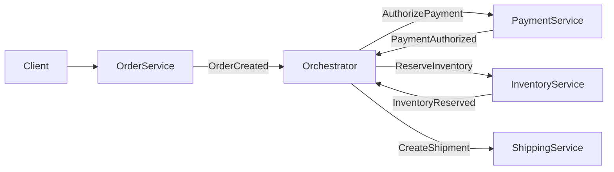

# Event orchestration

> **Learning Path:** Distributed Systems
> **Section:** 3.2.7 — Messaging

### 1. Problem

ஒரு order place ஆனதும் என்ன ஆகணும்? Payment போகணும், inventory reserve ஆகணும், shipping trigger ஆகணும், notification போகணும். இதெல்லாம் 4-5 different services.

இதை choreography-ல செய்தால்: Order service event publish பண்ணும், Payment service கேட்டு process பண்ணும், அது success event publish பண்ணும், அதை Inventory service கேட்கும்... 

இங்கே என்ன painful ஆகும்?

* Process-இன் மொத்த flow எங்கே இருக்கு? எந்த service-லயும் முழுசா தெரியாது.
* ஒரு step fail ஆனால் compensation எப்படி தெரியும்? Retry யார் முடிவு பண்ணுவா?
* Business rule மாறினால் எத்தனை service-ல மாற்றம் வேண்டும்?
* Debugging பண்ணும்போது event chain-ஐ கையால் தேட வேண்டும்.

Event orchestration இந்த chaos-க்கு ஒரு central brain கொடுக்கிறது.

### 2. Mental Model

Orchestration = Conductor + Musicians.

Conductor ஒருத்தன் மட்டும் முழு composition-ஐ பார்க்கிறான். எப்போது violin start பண்ணணும், எப்போது pause வேண்டும் என்று சொல்கிறான்.

Musicians = services. அவர்கள் conductor-இன் command-க்கு மட்டும் கேட்பார்கள், ஒருவருக்கொருவர் பேச மாட்டார்கள்.

இதனால் flow explicit ஆகி விடுகிறது, visible ஆகிறது.

### 3. How It Works

Orchestrator ஒரு stateful service. இது workflow definition-ஐ own பண்ணும்.

Flow எப்படி நடக்கும்:

1.  `OrderCreated` event வரும்.
2. Orchestrator state-ஐ update பண்ணி `AuthorizePayment` command-ஐ Payment service-க்கு அனுப்பும்.
3. Payment service `PaymentAuthorized` அல்லது `PaymentFailed` event-ஐ publish பண்ணும்.
4. Orchestrator அந்த event-ஐ கேட்டு அடுத்த step முடிவு பண்ணும். Success என்றால் `ReserveInventory`, fail என்றால் `CancelOrder`.
5. இப்படி state machine-ஆக முழு process-ஐ drive பண்ணும்.

Implementation-ல இது பெரும்பாலும் message queue + durable state store வைத்து வேலை செய்யும். Orchestrator idempotent ஆக இருக்க வேண்டும், because events duplicate ஆக வரலாம்.

### 4. Architectural Reasoning

**எப்போது useful?**

* Business process multi-step, long-running, human intervention தேவைப்படும்.
* Compensation / rollback logic தெளிவாக வேண்டும்.
* Audit, visibility, reporting முக்கியம்.
* Process change அடிக்கடி வரும்.

**Alternatives**

* **Choreography:** Services events-ஐ கேட்டு self-organize பண்ணும். Decoupling அதிகம், but flow hidden.
* **Synchronous orchestration:** REST calls chain. Simple ஆனால் latency, coupling, failure cascade அதிகம்.

Orchestrator தேர்வு = flow-ஐ centralize பண்ணி reasoning-ஐ ஒரிடத்தில் வைக்க வேண்டும் என்ற decision.

### 5. Trade-offs

* **Single source of truth vs single point of failure.** Orchestrator down ஆனால் முழு process stall ஆகும். High availability, persistence, replay தேவை.
* **Coupling vs visibility.** Services orchestrator-ஐ depend பண்ணும். ஆனால் flow ஒரே file-ல பார்க்க முடியும்.
* **Scalability.** Orchestrator state ஒரு bottleneck ஆகலாம். Partition by business key, e.g. orderId, செய்ய வேண்டும்.
* **Latency.** Each step async event wait. Real-time இல்லை. Synchronous flow விட slow.

Failure modes: Orchestrator duplicate command அனுப்பினால்? Idempotency key தேவை. Orchestrator crash ஆனால் in-flight state எப்படி recover ஆகும்? Event sourcing + state store.

### 6. Practical Example

Enterprise order fulfillment.

Orchestrator service `OrderOrchestrator` ஒன்று உள்ளது. Workflow:

`OrderCreated` -> `AuthorizePayment` -> wait -> `PaymentAuthorized` -> `ReserveInventory` -> wait -> `InventoryReserved` -> `CreateShipment` -> wait -> `ShipmentCreated` -> `NotifyCustomer`

Payment fail ஆனால் orchestrator தானாக `CancelOrder` + `ReleaseHold` செய்யும். Inventory insufficient என்றால் `WaitForRestock` அல்லது `Backorder` branch எடுக்கும்.

இதனால் product team process rule மாற்ற வேண்டுமானால் orchestrator code மட்டும் மாற்றினால் போதும். Services untouched.

### 7. Reasoning Challenge

உங்களிடம் 20 consumers இருக்கிறது. எல்லாருக்கும் same event தேவை. Consumer processing speed வேறுபடுகிறது. Producer-ஐ block பண்ணக்கூடாது. Replay-ம் வேண்டும்.

இப்போது ஒரு new business requirement வருகிறது: `Refund` process 3 steps: validate, process payout, notify. ஒரு step fail ஆனால் முழு process-ஐ audit முடிய வேண்டும், மாதம் ஒருமுறை process definition மாறும்.

இங்கே choreography பயன்படுத்துவீர்களா, orchestration பயன்படுத்துவீர்களா? ஏன்? Orchestrator-இன் failure-ஐ எப்படி handle பண்ணுவீர்கள்?

### 8. Key Takeaways

* Event orchestration என்பது complex business process-ஐ explicit state machine-ஆக centralize செய்வது.
* Orchestrator flow-ஐ own பண்ணும், services dumb workers ஆகும்.
* Visibility மற்றும் control கிடைக்கும், ஆனால் central point of failure மற்றும் coupling வரும்.
* Chore
