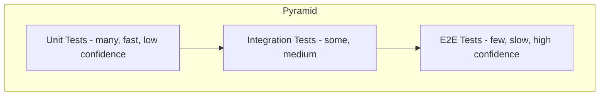

# Test pyramid trade-offs

> **Learning Path:** Testing, Quality & Observability Foundations
> **Section:** 2.1.1 — Testing strategy

## Problem

உங்கள் team-ல ஒரு service-க்கு tests எழுதுறாங்க. Unit tests, integration tests, end-to-end tests எல்லாம் இருக்கு. ஆனால் CI pipeline 40 நிமிடம் ஓடுது. Developer ஒரு small change push பண்ணினாலும் wait பண்ணனும். அதனால் local-ல run பண்ணாமலே push பண்றார்.

இன்னொரு பக்கம் production-ல bug வருது. "இது test-ல catch ஆகியிருக்க வேண்டாமா?"ன்னு கேட்கிறார்கள். Test எழுதியிருக்கோம், ஆனால் அது மெதுவா, flaky ஆக இருக்கு. பாதி நேரம் test fail ஆகுது, ஆனால் code-ல bug இல்லை. அப்போ test-ஐ trust பண்ண முடியாது.

இந்த pain-தான் Test Pyramid-ஐ பிறக்க வச்சது. Tests எல்லாம் சமமா இல்லை. Speed, cost, confidence எல்லாம் வேற வேற.

## Mental Model

Test Pyramid என்பது test-களின் **cost vs confidence**-ஐ visualize பண்ணுறது.

Base-ல நிறைய fast, cheap, isolated **unit tests**. மேலே குறைவான **integration tests**. உச்சியில் மிக குறைவான **end-to-end tests**.

ஏன் இந்த shape? ஒரு test எவ்வளவு real system-ஐ touch பண்ணுதோ, அவ்வளவு அது slow, flaky, expensive ஆகும். ஆனால் அதே நேரம் அது தரும் confidence அதிகம்.

நீங்கள் ஒரு building கட்டுறீங்க. Foundation-ல நிறைய small bricks, top-ல குறைவான heavy beams. அதே logic.

## How It Works

**Unit test:** ஒரு function / class ஒன்னை தனியா test பண்ணுறது. Dependencies-ஐ mock பண்ணி விடுறது. Milliseconds-ல ஓடும். Fail ஆனால் எங்கே பிரச்சனைன்னு உடனே தெரியும்.

**Integration test:** 2-3 real components சேர்ந்து வேலை செய்யுதா என்று பார்ப்பது. Database, message queue, external API போன்றவை உண்மையா அல்லது test double-ஆ? இங்கே speed குறையும், flakiness வரும்.

**E2E test:** User flow முழுவதும், UI முதல் database வரை. Real browser, real environment. Slow, brittle, expensive. ஆனால் "இது உண்மையில் வேலை செய்யுதா?" என்று உறுதி தரும்.

## Architectural Reasoning

Pyramid இல்லாமல் என்ன ஆகும்?

எல்லாம் E2E tests மட்டும் வச்சா: CI 2 மணி நேரம் ஆகும். ஒரு small logic change-க்கு full flow run பண்ணனும். Feedback loop மெதுவாகும். Developer test-ஐ skip பண்ண ஆரம்பிப்பார்.

எல்லாம் Unit tests மட்டும் வச்சா: Code தனியா வேலை செய்யுது, ஆனால் components சேரும் போது integration bug வரும். Production-ல தான் தெரியும்.

அதனால் architect ஒரு balance பார்க்கிறார்:

* **Fast feedback** வேண்டும் → unit tests அதிகம்
* **Contract சரியா?** → integration tests தேவை
* **Critical user journey safe-ஆ?** → சில E2E tests போதும்

Alternative இருக்கு: Test Ice Cream Cone, Test Honeycomb. அதாவது E2E அதிகம். ஆனால் அது scale ஆகாது. Team size பெரிதாகும்போது maintenance cost explode ஆகும்.

## Trade-offs

**Speed vs Confidence:** Unit tests fast ஆனால் isolation-க்காக mocks use பண்ணும். Mock-கள் தப்பா இருந்தால் false confidence வரும். E2E slow ஆனால் real.

**Cost vs Coverage:** ஒரு integration test-ன் cost ~ 10-100x unit test. அதனால் நீங்கள் எல்லா integration combinations-ஐயும் test பண்ண முடியாது. Focus on critical paths.

**Flakiness:** E2E மற்றும் integration tests network, timing, data state-ஐ depend பண்ணும். Flaky test ஒன்று தான் developer trust-ஐ க
