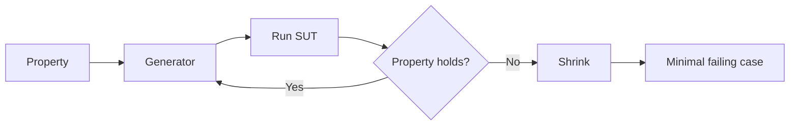

# Property-based testing

> **Learning Path:** Testing, Quality & Observability Foundations
> **Section:** 2.1.4 — Testing strategy

## Problem

நீங்கள் ஒரு `sort` function எழுதியிருக்கிறீர்கள். Unit test-ல் `[3,1,2]`, `[1,2]`, `[5]` என்று மூன்று example கொடுத்து பாஸ் ஆகுது. Production-ல் வருகிறது: empty list, duplicate values, negative numbers, மிக பெரிய list. ஒன்றில் crash.

இது தான் example-based testing-ன் வலி. நீங்கள் நினைத்த example-களை மட்டுமே test பண்ணுவீர்கள். Edge case-களை நீங்கள் கற்பனை பண்ண முடியாது.

என்ன பிரச்சனை? **Input space மிக பெரியது, நீங்கள் அதை enumerate பண்ண முடியாது.** Bug எப்போதும் நீங்கள் test பண்ணாத input-ல் தான் வரும்.

## Mental Model

Example test கேட்கிறது: *இந்த input-க்கு இந்த output வருமா?*

Property-based testing கேட்கிறது: *எந்த input வந்தாலும், இந்த invariant எப்போதும் உண்மையாக இருக்குமா?*

நீங்கள் specific example-களுக்கு பதில், **property-களை** define பண்ணுகிறீர்கள். Framework அதை break செய்ய random inputs generate பண்ணி தேடும்.

Sort-க்கு property என்ன?
* output sorted ஆக இருக்க வேண்டும்
* output-ன் elements input-ன் elements-ன் permutation தான் இருக்க வேண்டும்
* length மாறாது

இந்த property எந்த input-க்கும் உண்மையாக இருக்க வேண்டும்.

## How It Works

Workflow மூன்று பாகங்கள்:

1. **Property define பண்ணுங்கள்** - code-ல் ஒரு boolean function. `for all inputs, property holds`.
2. **Generator** - framework Hypothesis, fast-check, jqwik போன்றவை input-களை random ஆக generate பண்ணும். Strategies: ints, lists, dicts, custom types.
3. **Shrinker** - property fail ஆனால், minimal counterexample-ஐ கண்டுபிடிக்கும். `[ -1, 0, 42, 7, 7, ...]` fail ஆனால் shrinker சிறிய list-க்கு கொண்டு வரும்.

Loop:

இது fuzzing-க்கு நெருக்கம், ஆனால் goal random break அல்ல. Invariant-ஐ காப்பது.

## Architectural Reasoning

எப்போது use பண்ண வேண்டும்?

* Logic-க்கு மிக பெரிய input space உள்ளது, ஆனால் சில simple invariants உள்ளன. Parser, serializer, math utilities, validation.
* State machine உள்ள systems. Queue, cache eviction, retry policy.
* Correctness cost அதிகம். Payment calculation, tax, discount engine.

Alternatives:
* Example tests: வேகமான, easy to read,
