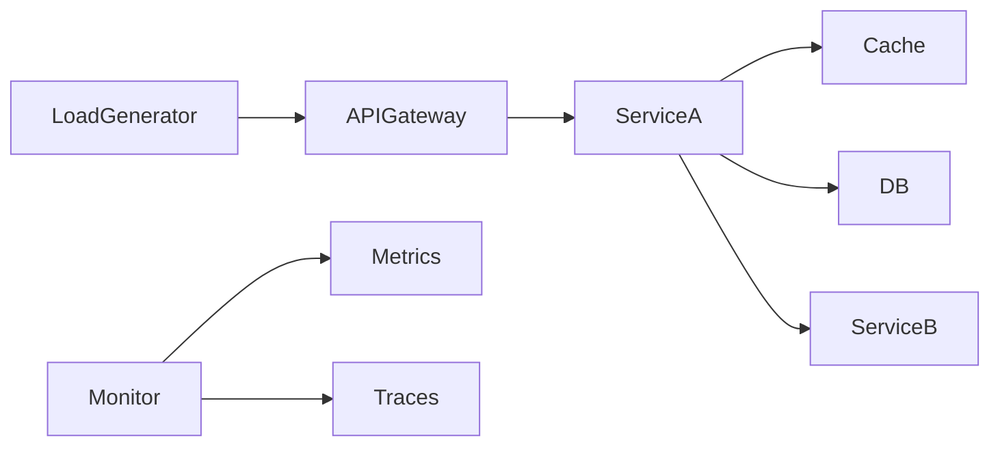

# Performance testing strategy

> **Learning Path:** Testing, Quality & Observability Foundations
> **Section:** 2.1.8 — Testing strategy

## 1. Problem

உங்கள் API dev-ல சூப்பரா வேலை செய்கிறது. 10 req/sec வரை latency 50ms. Production-க்கு வந்ததும் முதல் sale, Diwali sale, Black Friday மாதிரி traffic spike வந்தால் என்ன ஆகும்?

ஒரு service database connection pool-ஐ முழுவதும் எடுத்துக்கொள்ளும். மற்றொரு service-ல CPU saturate ஆகி garbage collection pause ஆகும். Cache miss ஆனதும் DB-க்கு thundering herd போகும். பயனர் பார்ப்பது timeout, 5xx error.

Bug இல்லை. Code சரியாகத்தான் இருக்கிறது. Problem என்னவென்றால் **system behavior under load** புரியாமல் deploy செய்துவிட்டோம்.

இதை production-ல கண்டுபிடிக்காமல் முன்னதாக கண்டுபிடிக்க வேண்டும். அதுதான் performance testing strategy.

## 2. Mental Model

Performance testing என்பது "system fast ஆ?" என்று கேட்பது அல்ல. 

இது: **given constraints, system எப்போது break ஆகும், எங்கே bottleneck உருவாகும், எப்படி behave ஆகும் என்பதை quantify செய்வது.**

நீங்கள் capacity-ஐ map செய்கிறீர்கள்: throughput எவ்வளவு வரை sustain ஆகும், latency எப்போது degrade ஆகும், resource saturation எங்கே தொடங்கும்.

## 3. How It Works

நீங்கள் ஒரு load generator வைத்து controlled traffic உருவாக்கி, metrics-ஐ பார்க்கிறீர்கள்.

Core tests:

* **Load test** - expected production load-ஐ simulate செய்ய. Baseline latency, throughput, error rate எது. உதாரணம் 1000 concurrent users.
* **Stress test** - load-ஐ மெதுவாக அதிகரித்து breaking point கண்டுபிடிக்க. எங்கே error rate spike ஆகிறது, எந்த resource saturate ஆகிறது.
* **Soak test** - normal load-ஐ hours / days run செய்ய. Memory leak, connection leak, GC pressure மாதிரி long-running issues தெரியும்.
* **Spike test** - traffic-ஐ sudden jump. Auto-scaling react ஆக எவ்வளவு நேரம் எடுக்கிறது.
* **Volume test** - data size-ஐ அதிகரிக்க. Database table 10M rows-க்கு மேல் query எப்படி behave ஆகும்.

Tools முக்கியமில்லை. k6, Locust, JMeter எல்லாம் ஒரே வேலை. முக்கியம் என்ன scenario, what you measure, and what decision you take.

## 4. Architectural Reasoning

Performance testing-ஐ எப்போது பயன்படுத்துவது?

* System boundary மாறும்போது. New service add, DB schema change, cache layer remove.
* SLA / SLO define செய்யும்போது. p95 latency < 200ms, throughput 5000 RPS என்று target set பண்ணும்போது அது achievable ஆ? என்பதை prove செய்ய.
* Cost vs reliability trade-off பார்க்க. Kubernetes replica எத்தனை வைக்க வேண்டும்? DB read replica தேவையா?

Alternative என்ன? Production traffic-ஐ மட்டும் பார்ப்பது. அது real ஆனால் risky. Production-ல break ஆகும் வரை wait செய்ய முடியாது. குறிப்பாக financial, healthcare, e-commerce.

## 5. Trade-offs

* **Fidelity vs cost**. Production clone செய்வது கஷ்டம், data size, downstream dependencies. Mock செய்தால் realism குறையும். அதனால் strategy-ல கொஞ்சம் mock, கொஞ்சம் real dependencies என்று hybrid பயன்படுத்துவார்கள்.
* **Test environment drift**. Test DB-ல data 1GB, prod-ல 1TB. Index மட்டும் இல்லாமல் query plan மாறும். Test environment-ஐ prod-க்கு நெருக்கமாக வைத்திருக்க வேண்டும்.
* **Result actionability**. Metrics மட்டும் கொடுக்காமல், bottleneck root cause வரை போக வேண்டும். Latency அதிகரித்தது service-லயா, network-லயா, DB-லயா? Distributed tracing இல்லாமல் performance test blind.
* **Test maintenance**. Scenario stale ஆகும். Real user behavior மாறும். Tests-ஐ code மாதிரி version control செய்ய வேண்டும்.

Failure mode: Test pass ஆனதால் prod safe என்று நினைப்பது. Traffic pattern, data distribution, cache warm-up மாறுபடும். Performance testing is a signal, not guarantee.

## 6. Practical Example

E-commerce checkout flow.

Constraints: Diwali sale-ல 10x traffic, p95 < 300ms, error rate < 0.1%.

Load test: 5000 users
