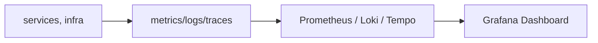

# Dashboards

> **Learning Path:** Testing, Quality & Observability Foundations
> **Section:** 2.2.5 — Observability foundations

# Dashboards

## 1. Problem

உங்கள் service production-ல ஓடிக்கொண்டிருக்கிறது. திடீரென error rate ஏறுகிறது, latency spike ஆகிறது. ஒரு alert வருகிறது.

ஆனால் எதனால் என்று தெரியவில்லை. Logs-ல பார்த்தால் thousands of lines. Metrics எங்கே இருக்கிறது தெரியவில்லை. ஒவ்வொரு service-க்கும் ஒவ்வொரு tool.

இந்த நிலையில் engineer என்ன செய்வார்? தகவலை சேகரித்து, correlate செய்து, root cause-க்கு போவது நேரம் எடுக்கும். Customer impact ஆகும்.

இங்கே தேவைப்படுவது ஒரு shared, real-time mental picture of system-இன் health. அதை தான் dashboard கொடுக்கிறது.

> Dashboard என்பது அழகான graph அல்ல. System-ஐ புரிந்துகொள்ளும் கண்ணாடி.

## 2. Mental Model

Dashboard = **hypothesis testing surface**.

நீங்கள் ஒரு assumption வைக்கிறீர்கள்: "Payment service slow ஆகிறது". Dashboard-ல latency, error rate, throughput, queue depth ஒன்றாக பார்த்தால், assumption உண்மையா பொய்யா என்று 10 வினாடியில் தெரிந்துவிடும்.

ஒரு dashboard-ல் மூன்று விஷயங்கள் மட்டும் இருக்க வேண்டும்:
* **What is normal?** baseline
* **What changed?** deviation
* **Where to look next?** correlated signals

நினைவில் வைத்துக்கொள்ளுங்கள்: dashboard alert-க்கு மாற்று அல்ல. Alert உங்களை எழுப்பும். Dashboard உங்களுக்கு context கொடுக்கும்.

## 3. How It Works

பொதுவான pipeline:

Service code-ல அல்லது exporter-ல metrics expose ஆகிறது. Prometheus போன்ற collector scrape செய்கிறது. Logs மற்றும் traces கூட collect ஆகின்றன.

Dashboard ஒரு query layer மட்டுமே. `rate(http_requests_total[5m])`, `histogram_quantile(0.95, ...)` போன்ற queries-ஐ run செய்து, time series-ஐ visualize செய்கிறது.

Key point: dashboard இன் value data collection & aggregation quality-ல் இருக்கிறது. Visualization அது மேலே உள்ள layer மட்டுமே.

## 4. Architectural Reasoning

Dashboard எப்போது useful ஆகிறது?

* Multiple services ஒன்றாக வேலை செய்யும்போது. ஒரு request பல service-கள் வழியாக போகிறது. Latency எங்கே add ஆகிறது என்று பார்க்க வேண்டும்.
* On-call engineer-க்கு fast triage தேவைப்படும்போது.
* Business stakeholder-க்கு SLO/SLA compliance காட்ட வேண்டும்.
* Capacity planning-க்கு trend பார்க்க வேண்டும்.

Alternatives:
* Pure logs: deep, but slow to scan.
* Alert only: noisy, context இல்லை.
* Ad-hoc queries in CLI: powerful, but not shared.

Architect ஏன் dashboard தேர்வு செய்கிறார்? Because **shared situational awareness** reduces MTTR. Team ஒரே view-ல் பேசுகிறது.

## 5. Trade-offs

**Signal vs Noise.** அதிக panels வைத்தால் dashboard unreadable ஆகும். ஒரு good dashboard = 5-7 key signals.

**Freshness vs Cost.** High resolution metrics = high storage cost. Production-ல 15s scrape போதும். Debug-க்கு மட்டும் 5s.

**Aggregation hides problems.** Average latency 200ms ஆக இருக்கலாம், ஆனால் p99 5s ஆக இருக்கலாம். Histogram வைக்காவிட்டால் tail latency தெரியாது.

**Stale dashboards.** Service evolve ஆகும். Metric names மாறும். Dashboard maintain பண்ணாவிட்டால் misleading view கொடுக்கும்.

Failure mode: dashboard refresh ஆகவில்லை, data pipeline down ஆகிறது, engineer false sense of security பெறுகிறார்.

## 6. Practical Example

Enterprise e-commerce payment flow.

Services: API Gateway -> Auth Service -> Payment Service -> Bank Adapter.

ஒரு dashboard-ல்:
* Top row: Request rate, error rate, p95 latency for overall
