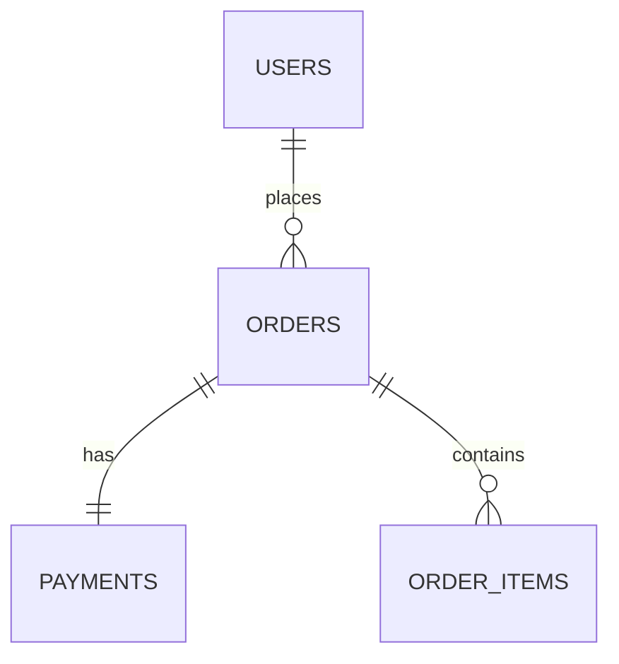

# Relational databases

> **Learning Path:** Data Architecture
> **Section:** 4.1.1 — Databases

**Problem**

உங்க company-ல Users, Orders, Payments, Inventoryன்னு நாலு service இருக்கு. எல்லாம் ஒவ்வொரு service-க்கும் தனிதனி CSV file, spreadsheet, அல்லது JSON file-ல data வச்சிருக்கு.

ஒரு customer தன் email-ஐ மாத்துறார். User service-ல மாற்றிட்டீங்க. ஆனா Orders-ல அதே email இருக்கு. Payment report தப்பா வருது. Finance team ஒரு report கேட்டா, நீங்க 4 files-ஐ join பண்ணி manually reconcile பண்ணனும்.

இதுல வர்ற வலி:
* Data duplication & inconsistency
* Ad-hoc query கேட்டால் impossible
* Two users same time-ல edit பண்ணா data corrupt ஆகும்
* Business rule enforce எப்படி?

File-based approach small team-க்கு வேலை செய்யும். Data grow ஆகும்போது, cross-service consistency, audit, and complex filtering painful ஆகுது.

**Mental Model**

Relational database என்பது data-ஐ structured tables-ல வச்சு, relationships-ஐ explicit-ஆ define பண்ணுறது.

Think of it as a set of spreadsheets linked by keys, but with enforcement.

One table = one entity type. Rows = instances. Columns = attributes. Primary key uniquely identifies a row. Foreign key என்பது ஒரு table இன்னொரு table-ஐ reference பண்ணுறது.

இது சொல்லுது: "நீங்க ஒரு Order create பண்ணுறதுக்கு முன்னாடி valid User இருக்கணும்". Database-யே அதை enforce பண்ணும்.

**How It Works**

Core ideas மட்டும்:

* **Schema**: Table structure predefined. columns, types, constraints.
* **ACID transaction**: Multiple writes either all succeed or all fail. Bank transfer-ல debit + credit ஒன்னா நடக்கணும்.
* **SQL**: Declarative language. நீங்க *what* வேணும்னு சொல்லுங்க, database *how* to fetch பண்ணும்.
* **Indexes**: Lookup-ஐ fast ஆக்குறது. Primary key-ல automatic index.
* **Normalization**: Redundant data-ஐ குறைக்க tables-ஐ split பண்ணுறது. Update once, reflect everywhere.

Simple flow:

`SELECT o.id, u.email FROM orders o JOIN users u ON o.user_id = u.id WHERE o.status = 'paid'`

**Architectural Reasoning**

Relational database useful ஆகும் போது:

* Data integrity முக்கியம். Money, inventory, compliance.
* Complex joins, aggregations, ad-hoc reports தேவை.
* Strong consistency வேணும். Same time-ல இரண்டு writers இருந்தாலும் correct result வேணும்.
* Business rules DB level-ல enforce பண்ணலாம்.

Alternatives உண்டு:
* Document store like MongoDB: flexible schema, fast writes, less join pain.
* Key-value / cache: simple lookups.
* Data warehouse: analytical queries, not transactional.

Architect decide பண்ணுறது: write pattern என்ன? Read pattern என்ன? Consistency requirement எவ்ளோ? Team familiar with SQL ஆ?

**Trade-offs**

* **Consistency vs Scale**: Relational DB strong consistency கொடுக்கும், ஆனா write scale பண்ணுறது கஷ்டம். Sharding complexity அதிகம். High write throughput வேணும்னா pain.
* **Schema rigidity vs safety**: Schema change-க்கு migration தேவை. ஆனா அது data corruption-ஐ தடுக்கும். Document DB-ல schema flexible, ஆனா bad data creep in ஆகும்.
* **Joins cost**: Joins powerful, ஆனா large tables-ல expensive. Read latency grow ஆகும். Denormalization சில சமயம் தேவை.
* **Operational overhead**: Backups, replication, vacuum, index maintenance. Small team-க்கு heavy.

Failure mode: Long running transaction + lock contention = deadlock. Missing index = full table scan. N+1 queries from app layer.

**Practical Example**

E-commerce order placement:

1. `BEGIN TRANSACTION`
2. Check inventory `SELECT qty FROM products WHERE id=? FOR UPDATE`
3. If enough, `UPDATE products SET qty = qty -1`
4. `INSERT INTO orders ...`
5. `INSERT INTO payments ...`
6. `COMMIT`

If payment service fail ஆனா, transaction rollback ஆகும். Inventory revert ஆகும். Customer-க்கு inconsistent state போகாது.

Reporting: "Last month Chennai-ல paid orders-ன் average value என்ன?" என்ற query-ஐ SQL-ல 2 lines-ல எழுதலாம். No ETL needed.

**Reasoning Challenge**

உங்க system-ல 10k orders/sec write வருது. Each order needs 5 table writes. Read traffic 100x write. Latency SLO 50ms. Team-க்கு strong consistency கண்டிப்பா வேணும், ஆனா read scale பண்ணணும்.

இப்போ relational database-ஐ தொடர்ந்து use பண்ணுவீங்களா? எப்படி scale பண்ணுவீங்க?
