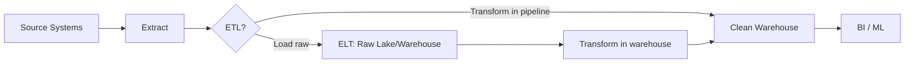

# ETL / ELT

> **Learning Path:** Data Architecture
> **Section:** 4.2.10 — Data architecture

## 1. Problem

உங்கள் company-ல் orders PostgreSQL-ல், payments Stripe-ல், user events Kafka-ல், CRM Salesforce-ல் இருக்கு. Business team-க்கு daily revenue report வேண்டும், product team-க்கு churn model-க்கு feature table வேண்டும்.

இப்போது என்ன நடக்கும்? Analyst-கள் காலையில் SQL query பண்ணி 20 நிமிடம் wait பண்ணுவார்கள். Source DB-யில் heavy query போட்டால் OLTP slow ஆகும். Schema ஒவ்வொரு source-க்கும் வேறு வேறு. Data quality inconsistent.

Core pain: **நீங்கள் analyze பண்ண வேண்டிய data, நீங்கள் operate பண்ணும் system-ல் இல்லை.** Source systems operational load-க்காக optimize பண்ணப்பட்டவை, analytical load-க்காக இல்லை.

இந்த gap-ஐ close பண்ணத்தான் data pipeline தேவைப்பட்டது.

## 2. Mental Model

Data pipeline ஒரு factory line மாதிரி. Raw material source system-லிருந்து வரும். அதை clean, standardize, combine பண்ணி, warehouse / lake-ல் வைக்கிறோம். அங்கிருந்துதான் reporting, BI, ML எல்லாம் read பண்ணும்.

ETL vs ELT வித்தியாசம் எங்கே இருக்கு? Transform எங்கே நடக்கிறது என்பதுதான்.

## 3. How It Works

**ETL - Extract, Transform, Load**
Source-லிருந்து extract பண்ணி, pipeline-லேயே transform பண்ணி, clean data-வை மட்டும் warehouse-க்கு load பண்ணுவோம்.

Source -> Transform in pipeline -> Warehouse

**ELT - Extract, Load, Transform**
Source-லிருந்து extract பண்ணி, raw data-வை முதலில் lake / warehouse-க்கு load பண்ணுவோம். Transform-ஐ target system-லேயே செய்வோம்.

Source -> Warehouse raw -> Transform in warehouse

எடுத்துக்காட்டு: orders table-ல் `created_at` timezone mixed. ETL-ல் pipeline-ல் standardize பண்ணி, UTC-க்கு மாற்றி பின் load. ELT-ல் raw-ஐயே load பண்ணி, Snowflake / BigQuery-ல் view / materialized view மூலம் transform பண்ணுவோம்.

## 4. Architectural Reasoning

ETL ஏன் பிறந்தது? On-premise data warehouse compute expensive, limited. Transform-ஐ மலிவான ETL server-ல் செய்து, warehouse-க்கு மட்டும் clean data அனுப்பினால் cost குறையும். Data quality gate முக்கியம்.

ELT ஏன் பிறந்தது? Cloud data warehouse-ல் compute cheap, elastic, scale பண்ணலாம். Storage cheap. அதனால் raw data-வை முதலில் save பண்ணி, பிறகு தேவைப்படும்போது transform செய்யலாம். Schema evolution-க்கு கை கொடுக்கும். திடீரென ஒரு new column வந்தால், re-extract பண்ண தேவையில்லை. Raw இருக்கு.

**When to choose?**
* Tight latency, strict schema, limited warehouse compute -> ETL
* Exploration, multiple downstream use cases, schema changes frequent -> ELT
* Compliance / audit needs raw retention -> ELT

## 5. Trade-offs

**Latency vs Cost.** ETL-ல் transform pipeline-ல் நடக்கும், load தாமதமாகும். ELT-ல் load fast, transform on demand.

**Coupling.** ETL pipeline-ல் business logic hard code ஆகும். Change வந்தால் pipeline redeploy. ELT-ல் logic warehouse-ல் SQL / dbt-ல் இருக்கும், more flexible.

**Failure mode.** ETL-ல் transform fail ஆனால் data warehouse-க்கு எதுவும் போகாது. Data quality high, but pipeline complexity high. ELT-ல் bad raw data load ஆகும். Transform fail ஆனாலும் raw safe. But downstream wrong result வர வாய்ப்பு.

**Operational complexity.** ETL-க்கு orchestration, monitoring, retry logic தேவை. ELT-க்கு warehouse transformation orchestration தேவை.

## 6. Practical Example

E-commerce company. Daily revenue dashboard + churn prediction model.

Sources: Postgres orders, Stripe payments, Kafka user events.

Decision: Cloud warehouse Snowflake. Raw data 3 months retain. 

ELT pipeline: Debezium மூலம் Postgres CDC -> S3 -> Snowflake raw schema. Stripe API batch -> S3 -> Snowflake. Kafka -> Kinesis -> S3 -> Snowflake.

Transform in Snowflake using dbt: `orders_clean` view join payments, deduplicate, timezone normalize. BI dashboard reads clean views. ML team reads raw events for feature engineering.

இதன் நன்மை: Analyst ஒரு new metric கேட்டால், raw data இருக்கு, dbt model மாற்றி 10 நிமிடத்தில் deploy. ETL-ல் இதற்கு re-extract தேவைப்பட்டிருக்கும்.

## 7. Reasoning Challenge

உங்களிடம் 20 downstream consumers இருக்கிறார்கள். எல்லாருக்கும் same source events தேவை, ஆனால் ஒவ்வொருவருக்கும் transform வேறு வேறு. Processing speed வேறுபடும். Data governance team raw audit வேண்டும் என்கிறார்கள். இங்கே ETL vs ELT எது சரியானதும், ஏன்? Replay capability மற்றும் cost-ஐ எப்ப
