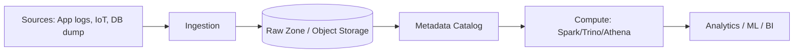

# Data lakes

> **Learning Path:** Data Architecture
> **Section:** 4.2.11 — Data architecture

## Problem

ஒரு enterprise-ல data குவிய ஆரம்பிக்கிறது. 
Transactional DB-ல இருந்து OLTP data எடுத்து data warehouse-க்கு ETL போடுறீங்க. அங்கே star schema-ல, curated tables-ல, business metrics-க்கு தேவையான fields மட்டும்.

பிரச்சனை என்ன?
New use case வந்தா — ad-hoc analysis, ML model training, raw logs explore பண்ணனும் — அதுக்கு schema மாற்றணும். Warehouse team-க்கு ticket raise பண்ணி, ETL pipeline மாற்றி, weeks ஆகும். அதுவரை data scientist experiment பண்ண முடியாது.

அதே நேரம், IoT sensors, clickstream, social media feeds, call center recordings மாதிரி semi-structured, unstructured data வருது. அதை ETL-ல clean பண்ணி warehouse-க்கு அனுப்புறது expensive. Data volume daily terabytes ஆகிறது. Storage cost + compute cost அதிகமாகுது.

இந்த **schema rigidity + time to insight + cost of cleaning everything upfront** பிரச்சனை தான் data lake-ஐ create பண்ண காரணம்.

## Mental Model

Data warehouse என்பது **schema-on-write**. Data clean பண்ணி, structure பண்ணி, அப்புறம் store பண்ணுவோம். ஒரு well-organized library.

Data lake என்பது **schema-on-read**. Raw data-ஐ முதல்ல அப்படியே store பண்ணிடுவோம். பயன்படுத்தும் நேரத்தில் தேவையான schema-ஐ apply பண்ணுவோம். ஒரு lake.

நீங்கள் ஒரு lake-ல எல்லாத்தையும் விடுறீங்க, பிறகு தேவைக்கு ஏத்த மாதிரி filter பண்ணுறீங்க.

## How It Works

Core idea simple:

1. **Raw zone**: Object storage - S3, Azure Blob, GCS. Cheap, durable, scalable. Files in Parquet, ORC, Avro, JSON, even raw binary.
2. **Ingestion**: Batch அல்லது streaming. Kafka -> S3, or direct dump from apps. Data-ஐ transform பண்ணாமல் drop பண்ணுவோம்.
3. **Catalog**: Data discovery-க்கு metadata catalog. Hive Metastore, AWS Glue Data Catalog, Databricks Unity Catalog. Schema-ஐ read time-ல register பண்ணுவோம்.
4. **Compute**: Query engine - Presto/Trino, Athena, Spark. Data lake-ல இருந்து read பண்ணி, on-demand process பண்ணுவோம்.

Architecture flow:

ELT pattern இங்கே work ஆகும். Extract -> Load raw -> Transform later.

## Architectural Reasoning

Data lake useful ஆகும் போது:

* Data volume பெரிசா இருக்கு, growth unpredictable. Object storage cost per TB warehouse-வை விட குறைவு.
* Data types mixed - structured, semi-structured, unstructured. Schema upfront define பண்ண முடியாது.
* Use cases exploratory. Data science team-க்கு self-serve access வேண்டும், wait time குறைக்க.
* Replay வேண்டும். Raw data retain பண்ணி, new algorithm-க்கு reprocess பண்ண வேண்டும்.

ஆனால் data warehouse இன்னும் தேவை. Operational reporting, real-time dashboard, strong consistency வேண்டும் என்றால் warehouse தான் better. பெரும்பாலான companies இப்போது **lakehouse** hybrid பார்க்கிறார்கள்.

## Trade-offs

**Schema-on-read vs governance.** 
Flexibility கிடைக்கும், ஆனால் data quality கட்டுப்பாடு குறையும். யார் வேண்டுமானாலும் எந்த format-ல வேண்டுமானாலும் dump பண்ணலாம். PII leak, duplicate, corrupt files வரும். Catalog + data contracts இல்லாமல் lake ஒரு swamp ஆகும்.

**Cost model.** 
Storage cheap. Compute on-demand. ஆனால் ad-hoc query inefficient ஆகும். Small file problem, partition missing என்றால் scan cost பெரியதாகும். Partitioning, file sizing, columnar format முக்கியம்.

**Latency & freshness.** 
Warehouse போல real-time SLA கிடைக்காது. Lake-ல raw data land ஆகும், processing lag உண்டு. Streaming ingestion செய்தாலும், eventual consistency இருக்கும்.

**Operability.** 
Team-க்கு data engineering + data science skill வேண்டும். Data lineage, access control, audit கஷ்டம்.

## Practical Example

ஒரு e-commerce company. 
Orders, payments structured data warehouse-க்கு போகுது. ஆனால் app clickstream, search logs, product images, customer support chat transcripts raw ஆக வருது.

Decision: Clickstream raw JSON-ஐ S3-ல raw zone-ல dump பண்ணுவோம். Glue crawler schema auto discover பண்ணும். Data scientist தன் experiment-க்கு Athena-ல directly query பண்ணுவார். 
பிறகு useful features identify ஆனதும், அதை curated zone-க்கு Spark job-ல transform பண்ணி Parquet-ல store பண்ணி, warehouse-க்கு feed பண்ணுவோம்.

Time to insight வாரங்களில் இருந்து hours-க்கு வந்தது. Storage cost 60% குறைந்தது.

## Reasoning Challenge

உங்களிடம் banking app இருக்கு. Transaction logs, KYC documents, call recordings வருது. Compliance team-க்கு 7 years retention தேவை. Data science team-க்கு fraud detection model train பண்ண raw features வேண்டும். Finance team-க்கு daily reconciled reports வேண்டும்.

இங்கே எல்லாத்தைய
