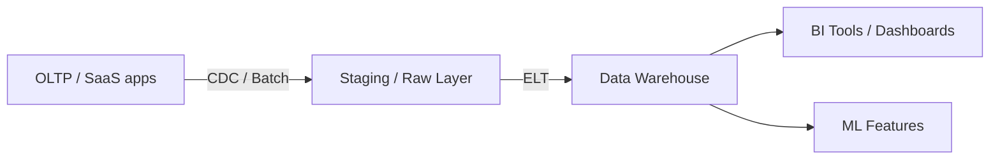

# Data warehouses

> **Learning Path:** Data Architecture
> **Section:** 4.2.12 — Data architecture

## 1. Problem

உங்க production OLTP database-ல orders, payments, inventory எல்லாம் இருக்கு. இதே DB-லே business team-க்கு monthly sales report, customer cohort analysis, product affinity query எல்லாம் run பண்ணச் சொன்னா என்ன ஆகும்?

Complex joins, large scans, aggregation queries production transactions-ஐ block பண்ணும். Latency spike ஆகும். Index-ஐ increase பண்ணினாலும் write performance போகும். Schema-வும் transactional normalization-க்கு optimize ஆகி இருக்கும், analytical query-க்கு அல்ல.

இன்னொரு பிரச்சனை: real-time operational data-ஐ நேரடியா report-க்கு use பண்ண முடியாது. Half-written transactions, inconsistent state வரும். Business-க்கு தேவை historical, consistent snapshot.

> **Pain point:** One system cannot be optimized for both low-latency writes and heavy analytical reads.

## 2. Mental Model

Data warehouse என்பது **read-optimized, analytical copy of data** from multiple operational sources.

OLTP system என்பது write-heavy, normalized, row-based. Data warehouse என்பது read-heavy, denormalized, columnar, batch-updated.

Think of it as: operational DB = live bank ledger. Data warehouse = monthly audited books for analysis.

Data warehouse-ல star schema / snowflake schema போல dimension tables மற்றும் fact tables-ல data-ஐ மாடல் பண்ணுவோம். Query speed-க்காக denormalize பண்ணுவது normal.

## 3. How It Works

Data flow பொதுவாக இப்படி இருக்கும்:

1. **Extract**: OLTP, CRM, payment gateway போன்ற sources-ல இருந்து data எடுக்கிறோம். Batch ETL அல்லது Change Data Capture மூலம்.
2. **Transform / Load**: Data cleaning, standardization, conformed dimensions create பண்ணி warehouse-க்கு load பண்ணுவோம். Modern stacks-ல ELT: raw data-ஐ முதலில் load பண்ணி, warehouse-க்குள்ள transform பண்ணுவோம்.
3. **Serve**: Analysts SQL மூலம் query பண்ணுவாங்க. BI tool, self-service layer இருக்கும்.

Storage பொதுவாக columnar, compression heavy. Query patterns predictable aggregation ஆனதால் performance கிடைக்கும்.

## 4. Architectural Reasoning

Data warehouse தேவைப்படும் constraints:

* **Consistency over freshness**: Business decisions-க்கு 1-24 hour lag acceptable.
* **Complex analytical queries**: Multi-table joins, GROUP BY, window functions.
* **Multiple source consolidation**: One source of truth for reporting.

Alternatives:
* **OLTP-லே report பண்ணுவது** → production risk.
* **Data Lake** → raw storage, flexible, but query performance மற்றும் governance குறைவு. Lake + warehouse = Lakehouse pattern.
* **Data Mart** → specific team-க்கு subset, warehouse-க்குள்ளேயே.

Architect ஏன் warehouse தேர்வு பண்ணுவார்? Because separate read path கொடுக்கிறது. Operational system-ஐ தொந்தரவு செய்யாமல் scale பண்ணலாம். Security, access control, audit ஒரே இடத்தில்.

## 5. Trade-offs

**Freshness vs Cost**: Near-real-time வேண்டுமென்றால் CDC + micro-batch செலவு அதிகம். Daily batch செலவு குறைவு ஆனால் data stale.

**Consistency vs Complexity**: ETL pipeline fail ஆனால் warehouse stale ஆகும். Monitoring, data quality checks, re-run logic தேவை. Operational DB-ல immediate consistency இருக்கும், warehouse-ல eventual.

**Schema rigidity**: Star schema change பண்ணுவது heavy. Agile teams-க்கு slow. Data mesh / data product மாடல் இதை சமாளிக்க முயற்சிக்கிறது.

**Cost**: Storage cheap ஆனால் compute for large scans, data transfer, tooling cost add ஆகும்.

Failure mode: ETL late ஆனால் dashboard wrong decisions கொடுக்கும். Silent data drift நடக்கும். அதனால் observability must.

## 6. Practical Example

E-commerce company-க்கு:

Orders DB PostgreSQL-ல இருக்கு. Inventory service MongoDB-ல. Payments Stripe-ல.

Business team வாரந்தோறும் sales by region, category, channel report கேட்கிறார்கள்.

Option 1: Direct read on PostgreSQL → DB load போகும்.
Option 2: Data warehouse: Nightly ETL jobs இந்த 3 sources-ல இருந்து data-ஐ Snowflake / BigQuery-க்கு load பண்ணி, star schema create பண்ணி `fact_orders` + `dim_customer`, `dim_product`, `dim_date` வைக்கிறோம்.

Analysts SQL query பண்ணி 10 sec-ல report எடுக்கிறார்கள். Production DB untouched.

இங்கே trade-off: Report always yesterday data தான். Real-time inventory accuracy தேவைப்பட்டால் separate path வேண்டும்.

## 7. Reasoning Challenge

உங்களிடம் 20 microservices இருக்கு. Each service தன் own database வைத்திருக்கு. Product team real-time personalization வேண்டும் என்கிறது, finance team monthly consolidated report வேண்டும் என்கிறது.

இதே warehouse-ஐ இரண்டுக்கும் use பண்ணுவீர்களா? இல்லை வேறு architecture தேவையா? ஏன்?

## 8. Key Takeaways

* Data warehouse என்பது OLTP-க்கு analytical read path-ஐ separate பண்ணும் architectural boundary.
* Optimize for batch, denormalized, columnar reads, not low-latency writes.
* Freshness, cost, complexity trade-off எப்போதும் இருக்கும். Use case-க்கு ஏற
