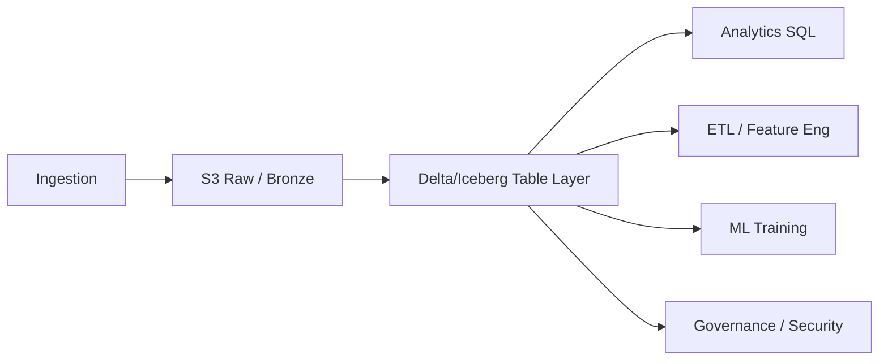

# Lakehouses

> **Learning Path:** Data Architecture
> **Section:** 4.2.13 — Data architecture

## Problem

உங்கள் கம்பெனியில் இரண்டு உலகங்கள் இருக்கு.

ஒன்று data lake. S3 / ADLS-ல raw logs, clickstream, IoT sensor data, JSON, Parquet எல்லாம் கொட்டிக்கிடக்கும். Cheap storage, schema-on-read. Data science-க்கு பிடிக்கும். ஆனால் query பண்ண ஒரு மணி நேரம் ஆகும், governance இல்ல, duplicate data, no ACID.

இன்னொன்று data warehouse. Snowflake / BigQuery / Redshift. Structured tables, ACID, fast SQL, governance, security. ஆனால் semi-structured data வரும்போது திணறும், raw data-வை வைக்க கட்டுப்படியாகாது, storage cost அதிகம், schema change-க்கு migration வேணும்.

இப்போ AI / ML workload வருது. Raw data-வை training-க்கு வேணும், analytics team-க்கு curated data வேணும், product team-க்கு real-time dashboard வேணும். Data-வை இரண்டு இடத்தில் copy பண்ணி maintain பண்ணுறது painful. Sync தப்பும், cost double ஆகும், team confusion ஆகும்.

**What problem became painful?** One source of truth வேணும், அதுவும் cheap lake storage + warehouse-like query, governance, reliability.

அதுவே Lakehouse-க்கு தேவையை உருவாக்கியது.

## Mental Model

Lakehouse = Lake + Warehouse discipline.

Lake-ன் flexibility மற்றும் low cost வைத்துக்கொண்டு, warehouse-ன் ACID transactions, schema enforcement, performance, governance கொண்டு வந்தது.

உருவகமாக: ஒரு பெரிய கிடங்கு இருக்கு, அங்கே எந்த பொருளையும் போடலாம். ஆனால் இப்போ அந்த கிடங்குக்கு shelving system, inventory log, barcode scanner வந்திருக்கு. யார் என்ன எடுத்தா, என்ன change ஆச்சுன்னு தெரியும். ஆனாலும் பொருளை எடுத்து போடுறது cheap தான்.

## How It Works

Lakehouse core idea: **open table formats on object storage + compute separation**.

Object storage தான் single storage layer. S3, ADLS, GCS.

Data அங்கே Delta Lake / Apache Iceberg / Apache Hudi format-ல் வைக்கப்படும். இவை metadata layer வைத்து:

* ACID transactions செய்யும்
* Time travel, snapshot isolation கொடுக்கும்
* Schema evolution handle பண்ணும்
* Partitioning, compaction manage பண்ணும்

Query engine Spark, Trino, Presto, Databricks SQL, Snowflake, etc., அதே files-ஐ directly read/write பண்ணும்.

Compute மற்றும் storage decoupled. இதனால் batch ETL, streaming ingestion, interactive SQL, ML training எல்லாம் ஒரே data-வில் run ஆகும்.

Bronze-Silver-Gold layers தொடர்கிறது, ஆனால் இப்போ அது ஒரே lakehouse-ல் இருக்கு, copy இல்ல.

## Architectural Reasoning

**When useful?**

* Raw + curated data ஒரே place-ல் வேணும்
* Data science, analytics, AI workloads ஒரே data-வை பயன்படுத்தணும்
* Schema change அடிக்கடி வரும்
* Cost control முக்கியம், ஆனால் performance குறையக்கூடாது

**What constraint it addresses?**

Cost of storage vs cost of compute vs governance. Lakehouse குறைந்த storage cost-ல் keep everything, ஆனால் warehouse-like reliability கொடுக்கும்.

**Alternatives?**

* Pure Data Lake + Spark: cheap, but operational overhead அதிகம், consistency இல்ல
* Pure Data Warehouse: simple, fast, ஆனால் raw, unstructured, large-scale ML data-க்கு cost prohibitive
* Lakehouse: middle ground

**Why choose?** Organisation-க்கு single source of truth வேணும், மற்றும் multiple workloads ஒரே data-வை share பண்ணணும். Team-கள் வளரும் போது governance must.

## Trade-offs

* **Complexity vs simplicity.** Warehouse-ல் vendor manage பண்ணும். Lakehouse-ல் நீங்கள் table format, compaction, metadata, access control manage பண்ணணும்.
* **Consistency vs latency.** Iceberg/Delta strong consistency கொடுக்கும், ஆனால் small file problem, compaction overhead வரும். Streaming ingestion-ல் eventual consistency trade-off இருக்கும்.
* **Cost vs performance.** Object storage cheap, ஆனால் scan heavy query slow ஆகும். Warehouse-ல் columnar cache இருக்கும். Lakehouse-ல் caching, file sizing, partitioning மூலம் தான் performance தீர்மானிக்கப்படும்.
* **Operational maturity.** Failure modes: metadata store down ஆனால் whole lakehouse read/write stop. Time travel retention cost. Schema evolution breaking downstream consumers.

## Practical Example

E-commerce platform.

Raw events: Kafka → S3 raw zone. Clickstream, orders, returns, user profile JSON.

Lakehouse layer: Delta tables on ADLS.

Bronze: raw ingestion as-is.
Silver: cleaned, deduplicated, upserted with ACID.
Gold: aggregated tables for dashboards, feature tables for ML recommendation model.

Analytics team Trino-வில் SQL run பண்ணி real-time dashboard வைக்கிறார்கள். Data science team ஒரே Delta table-ல் historical data-வை time travel பண்ணி model retrain பண்ணுகிறார்கள். Data engineers streaming pipeline-ல் CDC மூலம் silver update பண்ணுகிறார்கள்.

No separate warehouse copy. Cost ~ 40% down, latency for ad-hoc query ஏற்றுக்கொள்ளக்கூடிய level.

## Reasoning Challenge

உங்களிடம் 2 PB raw log data இருக்கு, ஒரு நாளைக்கு 5 TB வருகிறது. Finance team-க்கு daily reconciled view வேணும், strict consistency தேவை. Data science team-க்கு raw data replay வேணும், schema evolve ஆகும். Cost தான் main constraint.

Lakehouse வ
