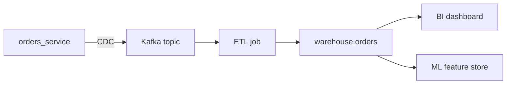

# Data lineage

> **Learning Path:** Data Architecture
> **Section:** 4.2.15 — Data architecture

## Problem

Production-ல ஒரு dashboard நம்பர் திடீர்னு மாறுது. Revenue 12% குறைஞ்சு காட்டுது. அல்லது finance team கேட்குது, "இந்த report-ல வந்த customer PII எங்கிருந்து வந்தது? GDPR delete request வந்தால் எந்த tables-ஐ touch பண்ணணும்?"

இன்னொரு case: data engineer ஒரு column name-ஐ மாற்றினான். 3 வாரம் கழித்து downstream ML model bias ஆகுது. யார் use பண்ணினாங்க? எப்படி impact ஆச்சு? யாருக்கு தெரியும்?

இந்த பிரச்சனைகளுக்கு root cause ஒன்னுதான்: data எங்கிருந்து வந்தது, என்ன transformation ஆகி, எங்கே போனது என்று யாருக்கும் தெளிவாக தெரியவில்லை.

Small team-ல 2-3 pipeline இருக்கும்போது நினைவில் வைத்துக்கொள்ளலாம். Pipeline 20+ ஆகும்போது, 10 engineers cross-team ஆக பணிபுரியும்போது, schema evolve ஆகும்போது, இது painful ஆகிவிடும்.

## Mental Model

Data lineage என்பது data-க்கான family tree.

ஒரு table-ல உள்ள ஒரு column என்பது ஒரு பிள்ளை. அதன் parents யார்? source table, source column, transformation logic. அதன் children யார்? அதை use பண்ணும் downstream table, feature, dashboard.

Lineage ஒரு directed graph. Node = dataset / table / column / file. Edge = transformation / copy / join.

இது audit trail மட்டுமல்ல. Impact analysis tool. ஒரு source schema மாற்றினால் என்ன break ஆகும் என்பதை கண்டுபிடிக்க.

## How It Works

Lineage-ஐ கட்டுவதற்கு இரண்டு வழி.

**Static lineage**: code / SQL / DAG definition-ஐ parse பண்ணி graph உருவாக்குவது. dbt, Spark job, Airflow DAG definitions-இலிருந்து table-to-table mapping எடுப்பது. வேகமாக start ஆகும், ஆனால் runtime values, conditional logic miss ஆகும்.

**Dynamic lineage**: actual execution-ல metadata capture பண்ணுவது. query runtime-ல read/write tables, column projection track பண்ணுவது. Column-level lineage accurate ஆக இருக்கும். ஆனால் overhead உண்டு.

பெரும்பாலான systems hybrid ஆக இருக்கும். Metadata store-ல lineage graph வைத்து, source, transformation, sink நோடுகளை connect செய்வார்கள். Data catalog-உடன் இணைத்தால், owner, PII tag, retention policy போன்ற context-ம் கிடைக்கும்.

இங்கே D-ல உள்ள `order_amount` column-க்கு lineage என்பது A-ல `amount` + tax transformation என்பதை காட்ட வேண்டும்.

## Architectural Reasoning

Lineage useful ஆகும் போது:
* Pipeline 5+ steps கடந்து, multiple teams own பண்ணும்போது
* Regulatory compliance: GDPR, SOX, HIPAA. Data origin மற்றும் deletion scope prove பண்ண வேண்டும்
* Incident response: bad data வந்தால் root cause tracing வேண்டும்
* ML/AI systems: feature drift, model retraining trigger ஆகும் source மாற்றம் track பண்ண வேண்டும்

Alternatives:
* Manual documentation: Confluence-ல pipeline diagram. விரைவில் stale ஆகும்
* Ad-hoc grep: code base search. Costly, incomplete
* Data catalog மட்டும்: discovery உண்டு, lineage இல்லை

Architect choose பண்ணும்போது கேட்க வேண்டியது: நமக்கு table-level ப
